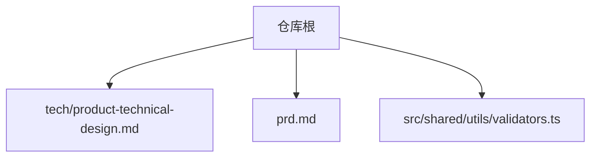
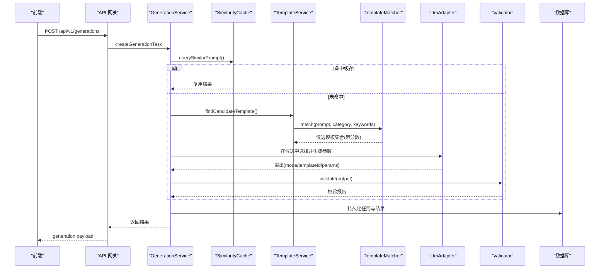
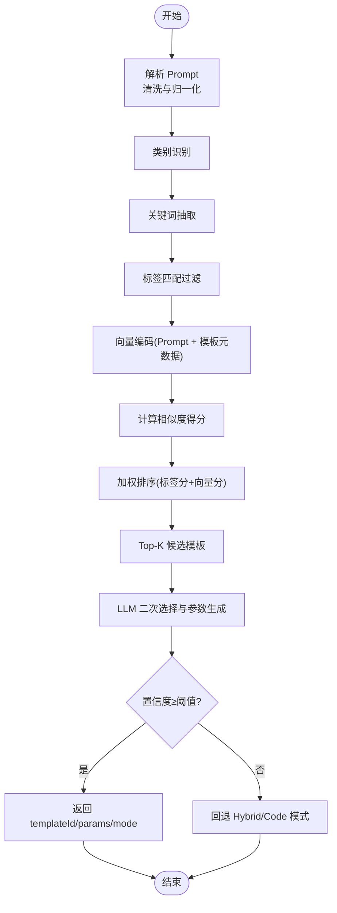
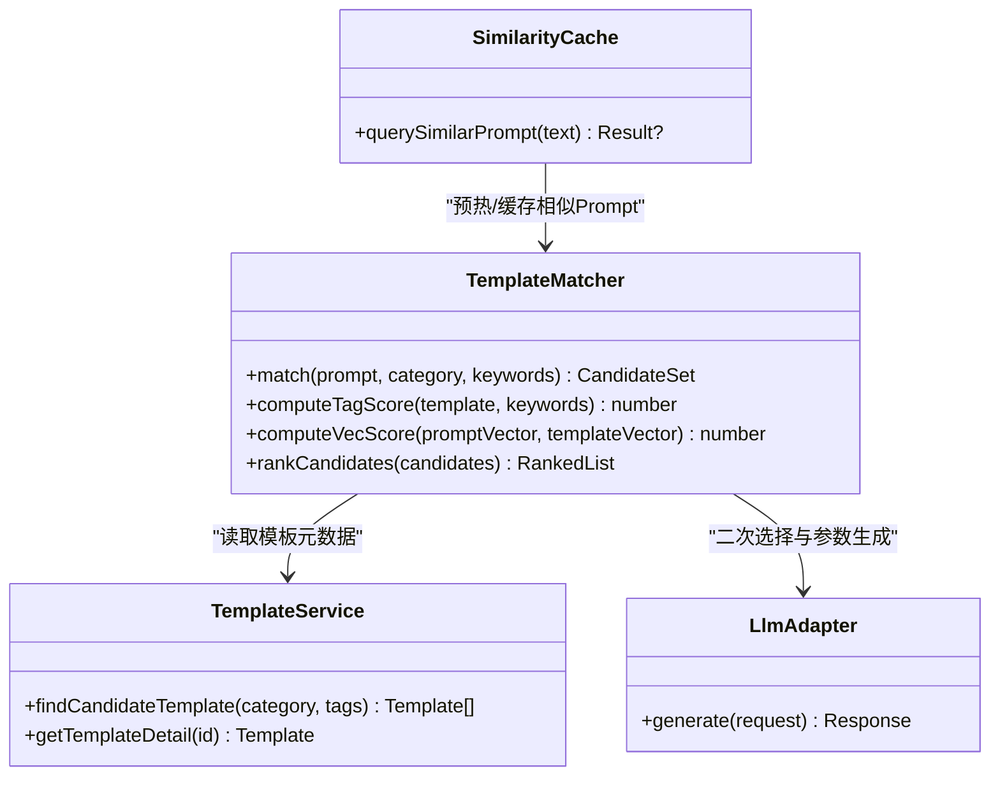
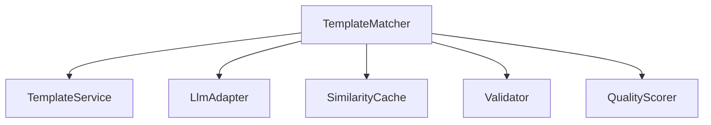

# 模板匹配算法

<cite>
**本文引用的文件**
- [产品需求文档](file://prd.md)
- [产品技术设计文档](file://tech/product-technical-design.md)
- [提示词校验工具](file://src/shared/utils/validators.ts)
</cite>

## 目录
1. [引言](#引言)
2. [项目结构](#项目结构)
3. [核心组件](#核心组件)
4. [架构总览](#架构总览)
5. [详细组件分析](#详细组件分析)
6. [依赖关系分析](#依赖关系分析)
7. [性能与索引优化](#性能与索引优化)
8. [故障排查指南](#故障排查指南)
9. [结论](#结论)
10. [附录](#附录)

## 引言
本文件面向 ApexForge 的模板匹配算法，聚焦 TemplateMatcher 的实现原理与落地方案。内容覆盖：
- Prompt 语义分析与关键词提取
- 向量相似度计算与候选集筛选
- 多阶段匹配策略：类别识别 → 标签匹配 → 语义相似度排序 → 最终候选集
- 向量数据库集成、索引优化与查询性能调优
- 模板元数据设计、匹配权重配置与自定义匹配规则实现方法

该文档基于仓库中的产品与技术设计文档进行系统化整理，确保所有描述均可追溯至具体章节与行号。

## 项目结构
仓库当前包含产品需求文档与技术设计文档，以及少量前端共享工具代码。模板匹配相关的设计与流程主要分布于技术设计文档中，涉及生成链路、模板系统、质量评分与性能优化等章节。

图表来源
- [产品技术设计文档](file://tech/product-technical-design.md)
- [产品需求文档](file://prd.md)
- [提示词校验工具](file://src/shared/utils/validators.ts)

章节来源
- [产品技术设计文档:1-120](file://tech/product-technical-design.md#L1-L120)
- [产品需求文档:1-168](file://prd.md#L1-L168)
- [提示词校验工具:1-13](file://src/shared/utils/validators.ts#L1-L13)

## 核心组件
围绕模板匹配的核心组件包括：
- TemplateMatcher：负责从用户 Prompt 到模板候选集的匹配与排序
- PromptBuilder：负责构建系统级 Prompt 与上下文（含模板摘要）
- SimilarityCache：相似 Prompt 缓存，命中时直接复用结果
- TemplateService：提供模板列表、详情、版本与渲染接口
- LlmAdapter：统一调用不同大模型供应商，用于在候选集中做二次选择与参数生成
- Validator / QualityScorer：对输出进行安全与质量评估，反馈至匹配策略优化

这些组件在 Generation Service 内部协作，形成“先检索、再精排”的两段式匹配路径。

章节来源
- [产品技术设计文档:594-610](file://tech/product-technical-design.md#L594-L610)
- [产品技术设计文档:724-733](file://tech/product-technical-design.md#L724-L733)
- [产品技术设计文档:797-804](file://tech/product-technical-design.md#L797-L804)

## 架构总览
TemplateMatcher 在多阶段匹配策略下工作：
- 第一阶段：类别识别与关键词抽取，快速缩小搜索空间
- 第二阶段：标签匹配与向量检索，召回候选模板
- 第三阶段：LLM 在候选集中进行二次选择与参数生成
- 第四阶段：置信度阈值判断，必要时回退 Hybrid 或 Code 模式

图表来源
- [产品技术设计文档:362-391](file://tech/product-technical-design.md#L362-L391)
- [产品技术设计文档:594-610](file://tech/product-technical-design.md#L594-L610)
- [产品技术设计文档:724-733](file://tech/product-technical-design.md#L724-L733)

## 详细组件分析

### TemplateMatcher 实现原理
- 输入：用户原始 Prompt、可选分类、上下文版本
- 处理流程：
  - 类别识别：将自然语言映射到预定义类别（如 vehicle、building、aircraft、furniture、prop），用于过滤模板范围
  - 关键词抽取：从 Prompt 中提取风格、材质、部件等关键词，辅助标签匹配与向量检索
  - 标签匹配：基于模板 tags/category 进行精确或模糊匹配，作为初筛
  - 向量相似度：将 Prompt 与模板元数据（名称、描述、示例 Prompt、标签）编码为向量，计算相似度得分
  - 候选集排序：综合标签匹配分与向量相似度分，得到 Top-K 候选模板
  - 二次选择：将候选模板摘要与 Prompt 一起交给 LLM，让其选择最匹配的模板并生成参数
  - 置信度判定：若置信度低于阈值，则切换 Hybrid 或 Code 模式
- 输出：templateId、mode、params、confidence、warnings

图表来源
- [产品技术设计文档:797-804](file://tech/product-technical-design.md#L797-L804)

章节来源
- [产品技术设计文档:797-804](file://tech/product-technical-design.md#L797-L804)

### Prompt 语义分析与关键词提取
- 语义分析目标：
  - 识别主体对象（如跑车、飞行器、建筑）
  - 识别风格与材质（如科幻、复古、金属、发光）
  - 识别关键部件与约束（如车轮竖直、开启阴影）
- 关键词提取建议：
  - 实体词：主体、部件、材质、颜色
  - 属性词：尺寸、比例、装饰件
  - 行为词：动作、交互（如有）
- 与模板元数据的对齐：
  - 模板 tags/category 需覆盖常见实体与风格
  - examplePrompts 应覆盖典型表达，提升向量检索召回率

章节来源
- [产品技术设计文档:797-804](file://tech/product-technical-design.md#L797-L804)
- [产品技术设计文档:392-425](file://tech/product-technical-design.md#L392-L425)

### 向量相似度计算与候选集筛选
- 向量来源：
  - Prompt 文本向量
  - 模板元数据向量（name、description、tags、examplePrompts）
- 相似度度量：
  - 余弦相似度为主，可结合 BM25 或 TF-IDF 进行混合打分
- 候选集筛选：
  - 先按类别与标签过滤，再进行向量检索
  - 使用 Top-K 限制候选规模，降低 LLM 调用成本
- 权重配置：
  - 标签匹配权重 w_tag
  - 向量相似度权重 w_vec
  - 综合分 = w_tag * tag_score + w_vec * vec_score

章节来源
- [产品技术设计文档:797-804](file://tech/product-technical-design.md#L797-L804)

### 多阶段匹配策略
- 类别识别：快速缩小搜索空间，避免全库扫描
- 标签匹配：利用结构化元数据进行粗筛
- 语义相似度排序：通过向量检索提升召回精度
- 最终候选集：由 LLM 在候选集中做决策，生成参数或局部代码

图表来源
- [产品技术设计文档:594-610](file://tech/product-technical-design.md#L594-L610)
- [产品技术设计文档:724-733](file://tech/product-technical-design.md#L724-L733)
- [产品技术设计文档:797-804](file://tech/product-technical-design.md#L797-L804)

章节来源
- [产品技术设计文档:594-610](file://tech/product-technical-design.md#L594-L610)
- [产品技术设计文档:724-733](file://tech/product-technical-design.md#L724-L733)
- [产品技术设计文档:797-804](file://tech/product-technical-design.md#L797-L804)

### 向量数据库集成、索引优化与查询性能调优
- 集成方式：
  - 后端维护模板元数据向量索引，支持近似最近邻（ANN）检索
  - 热门模板与参数 Schema 缓存于 Redis，减少重复计算
- 索引优化：
  - 针对常用维度（category、tags）建立倒排索引，加速标签过滤
  - 向量索引采用 HNSW 或 IVF-PQ，平衡召回与延迟
- 查询性能调优：
  - 控制 K 值与召回上限，避免候选集过大
  - 合并标签过滤与向量检索，减少 I/O 次数
  - 相似 Prompt 缓存命中后直接返回，跳过 LLM 调用

章节来源
- [产品技术设计文档:944-958](file://tech/product-technical-design.md#L944-L958)

### 模板元数据设计
- 模板基础字段：
  - id、name、category、description、tags、status
- 模板版本字段：
  - version、paramSchema、defaultParams、rendererCode、examplePrompts、validationRules
- 设计要点：
  - tags 与 category 需覆盖常见实体与风格，提升标签匹配召回
  - examplePrompts 应贴近真实用户表达，增强向量检索效果
  - paramSchema 定义参数类型、范围与默认值，支撑动态表单与校验

章节来源
- [产品技术设计文档:270-296](file://tech/product-technical-design.md#L270-L296)
- [产品技术设计文档:760-785](file://tech/product-technical-design.md#L760-L785)

### 匹配权重配置与自定义匹配规则
- 权重配置项：
  - w_tag：标签匹配权重
  - w_vec：向量相似度权重
  - threshold：置信度阈值，决定是否回退 Hybrid/Code 模式
- 自定义匹配规则：
  - 扩展关键词词典（风格、材质、部件）
  - 增加业务规则（如某些 category 必须命中特定 tags）
  - 引入历史命中率与用户反馈，动态调整权重

章节来源
- [产品技术设计文档:797-804](file://tech/product-technical-design.md#L797-L804)

### 与质量评分体系的联动
- 评分维度：
  - 可渲染性、Prompt 匹配度、结构完整性、性能表现、可编辑性
- 自动评分输入：
  - 生成模式与模板命中情况、AST 校验结果、几何体数量、沙箱执行结果、边界盒与空模型检测、用户反馈与保存行为
- 闭环优化：
  - 根据评分与反馈优化 Prompt、模板与匹配策略

章节来源
- [产品技术设计文档:807-841](file://tech/product-technical-design.md#L807-L841)

## 依赖关系分析
TemplateMatcher 的依赖关系如下：
- 依赖 TemplateService 获取模板元数据与版本信息
- 依赖 LlmAdapter 进行二次选择与参数生成
- 依赖 SimilarityCache 进行相似 Prompt 缓存命中
- 依赖 Validator 与 QualityScorer 完成输出校验与质量评估

图表来源
- [产品技术设计文档:594-610](file://tech/product-technical-design.md#L594-L610)
- [产品技术设计文档:724-733](file://tech/product-technical-design.md#L724-L733)
- [产品技术设计文档:797-804](file://tech/product-technical-design.md#L797-L804)

章节来源
- [产品技术设计文档:594-610](file://tech/product-technical-design.md#L594-L610)
- [产品技术设计文档:724-733](file://tech/product-technical-design.md#L724-L733)
- [产品技术设计文档:797-804](file://tech/product-technical-design.md#L797-L804)

## 性能与索引优化
- 后端优化：
  - 相似 Prompt 缓存，向量相似度大于阈值时复用结果
  - 模板模式跳过 LLM 代码生成，改为参数生成
  - 生成任务异步化，避免 HTTP 长连接占用
  - LLM 供应商并发和熔断控制
  - 热门模板与参数 Schema 缓存在 Redis
- 数据库优化：
  - 为常用查询字段建索引（traceId、workspaceId、createdAt 等）
  - 大字段迁移至对象存储，仅保存 URL 与摘要
  - 历史任务按时间归档

章节来源
- [产品技术设计文档:944-958](file://tech/product-technical-design.md#L944-L958)

## 故障排查指南
- 常见问题定位：
  - 模板命中率低：检查 tags/category 覆盖度与 examplePrompts 质量
  - 向量检索延迟高：检查索引结构与 K 值设置
  - LLM 二次选择失败：检查候选集摘要是否完整、Prompt 是否清晰
  - 置信度低导致频繁回退：调整阈值或优化权重配置
- 日志与追踪：
  - 每个请求携带 traceId，贯穿前端、网关、服务、LLM、校验与数据库
  - 记录耗时、状态、错误码与质量分，便于回溯与分析

章节来源
- [产品技术设计文档:868-907](file://tech/product-technical-design.md#L868-L907)

## 结论
ApexForge 的模板匹配算法以“先检索、再精排”为核心思想，通过类别识别、标签匹配、向量相似度排序与 LLM 二次选择，实现了稳定且可控的模板命中与参数生成。配合质量评分体系与性能优化策略，可在保证生成质量的同时，有效控制成本与延迟。后续可通过持续沉淀高质量模板与优化 Prompt，进一步提升匹配准确率与用户体验。

## 附录
- 提示词长度与安全校验：
  - 前端对 Prompt 进行基础校验（非空与长度限制）
- 生成模式优先级：
  - Cache Mode → Template Mode → Hybrid Mode → Code Mode

章节来源
- [提示词校验工具:1-13](file://src/shared/utils/validators.ts#L1-L13)
- [产品技术设计文档:327-339](file://tech/product-technical-design.md#L327-L339)