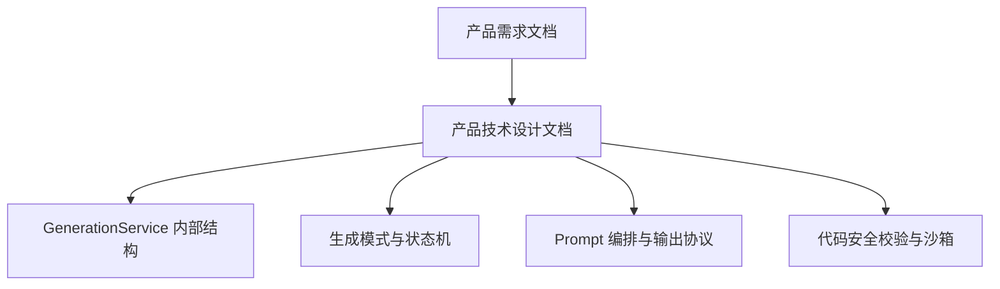
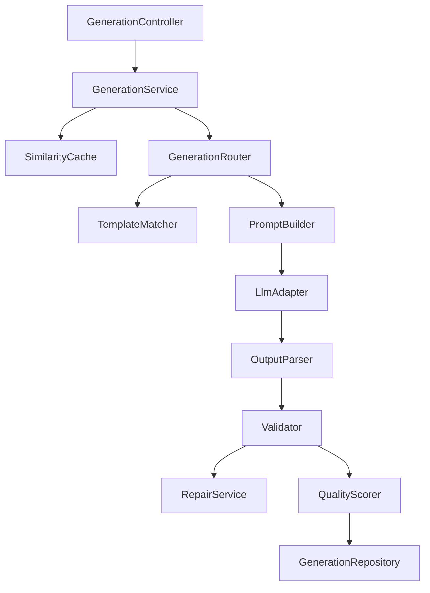
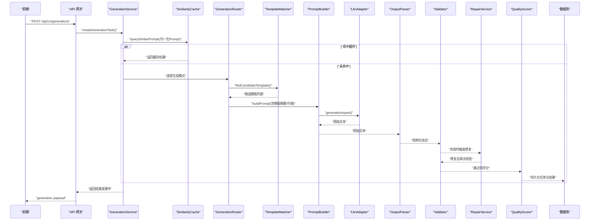
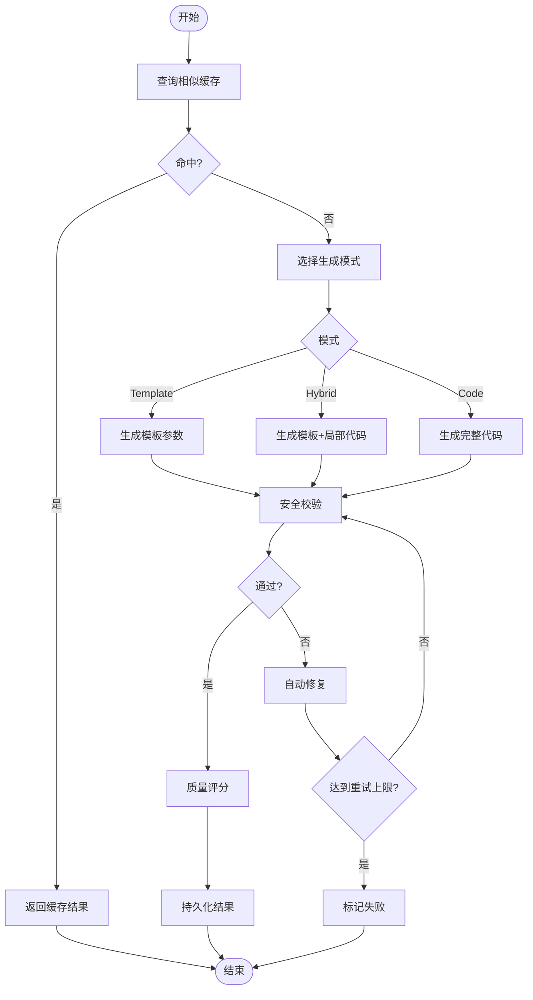
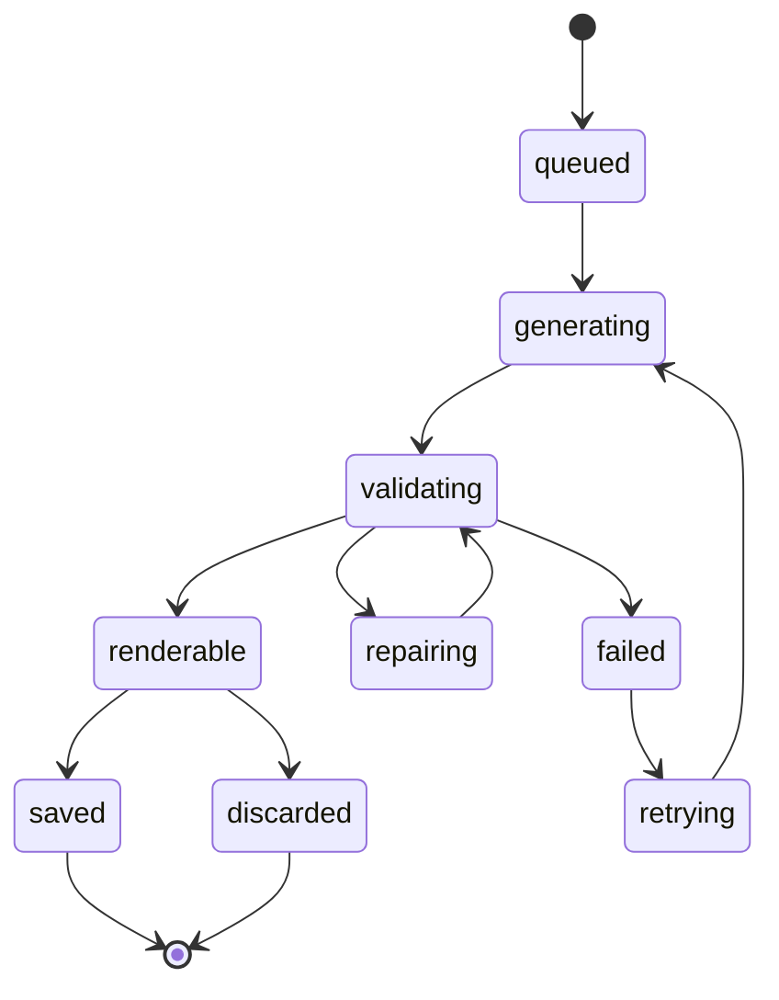
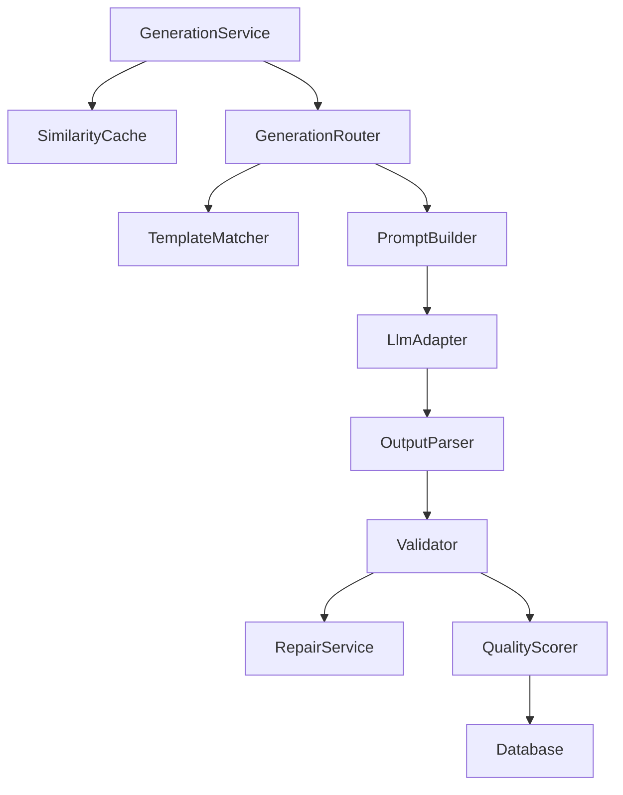

# 生成引擎设计

<cite>
**本文引用的文件**
- [产品技术设计文档](file://tech/product-technical-design.md)
- [产品需求文档](file://prd.md)
</cite>

## 目录
1. [引言](#引言)
2. [项目结构](#项目结构)
3. [核心组件](#核心组件)
4. [架构总览](#架构总览)
5. [详细组件分析](#详细组件分析)
6. [依赖关系分析](#依赖关系分析)
7. [性能考量](#性能考量)
8. [故障排查指南](#故障排查指南)
9. [结论](#结论)
10. [附录](#附录)

## 引言
本设计文档聚焦于 ApexForge 的“生成引擎”，围绕 GenerationService 的内部结构与调用链路展开，系统阐述以下关键能力：
- GenerationController 到 GenerationService 的调用链路
- SimilarityCache 相似性缓存机制
- GenerationRouter 生成路由策略
- TemplateMatcher 模板匹配算法
- PromptBuilder Prompt 构建器
- OutputParser 输出解析器
- Validator 安全校验器
- RepairService 自动修复服务
- QualityScorer 质量评分器
并详细说明四种生成模式（Template Mode、Code Mode、Hybrid Mode、Cache Mode）的选择逻辑与执行流程，包括状态机转换、错误处理策略与重试机制。

## 项目结构
当前仓库包含两份核心设计文档，用于定义平台级目标、架构、数据模型、API 与安全策略等。生成引擎的设计依据来源于这些文档中的“后端架构设计”、“生成链路设计”、“模板系统设计”等章节。

图表来源
- [产品技术设计文档:594-630](file://tech/product-technical-design.md#L594-L630)
- [产品技术设计文档:327-426](file://tech/product-technical-design.md#L327-L426)
- [产品技术设计文档:428-518](file://tech/product-technical-design.md#L428-L518)

章节来源
- [产品技术设计文档:594-630](file://tech/product-technical-design.md#L594-L630)
- [产品技术设计文档:327-426](file://tech/product-technical-design.md#L327-L426)
- [产品技术设计文档:428-518](file://tech/product-technical-design.md#L428-L518)

## 核心组件
本节从 GenerationService 内部结构出发，梳理各子组件的职责与交互关系。

- GenerationController：接收前端请求，创建生成任务并返回结果或事件流。
- GenerationService：编排整个生成流程，协调缓存、路由、提示词构建、LLM 调用、解析、校验、修复与评分。
- SimilarityCache：基于归一化 Prompt 的相似性检索与命中缓存，优先复用历史结果。
- GenerationRouter：根据任务上下文与偏好选择生成模式（Template/Code/Hybrid/Cache）。
- TemplateMatcher：对候选模板进行相似度与规则匹配，返回最佳模板及参数 Schema。
- PromptBuilder：组装 System Prompt、Few-shot 示例、模板摘要与约束，形成最终 LLM 输入。
- LlmAdapter：统一多供应商接口，负责实际推理调用与降级重试。
- OutputParser：将 LLM 返回文本解析为结构化协议（mode、templateId、params、code 等）。
- Validator：执行多层安全校验（协议、黑名单、AST、复杂度），产出验证报告。
- RepairService：在失败路径上尝试自动修复（如补全缺失字段、修正语法、回退模板）。
- QualityScorer：对可渲染结果进行多维评分（可渲染性、结构、Prompt 匹配度、性能等）。
- GenerationRepository：持久化任务、结果、版本与指标。

图表来源
- [产品技术设计文档:594-630](file://tech/product-technical-design.md#L594-L630)

章节来源
- [产品技术设计文档:594-630](file://tech/product-technical-design.md#L594-L630)

## 架构总览
整体生成链路从 API Gateway 进入 Generation Service，依次经过缓存、路由、提示词构建、LLM 调用、解析、校验、修复与评分，最终落库并向前端返回结果或事件。

图表来源
- [产品技术设计文档:359-391](file://tech/product-technical-design.md#L359-L391)
- [产品技术设计文档:594-630](file://tech/product-technical-design.md#L594-L630)

## 详细组件分析

### GenerationController 到 GenerationService 的调用链路
- 入口：REST 接口 POST /api/v1/generations，接收 projectId、prompt、category、mode、contextVersionId、preferences 等参数。
- 鉴权与限流：由 API 网关层完成，确保 traceId 贯穿全链路。
- 任务创建：GenerationController 调用 GenerationService.createGenerationTask()，初始化任务记录与状态。
- 事件推送：支持 SSE 事件队列，实时推送 queued、generating、validating、repairing、renderable、failed 等状态。

章节来源
- [产品技术设计文档:632-757](file://tech/product-technical-design.md#L632-L757)
- [产品技术设计文档:359-391](file://tech/product-technical-design.md#L359-L391)

### SimilarityCache 相似性缓存机制
- 输入：归一化后的 Prompt（去除空白、标准化大小写、同义词替换等）。
- 检索：使用向量或关键词索引计算相似度阈值（例如 >0.95），命中则直接返回历史结果。
- 存储：缓存键包含 category、mode、contextVersionId 等维度，避免跨域误用。
- 失效策略：当模板版本或 Prompt 版本变更时，相关缓存失效；支持 TTL 与容量上限。

章节来源
- [产品技术设计文档:327-339](file://tech/product-technical-design.md#L327-L339)
- [产品技术设计文档:359-391](file://tech/product-technical-design.md#L359-L391)

### GenerationRouter 生成路由策略
- 优先级推荐：Cache Mode → Template Mode → Hybrid Mode → Code Mode。
- 选择依据：
  - 是否命中相似缓存（Cache Mode）。
  - 是否存在高置信度候选模板（Template Mode）。
  - 是否需要模板+局部代码补充（Hybrid Mode）。
  - 否则回退至自由生成（Code Mode）。
- 决策因素：用户 mode 偏好、类别识别、模板匹配分数、历史成功率、成本与延迟预算。

章节来源
- [产品技术设计文档:327-339](file://tech/product-technical-design.md#L327-L339)
- [产品技术设计文档:594-630](file://tech/product-technical-design.md#L594-L630)

### TemplateMatcher 模板匹配算法
- 步骤：
  1) 对 Prompt 做类别识别与关键词抽取。
  2) 使用标签与向量检索找出候选模板。
  3) 结合模板元信息（category、tags、version、paramSchema）与 Prompt 语义相似度排序。
  4) 返回 Top-K 候选模板及其参数 Schema 与默认值。
- 分层模板：Skeleton、Style Variant、Detail Pack、Material Preset、Param Schema，便于组合与变体生成。

章节来源
- [产品技术设计文档:797-800](file://tech/product-technical-design.md#L797-L800)
- [产品技术设计文档:760-796](file://tech/product-technical-design.md#L760-L796)

### PromptBuilder Prompt 构建器
- System Prompt 要点：
  - 角色设定为资深 Three.js 程序化建模工程师。
  - 输出必须符合固定 JSON 协议。
  - 代码必须只暴露 buildModel(params, THREE) 或返回参数对象。
  - 禁止访问网络、DOM、全局对象、浏览器存储。
  - 几何体和材质必须在白名单范围内。
  - 限制模型复杂度、循环、递归和动态代码执行。
- Few-shot 示例：提供经典实现以稳定输出格式与风格。
- 版本管理：每次生成记录 promptVersion，System Prompt、Few-shot、模板摘要均版本化，支持快速回滚。

章节来源
- [产品技术设计文档:392-426](file://tech/product-technical-design.md#L392-L426)

### OutputParser 输出解析器
- 职责：将 LLM 返回的文本解析为结构化协议，包含 mode、templateId、params、code、explanation、warnings 等字段。
- 容错：对缺失字段进行默认填充或回退策略（如回退到 Template Mode 并仅生成 params）。
- 校验前置：在进入 Validator 前进行基础结构检查，减少后续开销。

章节来源
- [产品技术设计文档:403-418](file://tech/product-technical-design.md#L403-L418)
- [产品技术设计文档:594-630](file://tech/product-technical-design.md#L594-L630)

### Validator 安全校验器
- 校验分层：
  - 输出协议校验：确保 JSON、mode、字段结构正确。
  - 文本黑名单：快速阻断明显危险代码。
  - AST 校验：精确限制 API、语法和复杂度。
  - 运行时沙箱：客户端隔离执行环境。
  - 超时销毁：防止死循环和阻塞。
  - 结果校验：检查模型 JSON 和复杂度。
- 黑名单 API：动态执行、网络访问、DOM 访问、动态加载、原型污染、计算风险等。
- AST 白名单策略：允许的基础语法、THREE 白名单构造器与方法、复杂度限制（长度、深度、循环层数、Mesh 数量、顶点估算等）。

章节来源
- [产品技术设计文档:428-470](file://tech/product-technical-design.md#L428-L470)
- [产品技术设计文档:472-518](file://tech/product-technical-design.md#L472-L518)

### RepairService 自动修复服务
- 触发条件：Validator 失败且具备可修复的错误类型（如缺少必要字段、轻微语法问题、模板参数不合法）。
- 修复策略：
  - 补全缺失字段与默认值。
  - 修正语法与函数签名。
  - 回退到更保守的模板或模式。
  - 重新构建 Prompt 并二次调用 LLM。
- 重试上限：配置最大修复次数，超过则标记失败并上报。

章节来源
- [产品技术设计文档:340-357](file://tech/product-technical-design.md#L340-L357)
- [产品技术设计文档:594-630](file://tech/product-technical-design.md#L594-L630)

### QualityScorer 质量评分器
- 评分维度：
  - 可渲染分：模型能否被 ObjectLoader 成功反序列化。
  - 结构分：几何体组织、命名规范、层级合理性。
  - Prompt 匹配分：生成内容与用户意图的一致性。
  - 性能分：面数、顶点数、材质数量、内存占用预估。
- 输出：totalScore 与各分项 details，用于质量回归测试与人工审核筛选。

章节来源
- [产品技术设计文档:311-324](file://tech/product-technical-design.md#L311-L324)
- [产品技术设计文档:594-630](file://tech/product-technical-design.md#L594-L630)

### 四种生成模式的选择逻辑与执行流程
- Cache Mode：
  - 选择逻辑：归一化 Prompt 命中相似缓存。
  - 执行流程：直接返回缓存结果，跳过 LLM 调用。
- Template Mode：
  - 选择逻辑：存在高置信度候选模板。
  - 执行流程：生成模板参数对象，前端执行 render(templateId, params)。
- Hybrid Mode：
  - 选择逻辑：需要模板骨架 + 局部代码补充。
  - 执行流程：生成 templateId 与 code 片段，合并后校验与评分。
- Code Mode：
  - 选择逻辑：无合适模板或探索性生成。
  - 执行流程：生成完整 buildModel(params, THREE) 代码，严格校验与评分。

图表来源
- [产品技术设计文档:327-357](file://tech/product-technical-design.md#L327-L357)
- [产品技术设计文档:594-630](file://tech/product-technical-design.md#L594-L630)

章节来源
- [产品技术设计文档:327-357](file://tech/product-technical-design.md#L327-L357)
- [产品技术设计文档:594-630](file://tech/product-technical-design.md#L594-L630)

### 状态机转换
- 状态集合：queued、generating、validating、repairing、renderable、saved、discarded、failed、retrying。
- 转换规则：
  - queued → generating：开始生成。
  - generating → validating：生成完成进入校验。
  - validating → renderable：校验通过可渲染。
  - validating → repairing：校验失败进入修复。
  - repairing → validating：修复后再次校验。
  - validating → failed：多次修复仍失败。
  - renderable → saved：保存为资产。
  - renderable → discarded：丢弃结果。
  - failed → retrying：触发重试。
  - retrying → generating：重试生成。

图表来源
- [产品技术设计文档:340-357](file://tech/product-technical-design.md#L340-L357)

章节来源
- [产品技术设计文档:340-357](file://tech/product-technical-design.md#L340-L357)

### 错误处理策略与重试机制
- 错误分类：
  - SANDBOX_TIMEOUT：执行超时。
  - SANDBOX_RUNTIME_ERROR：运行时报错。
  - MODEL_JSON_INVALID：返回结构非法。
  - MODEL_TOO_COMPLEX：模型复杂度超限。
  - MODEL_EMPTY：未生成有效对象。
- 重试策略：
  - 自动修复最多 N 次（可配置）。
  - 失败后进入 retrying 状态，按模式降级或更换模板重试。
  - 记录错误码与详细信息，便于回归分析与人工介入。

章节来源
- [产品技术设计文档:508-518](file://tech/product-technical-design.md#L508-L518)
- [产品技术设计文档:340-357](file://tech/product-technical-design.md#L340-L357)

## 依赖关系分析
- 模块耦合：
  - GenerationService 作为编排中心，强依赖 SimilarityCache、GenerationRouter、PromptBuilder、LlmAdapter、OutputParser、Validator、RepairService、QualityScorer。
  - TemplateMatcher 受 Template 版本与 Schema 影响，需与 PromptBuilder 协同。
  - Validator 与沙箱执行相互独立但共同保障安全性。
- 外部依赖：
  - LLM 供应商（DeepSeek、Qwen 等）通过 LlmAdapter 抽象。
  - 数据库与缓存用于持久化与加速。
  - 前端沙箱 iframe 与 ObjectLoader 用于渲染与结果校验。

图表来源
- [产品技术设计文档:594-630](file://tech/product-technical-design.md#L594-L630)

章节来源
- [产品技术设计文档:594-630](file://tech/product-technical-design.md#L594-L630)

## 性能考量
- 缓存优先：相似 Prompt 命中直接返回，显著降低 LLM 调用与延迟。
- 模板模式：参数化生成仅需毫秒级，避免大模型推理。
- 前端优化：动态加载 Three.js、Worker 反序列化、InstancedMesh 批量渲染、LOD 与不可见暂停。
- 服务端优化：异步 I/O、队列与 Worker 分离、Redis 缓存与限流。

章节来源
- [产品技术设计文档:563-571](file://tech/product-technical-design.md#L563-L571)
- [产品技术设计文档:155-168](file://prd.md#L155-L168)

## 故障排查指南
- 常见问题定位：
  - 校验失败：查看 Validator 报告中的 blockedReasons 与 warnings，确认黑名单与 AST 限制。
  - 渲染异常：检查模型 JSON 合法性与复杂度指标，必要时降级模板或减少细节。
  - 超时错误：评估模型复杂度与线程占用，调整超时阈值或拆分生成。
- 日志与追踪：
  - 每个请求携带 traceId，记录从创建到完成的耗时与状态变化。
  - 质量评分详情用于回归测试与人工审核筛选。

章节来源
- [产品技术设计文档:632-757](file://tech/product-technical-design.md#L632-L757)
- [产品技术设计文档:311-324](file://tech/product-technical-design.md#L311-L324)

## 结论
ApexForge 的生成引擎以 GenerationService 为核心，通过缓存优先、模板驱动与严格安全校验的策略，实现了高质量、可控、可扩展的 3D 模型生成流水线。四种生成模式的灵活切换与状态机的稳健流转，配合自动修复与质量评分，确保了系统在稳定性与用户体验上的平衡。未来可在多供应商 LLM 调度、模板生态扩展与前端渲染优化方面持续演进。

## 附录
- API 参考：
  - 创建生成任务：POST /api/v1/generations
  - 查询生成任务：GET /api/v1/generations/{taskId}
  - 保存为资产：POST /api/v1/assets
  - 查询资产版本：GET /api/v1/assets/{assetId}/versions
  - 模板接口：GET/POST /api/v1/templates 系列
- 事件流：SSE 事件类型包括 queued、generating、validating、repairing、renderable、failed。

章节来源
- [产品技术设计文档:632-757](file://tech/product-technical-design.md#L632-L757)