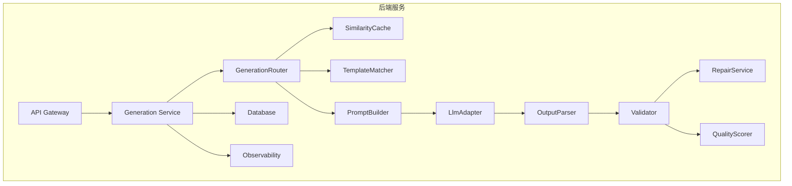
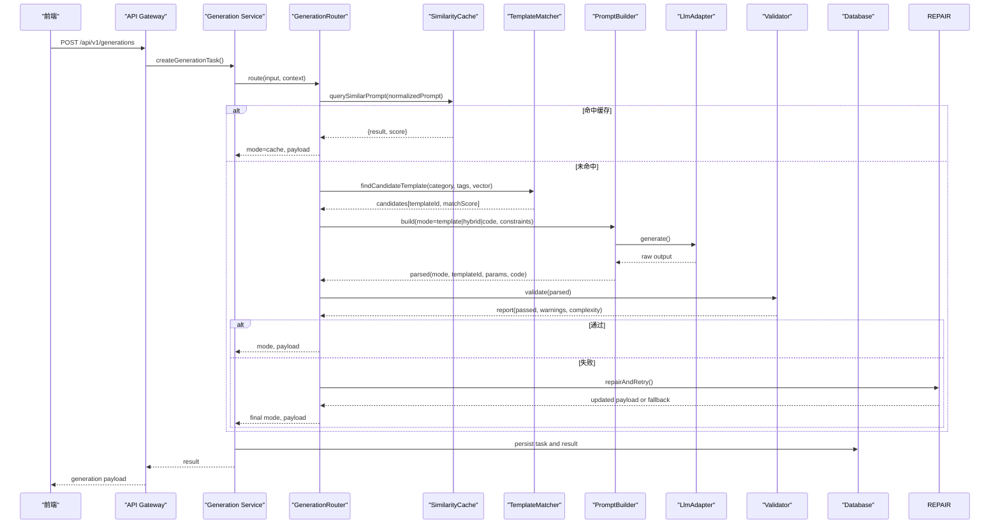
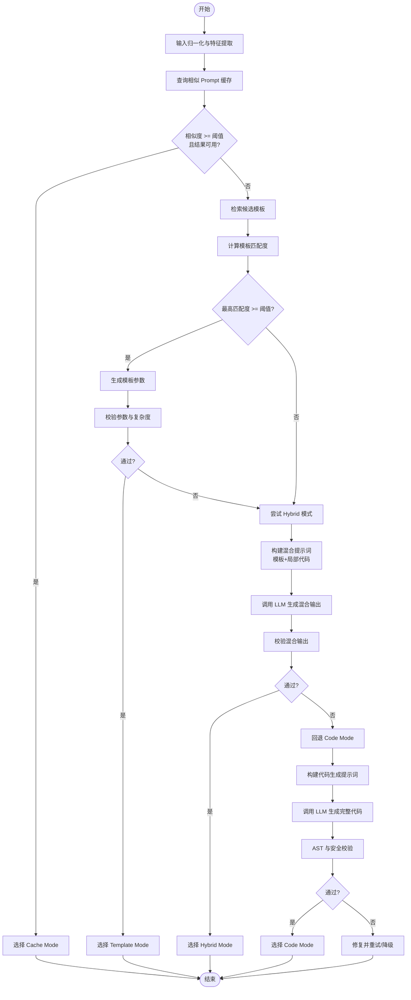
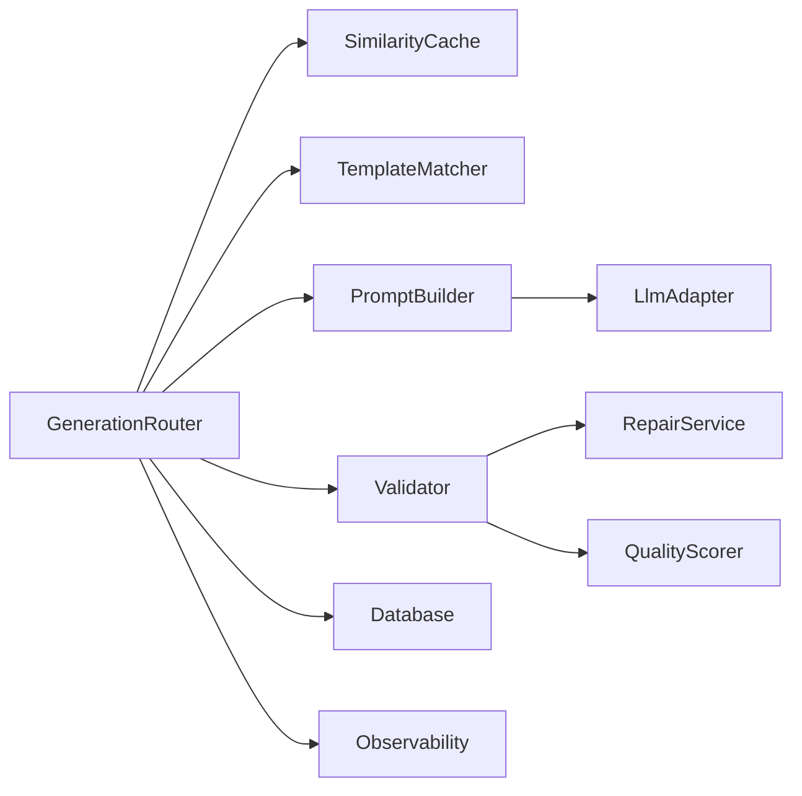

# 生成路由策略

<cite>
**本文引用的文件**   
- [产品技术设计文档](file://tech/product-technical-design.md)
- [产品需求文档](file://prd.md)
</cite>

## 目录
1. [引言](#引言)
2. [项目结构](#项目结构)
3. [核心组件](#核心组件)
4. [架构总览](#架构总览)
5. [详细组件分析](#详细组件分析)
6. [依赖关系分析](#依赖关系分析)
7. [性能考量](#性能考量)
8. [故障排查指南](#故障排查指南)
9. [结论](#结论)
10. [附录](#附录)

## 引言
本文件聚焦于 ApexForge 的“生成路由策略”，围绕 GenerationRouter 的实现原理与决策流程，系统阐述四种生成模式（Template Mode、Code Mode、Hybrid Mode、Cache Mode）的选择算法与执行路径。文档涵盖：
- 模式优先级判断逻辑
- 缓存命中率评估方法
- 模板匹配度计算思路
- 代码生成复杂度预估模型
- 路由决策树、权重配置与动态调整策略
- 具体配置示例与性能优化建议

## 项目结构
当前仓库包含产品与技术设计文档，用于定义平台级能力与实现路线。GenerationRouter 属于后端 Generation Service 内部模块，负责在创建生成任务后，依据输入上下文、历史数据与实时指标选择最优生成模式并编排后续流程。

图表来源
- [产品技术设计文档:594-610](file://tech/product-technical-design.md#L594-L610)

章节来源
- [产品技术设计文档:594-610](file://tech/product-technical-design.md#L594-L610)

## 核心组件
- GenerationController：接收前端请求，创建生成任务并返回 traceId。
- GenerationService：编排整体生成链路，协调缓存、路由、校验、评分等子模块。
- GenerationRouter：根据输入上下文与系统状态，决定采用 Cache/Template/Hybrid/Code 哪种模式。
- SimilarityCache：基于向量相似度或指纹哈希进行相似 Prompt 命中判定与结果复用。
- TemplateMatcher：从模板库检索候选模板，计算匹配度并输出推荐排序。
- PromptBuilder：组装 System Prompt、Few-shot 示例与约束，驱动 LLM 输出结构化结果。
- LlmAdapter：多供应商适配层，统一调用接口与降级策略。
- OutputParser：解析 LLM 输出为协议对象（mode、templateId、params、code 等）。
- Validator：对输出进行协议、黑名单、AST 白名单与复杂度检查。
- RepairService：失败修复与重试编排。
- QualityScorer：多维度质量评分，支撑反馈闭环与策略调优。

章节来源
- [产品技术设计文档:594-610](file://tech/product-technical-design.md#L594-L610)

## 架构总览
GenerationRouter 处于 Generation Service 的核心位置，承担“模式选择 + 参数准备”的职责。其输入包括用户 prompt、类别标签、偏好设置、历史任务与模板元信息；输出为最终选择的 mode 及对应执行所需的最小上下文（如 templateId、params、LLM 提示词等）。

图表来源
- [产品技术设计文档:359-391](file://tech/product-technical-design.md#L359-L391)
- [产品技术设计文档:594-610](file://tech/product-technical-design.md#L594-L610)

## 详细组件分析

### GenerationRouter 决策流程与算法
GenerationRouter 的目标是在保证安全与质量的前提下，优先选择成本更低、稳定性更高的模式。其决策遵循以下优先级顺序：
- Cache Mode：若相似 Prompt 命中且结果可用，直接复用。
- Template Mode：若存在高置信度模板匹配，则仅生成参数。
- Hybrid Mode：若模板可部分复用但需补充局部代码，则混合生成。
- Code Mode：当以上均不满足时，回退到完整代码生成。

#### 模式优先级判断逻辑
- 硬约束优先：安全校验失败、复杂度超限、模板不可用等情况会强制降级。
- 软约束加权：结合历史成功率、用户偏好、成本预算与延迟目标进行动态权衡。
- 阈值控制：模板匹配度、缓存相似度、复杂度上限均为可配置阈值。

#### 缓存命中率评估
- 输入归一化：去除空白、标准化大小写、同义词替换、单位换算等。
- 特征提取：关键词、实体、类别、风格标签、参数范围。
- 相似度度量：向量余弦相似度或编辑距离加权，设定命中阈值（例如 >0.95）。
- 结果可用性校验：检查上次结果的 AST 报告、质量分、沙箱执行是否成功。

#### 模板匹配度计算
- 候选召回：按 category/tags 过滤，再使用向量检索获取 Top-K。
- 匹配打分：综合语义相似度、标签重合度、示例 Prompt 覆盖度、历史成功率。
- 置信度阈值：低于阈值则放弃 Template Mode，进入 Hybrid 或 Code。

#### 代码生成复杂度预估
- 静态估算：基于 AST 深度、循环层数、几何体数量、材质数量、函数嵌套等。
- 运行时观测：沙箱预执行的耗时、内存峰值、Object3D 节点规模。
- 阈值策略：超过预设上限则拒绝或触发降级（如减少细节、切换模板）。

#### 路由决策树

图表来源
- [产品技术设计文档:329-338](file://tech/product-technical-design.md#L329-L338)
- [产品技术设计文档:594-610](file://tech/product-technical-design.md#L594-L610)

#### 权重配置与动态调整策略
- 权重维度
  - 稳定性权重：历史成功率、校验通过率、沙箱执行成功率。
  - 成本权重：模板/参数生成的成本显著低于全量代码生成。
  - 延迟权重：模板模式通常更快，适合低延迟场景。
  - 质量权重：质量评分与用户反馈影响长期策略。
- 动态调整
  - 在线学习：根据最近 N 次任务的 A/B 表现更新权重。
  - 熔断与回退：某模式连续失败超过阈值自动降级。
  - 配额与限流：结合套餐与配额限制，避免高成本模式滥用。

章节来源
- [产品技术设计文档:329-338](file://tech/product-technical-design.md#L329-L338)
- [产品技术设计文档:594-610](file://tech/product-technical-design.md#L594-L610)

### 缓存子系统（SimilarityCache）
- 功能职责
  - 存储 normalizedPrompt 与其对应的生成结果摘要与质量指标。
  - 提供相似度查询与 TTL 管理。
- 关键指标
  - 命中率：命中次数/总查询次数。
  - 平均响应时间：命中时的端到端延迟。
  - 结果有效性：AST 通过、质量分达标、沙箱执行成功。
- 优化建议
  - 分层缓存：热点 Prompt 常驻内存，长尾落盘。
  - 增量更新：新结果到达后异步刷新缓存索引。
  - 去重策略：对等价 Prompt 合并，降低冗余。

章节来源
- [产品技术设计文档:359-391](file://tech/product-technical-design.md#L359-L391)

### 模板匹配器（TemplateMatcher）
- 功能职责
  - 基于类别、标签与向量检索召回候选模板。
  - 计算匹配度并输出排序列表。
- 匹配度要素
  - 语义相似度：Prompt 与模板描述/示例的向量距离。
  - 标签重合度：category、tags 的交集比例。
  - 历史成功率：该模板在同类 Prompt 下的成功率。
  - 复杂度可控性：模板默认参数与边界是否满足复杂度上限。
- 输出契约
  - 返回 Top-K 模板及其 matchScore、confidence、recommendedParams。

章节来源
- [产品技术设计文档:797-804](file://tech/product-technical-design.md#L797-L804)

### 提示词编排（PromptBuilder）
- 功能职责
  - 根据选定模式组装 System Prompt、约束与 Few-shot 示例。
  - 注入模板摘要、参数 Schema 与编码规范。
- 版本管理
  - 每次生成记录 promptVersion，支持回滚与回归测试。
- 输出协议
  - 固定 JSON 协议，包含 mode、templateId、params、code、explanation、warnings。

章节来源
- [产品技术设计文档:392-425](file://tech/product-technical-design.md#L392-L425)

### 校验与修复（Validator & RepairService）
- 校验分层
  - 输出协议校验、文本黑名单、AST 白名单、复杂度限制、运行时沙箱、结果校验。
- 修复策略
  - 自动修复：补全缺失字段、修正语法错误、简化复杂结构。
  - 降级策略：从 Code 回退至 Hybrid 或 Template，必要时回退至 Code 重新生成。
- 质量评分
  - 可渲染性、Prompt 匹配度、结构完整性、性能表现、可编辑性。

章节来源
- [产品技术设计文档:428-470](file://tech/product-technical-design.md#L428-L470)
- [产品技术设计文档:807-841](file://tech/product-technical-design.md#L807-L841)

### 多供应商 LLM 适配（LlmAdapter）
- 统一接口
  - provider、generate、stream（可选）。
- 选择策略
  - 按任务类型选择模型、按成本与速度选择供应商、失败重试与降级。
- 观测指标
  - token 用量、耗时、错误码、输出质量。

章节来源
- [产品技术设计文档:611-629](file://tech/product-technical-design.md#L611-L629)

## 依赖关系分析
GenerationRouter 与周边模块的耦合关系如下：
- 强依赖：SimilarityCache、TemplateMatcher、PromptBuilder、Validator。
- 弱依赖：LlmAdapter（仅在需要生成时调用）、QualityScorer（事后评估）。
- 外部依赖：数据库（持久化任务与结果）、可观测性（traceId、日志、指标）。

图表来源
- [产品技术设计文档:594-610](file://tech/product-technical-design.md#L594-L610)

章节来源
- [产品技术设计文档:594-610](file://tech/product-technical-design.md#L594-L610)

## 性能考量
- 缓存优先：相似 Prompt 命中可直接复用，显著降低 LLM 调用与校验开销。
- 模板优先：模板模式仅需参数生成，速度快、稳定性高。
- 复杂度控制：AST 与运行时双重限制，避免浏览器卡顿与超时。
- 异步化：生成任务队列化，避免 HTTP 长连接占用。
- 资源隔离：iframe 沙箱隔离执行环境，防止主线程阻塞。

章节来源
- [产品技术设计文档:933-958](file://tech/product-technical-design.md#L933-L958)

## 故障排查指南
- 常见错误分类
  - SANDBOX_TIMEOUT：执行超时，可能因模型过于复杂。
  - SANDBOX_RUNTIME_ERROR：运行时报错，可重试或降级。
  - MODEL_JSON_INVALID：返回结构非法，系统将重新生成。
  - MODEL_TOO_COMPLEX：复杂度超限，建议降低细节或使用模板模式。
  - MODEL_EMPTY：未生成有效对象，需补充描述。
- 排查步骤
  - 查看 traceId 定位全链路日志。
  - 检查 Validator 报告中的 blockedReasons 与 warnings。
  - 确认模板匹配度与缓存命中率是否异常。
  - 观察 LLM 供应商延迟与错误码，必要时切换供应商。
  - 前端沙箱执行日志与 ObjectLoader 反序列化结果。

章节来源
- [产品技术设计文档:508-517](file://tech/product-technical-design.md#L508-L517)

## 结论
GenerationRouter 以“稳定优先、成本可控、质量可测”为原则，通过缓存命中、模板匹配与复杂度预估等多维信号，动态选择最优生成模式。配合 Prompt 版本管理与质量评分闭环，可在不同业务阶段持续优化路由策略，提升生成成功率与用户体验。

## 附录

### 配置示例（示意）
以下为 GenerationRouter 的关键配置项说明（值仅为示例，实际部署应通过配置中心管理）：
- 缓存相似度阈值：0.95
- 模板匹配度阈值：0.85
- 最大 AST 深度：30
- 最大 Mesh 数量：80
- 最大循环层数：2
- 最大代码长度：20KB
- 沙箱超时：5000ms
- 模板模式成功率目标：>90%
- 供应商降级策略：失败重试 2 次，超时切换备用供应商

章节来源
- [产品技术设计文档:452-470](file://tech/product-technical-design.md#L452-L470)
- [产品技术设计文档:933-958](file://tech/product-technical-design.md#L933-L958)

### 相关流程图参考
- 生成链路时序图（含缓存、模板、LLM、校验、保存）
- 沙箱执行流程（postMessage、ObjectLoader、超时销毁）
- 质量评分闭环（评分、反馈、分析与回归）

章节来源
- [产品技术设计文档:359-391](file://tech/product-technical-design.md#L359-L391)
- [产品技术设计文档:478-507](file://tech/product-technical-design.md#L478-L507)
- [产品技术设计文档:830-841](file://tech/product-technical-design.md#L830-L841)