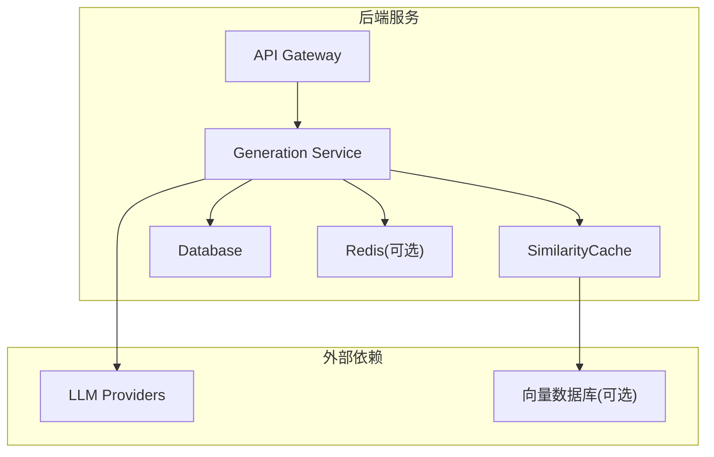
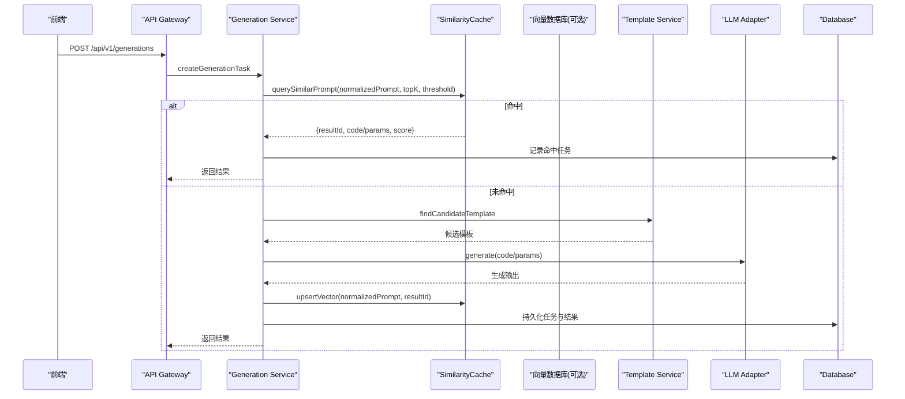
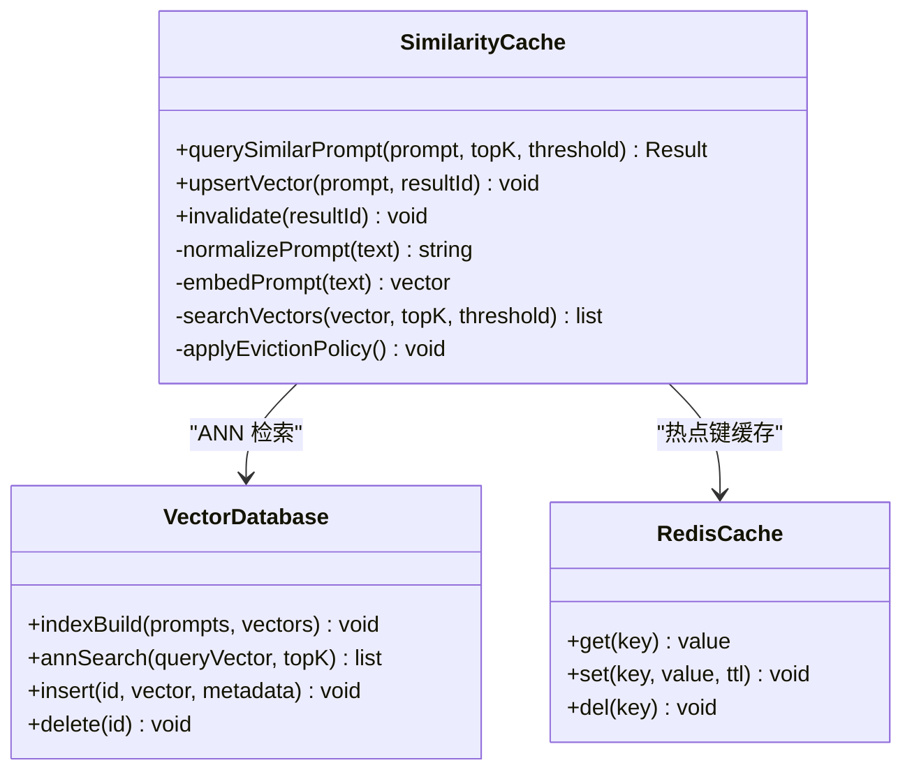
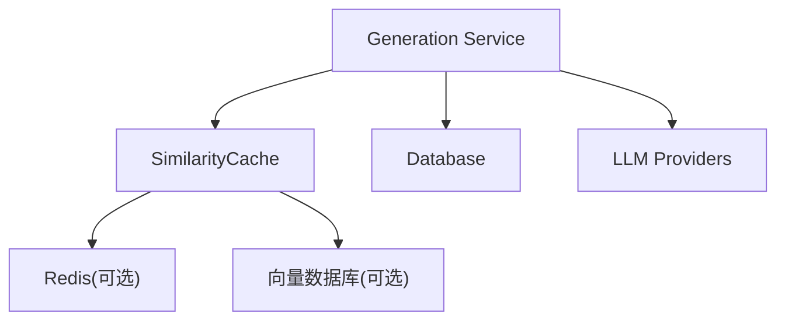

# 相似性缓存机制

<cite>
**本文引用的文件**
- [产品技术设计文档](file://tech/product-technical-design.md)
- [产品需求文档](file://prd.md)
</cite>

## 目录
1. [引言](#引言)
2. [项目结构](#项目结构)
3. [核心组件](#核心组件)
4. [架构总览](#架构总览)
5. [详细组件分析](#详细组件分析)
6. [依赖关系分析](#依赖关系分析)
7. [性能考量](#性能考量)
8. [故障排查指南](#故障排查指南)
9. [结论](#结论)
10. [附录](#附录)

## 引言
本章节聚焦 ApexForge 的“相似性缓存机制”，围绕 SimilarityCache 的设计与实现展开，覆盖 Prompt 向量化、相似度计算算法、缓存策略优化、向量数据库选型与索引构建、查询性能调优、缓存失效策略、数据同步与一致性保证，以及配置方法与自定义相似度算法集成方式。该机制用于在生成链路中快速命中“语义相近”的历史结果，从而减少 LLM 调用、降低延迟与成本，并提升系统吞吐能力。

## 项目结构
当前仓库包含产品与技术设计文档，未包含具体代码实现。因此，本节仅基于文档中的模块划分与部署形态进行说明，后续章节将结合这些模块定位 SimilarityCache 的位置与交互边界。

图表来源
- [产品技术设计文档:38-62](file://tech/product-technical-design.md#L38-L62)
- [产品技术设计文档:694-700](file://tech/product-technical-design.md#L694-L700)
- [产品技术设计文档:944-951](file://tech/product-technical-design.md#L944-L951)

章节来源
- [产品技术设计文档:38-62](file://tech/product-technical-design.md#L38-L62)
- [产品技术设计文档:694-700](file://tech/product-technical-design.md#694-L700)
- [产品技术设计文档:944-951](file://tech/product-technical-design.md#L944-L951)

## 核心组件
- SimilarityCache：负责 Prompt 归一化、向量化、相似度检索、缓存写入与读取、过期与淘汰管理。
- GenerationService：生成编排服务，在创建任务后优先查询 SimilarityCache，命中则直接复用结果；未命中则走模板匹配或 LLM 生成。
- Vector Database（可选）：存储 Prompt 向量与元数据，提供近似最近邻搜索（ANN）。
- Redis（可选）：作为热点键缓存层，加速高频相似请求的响应。
- Database：持久化生成任务、资产、版本等结构化数据。

章节来源
- [产品技术设计文档:594-609](file://tech/product-technical-design.md#L594-L609)
- [产品技术设计文档:944-951](file://tech/product-technical-design.md#L944-L951)

## 架构总览
相似性缓存位于 GenerationService 与外部存储之间，形成“先查缓存、再走生成”的短路路径。整体流程如下：

图表来源
- [产品技术设计文档:361-390](file://tech/product-technical-design.md#L361-L390)
- [产品技术设计文档:594-609](file://tech/product-technical-design.md#L594-L609)

## 详细组件分析

### SimilarityCache 设计与实现要点
- 输入预处理与归一化
  - 去除多余空白、统一大小写、标准化标点、移除无关修饰词，保留关键实体与意图。
  - 可选：同义词替换、领域词典映射、类别标签注入，以提升召回稳定性。
- Prompt 向量化
  - 使用文本嵌入模型将归一化后的 Prompt 转为固定维度向量。
  - 建议对向量做 L2 归一化，便于余弦相似度计算。
- 相似度计算与阈值策略
  - 采用余弦相似度或内积距离（取决于向量是否归一化）。
  - 设置动态阈值：按业务场景调整（如严格模式 0.95，宽松模式 0.85），支持按用户等级或套餐差异化。
- 缓存写入与更新
  - 当生成成功且通过校验后，将 normalizedPrompt 与 resultId 写入向量库。
  - 支持幂等写入：相同 normalizedPrompt 多次写入不重复建索引。
- 缓存读取与降级
  - 先查 Redis 热点键（normalizedPrompt -> resultId），再查向量库。
  - 若向量库不可用，回退到精确字符串匹配或跳过缓存。
- 过期与淘汰
  - 基于时间衰减：长时间未命中的条目逐步降权或清理。
  - 基于质量评分：低分结果降低命中率权重或提前淘汰。
  - 基于容量上限：LRU/LFU 淘汰策略，控制向量库规模。
- 一致性保障
  - 最终一致性：缓存写入异步执行，允许短暂不一致。
  - 冲突解决：以最新 resultId 为准，避免旧结果覆盖新结果。
  - 幂等与去重：写入前检查是否存在更高置信度或更新的条目。

章节来源
- [产品技术设计文档:944-951](file://tech/product-technical-design.md#L944-L951)
- [产品技术设计文档:594-609](file://tech/product-technical-design.md#L594-L609)

#### 类图（概念映射）

图表来源
- [产品技术设计文档:594-609](file://tech/product-technical-design.md#L594-L609)
- [产品技术设计文档:944-951](file://tech/product-technical-design.md#L944-L951)

### 向量数据库选型与索引构建
- 选型建议
  - 轻量级：Milvus Lite、Chroma、FAISS（内存/本地磁盘），适合 MVP 与单机部署。
  - 企业级：Milvus、Weaviate、Qdrant、Elasticsearch kNN，适合高并发与分布式扩展。
- 索引类型
  - HNSW：高精度、高召回，适合中小规模与实时查询。
  - IVF-PQ：大规模数据压缩与高效检索，适合海量历史 Prompt。
  - DiskANN：磁盘友好型，适合冷数据归档与低成本存储。
- 索引构建参数
  - M、efConstruction（HNSW）、nlist/nprobe（IVF）、quantization（PQ）等需根据数据量与延迟目标调优。
- 元数据设计
  - 保存 normalizedPrompt、resultId、score、createdAt、updatedAt、qualityScore、mode 等字段，便于过滤与审计。

章节来源
- [产品技术设计文档:944-951](file://tech/product-technical-design.md#L944-L951)

### 查询性能调优
- 分层缓存
  - L1：进程内内存缓存（短 TTL，极热键）。
  - L2：Redis 热点键（中等 TTL，跨实例共享）。
  - L3：向量数据库 ANN 检索（长尾查询）。
- 批量与批处理
  - 合并短时间窗口内的相似查询，减少重复索引构建与写入。
- 预取与预热
  - 对热门模板与常见 Prompt 类别预加载向量索引。
- 连接池与超时
  - 合理设置向量库连接池、读写超时与重试策略，避免雪崩。
- 监控与告警
  - 监控命中率、延迟分布、索引构建耗时、内存占用与错误率。

章节来源
- [产品技术设计文档:944-951](file://tech/product-technical-design.md#L944-L951)

### 缓存失效策略与数据同步
- 失效触发
  - 时间到期：TTL 过期自动失效。
  - 质量回滚：质量评分低于阈值时主动失效。
  - 版本变更：模板或 Prompt 版本升级导致旧结果失效。
- 数据同步
  - 生成成功后异步写入向量库与 Redis。
  - 失败或校验不通过不写入缓存。
  - 支持增量同步与断点续传，确保最终一致性。
- 一致性保证
  - 幂等写入与去重。
  - 冲突时以最新版本为准。
  - 可观测性：记录写入延迟与失败重试次数。

章节来源
- [产品技术设计文档:594-609](file://tech/product-technical-design.md#L594-L609)
- [产品技术设计文档:944-951](file://tech/product-technical-design.md#L944-L951)

### 缓存配置与自定义相似度算法集成
- 配置项建议
  - similarity.threshold：相似度阈值（默认 0.95）。
  - similarity.topK：候选数量（默认 5）。
  - cache.redis.ttl：Redis 缓存过期时间（秒）。
  - cache.vector.indexType：索引类型（HNSW/IVF-PQ/DiskANN）。
  - cache.eviction.policy：淘汰策略（LRU/LFU/TTL）。
  - cache.embedding.model：嵌入模型标识与版本。
- 自定义相似度算法集成
  - 定义相似度接口：输入两个向量或文本，输出相似度分数。
  - 支持多策略混合：余弦 + 编辑距离 + 类别匹配加权。
  - 在线切换与 A/B 测试：通过配置开关切换不同算法。
  - 评估指标：命中率、P@K、NDCG、延迟与资源占用。

章节来源
- [产品技术设计文档:944-951](file://tech/product-technical-design.md#L944-L951)

## 依赖关系分析
- 耦合与内聚
  - SimilarityCache 与 GenerationService 松耦合，通过接口交互。
  - 向量数据库与 Redis 为可选依赖，具备降级与回退能力。
- 外部依赖
  - LLM 供应商：仅在缓存未命中时调用。
  - 数据库：持久化任务与结果，供审计与回溯。
- 潜在循环依赖
  - 无直接循环依赖；缓存写入由生成完成后异步触发。

图表来源
- [产品技术设计文档:594-609](file://tech/product-technical-design.md#L594-L609)
- [产品技术设计文档:944-951](file://tech/product-technical-design.md#L944-L951)

章节来源
- [产品技术设计文档:594-609](file://tech/product-technical-design.md#L594-L609)
- [产品技术设计文档:944-951](file://tech/product-technical-design.md#L944-L951)

## 性能考量
- 前端优化
  - 模型加载前复杂度检查、Worker 解析大 JSON、InstancedMesh 渲染。
- 后端优化
  - 相似 Prompt 缓存、模板模式跳过 LLM、任务异步化、供应商熔断与限流。
- 数据库优化
  - 关键索引、大字段迁移对象存储、历史归档。

章节来源
- [产品技术设计文档:933-958](file://tech/product-technical-design.md#L933-L958)

## 故障排查指南
- 常见问题
  - 缓存未命中率高：检查归一化规则与阈值设置。
  - 向量库延迟过高：调整索引参数与连接池，启用分层缓存。
  - 一致性异常：确认幂等写入与冲突解决逻辑。
  - 内存溢出：限制缓存规模与淘汰策略。
- 监控指标
  - 命中率、P95/P99 延迟、写入失败率、索引构建耗时、内存与 CPU 占用。
- 日志与追踪
  - traceId 贯穿全链路，记录缓存查询与写入的关键步骤。

章节来源
- [产品技术设计文档:868-907](file://tech/product-technical-design.md#L868-L907)
- [产品技术设计文档:944-951](file://tech/product-technical-design.md#L944-L951)

## 结论
相似性缓存机制通过 Prompt 归一化、向量化与 ANN 检索，显著降低 LLM 调用成本与延迟，同时保持生成质量与一致性。通过分层缓存、动态阈值、淘汰策略与可观测性体系，可在不同规模下稳定运行。未来可引入更丰富的相似度算法与多模态特征，进一步提升召回精度与用户体验。

## 附录
- 术语
  - normalizedPrompt：归一化后的 Prompt 文本。
  - resultId：生成结果的唯一标识。
  - topK：相似度检索返回的候选数量。
  - threshold：相似度阈值，决定是否命中缓存。
- 参考接口
  - 创建生成任务：POST /api/v1/generations
  - 查询生成任务：GET /api/v1/generations/{taskId}
  - 保存为资产：POST /api/v1/assets
  - 查询资产版本：GET /api/v1/assets/{assetId}/versions

章节来源
- [产品技术设计文档:654-722](file://tech/product-technical-design.md#L654-L722)