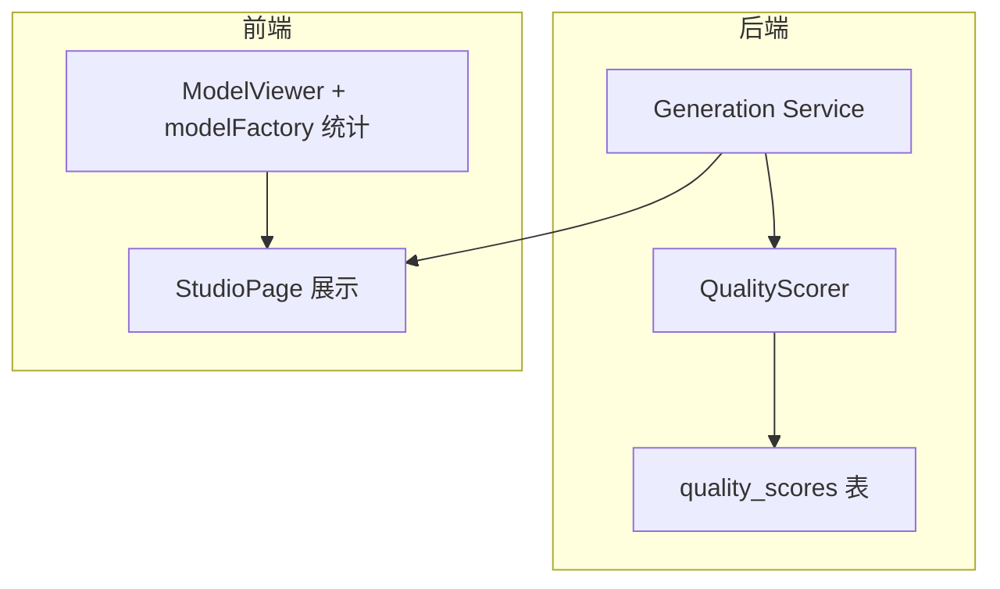
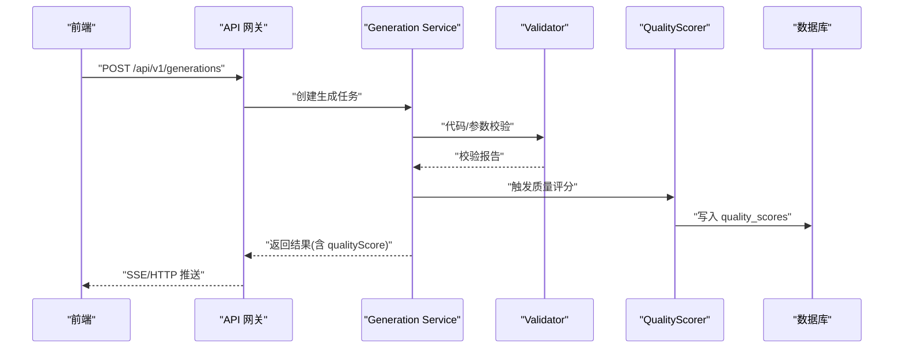
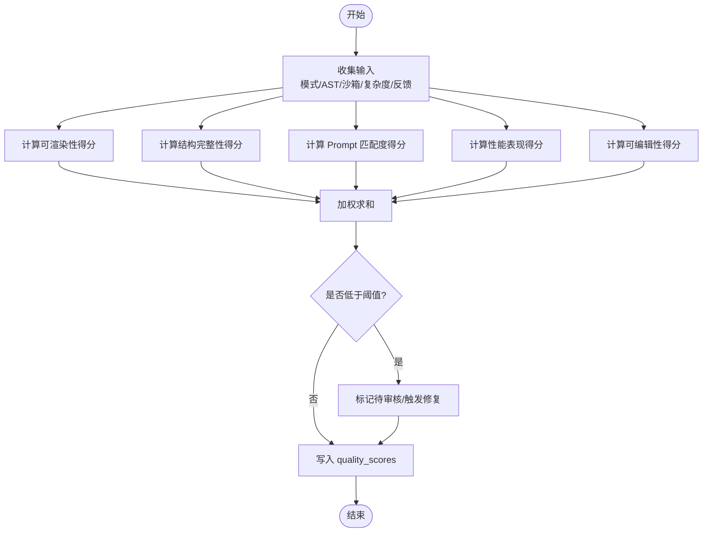
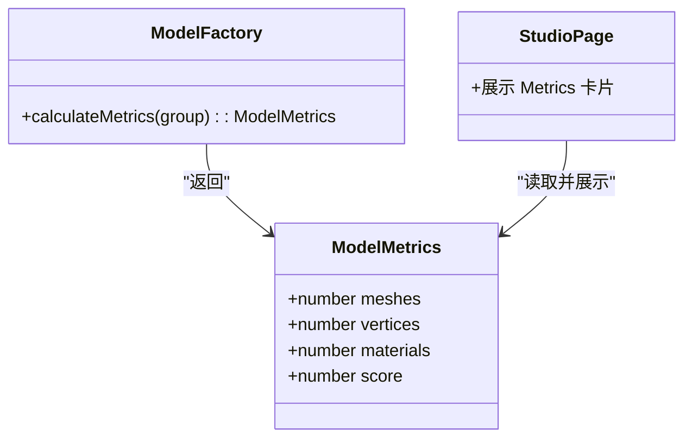
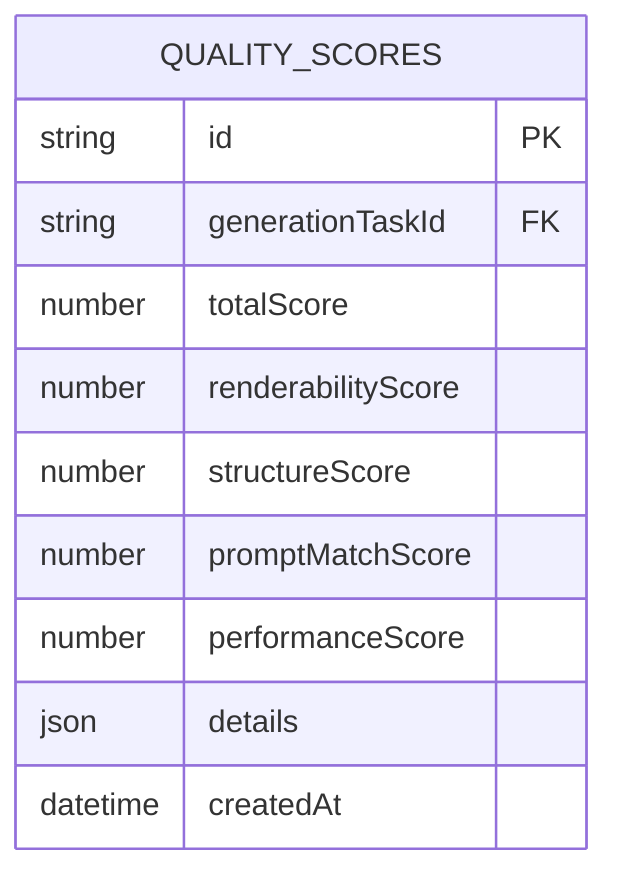
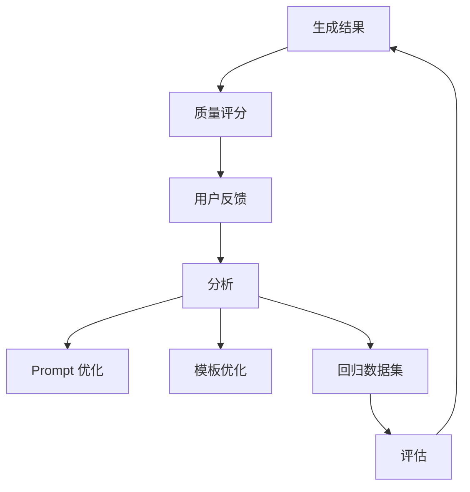
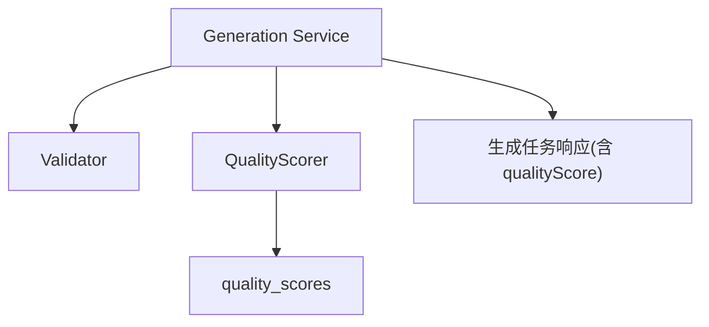

# 质量评分系统

<cite>
**本文引用的文件**   
- [产品技术设计文档](file://tech/product-technical-design.md)
- [产品需求文档](file://prd.md)
- [类型定义 generation.ts](file://src/shared/types/generation.ts)
- [模型工厂与指标计算 modelFactory.ts](file://src/modules/viewer/utils/modelFactory.ts)
- [工作室页面 StudioPage.tsx](file://src/modules/studio/pages/StudioPage.tsx)
</cite>

## 目录
1. [引言](#引言)
2. [项目结构](#项目结构)
3. [核心组件](#核心组件)
4. [架构总览](#架构总览)
5. [详细组件分析](#详细组件分析)
6. [依赖关系分析](#依赖关系分析)
7. [性能考量](#性能考量)
8. [故障排查指南](#故障排查指南)
9. [结论](#结论)
10. [附录](#附录)

## 引言
本文件面向 ApexForge 的质量评分系统，聚焦 QualityScorer 的评分算法、多维度评分模型、权重配置与阈值设置，并覆盖评分结果可视化、趋势分析与质量回归检测。同时提供评分规则定制与质量优化建议，帮助团队在“可渲染性、结构完整性、Prompt 匹配度、性能表现”等维度持续改进生成质量。

## 项目结构
质量评分体系贯穿后端生成链路、前端展示与数据持久化：
- 后端：Generation Service 调用 QualityScorer，产出 quality_scores 记录，供后续分析与回测使用。
- 前端：Studio 侧以卡片形式展示 Mesh、Vertices、Materials、Score 等关键指标；Viewer 侧通过遍历场景树统计几何体与材质数量。
- 数据：quality_scores 表包含总分与各维度分，details 字段承载评分详情，便于回溯与可视化。

图表来源
- [产品技术设计文档:606-609](file://tech/product-technical-design.md#L606-L609)
- [工作室页面 StudioPage.tsx:171-185](file://src/modules/studio/pages/StudioPage.tsx#L171-L185)
- [模型工厂与指标计算 modelFactory.ts:43-59](file://src/modules/viewer/utils/modelFactory.ts#L43-L59)

章节来源
- [产品技术设计文档:606-609](file://tech/product-technical-design.md#L606-L609)
- [工作室页面 StudioPage.tsx:171-185](file://src/modules/studio/pages/StudioPage.tsx#L171-L185)
- [模型工厂与指标计算 modelFactory.ts:43-59](file://src/modules/viewer/utils/modelFactory.ts#L43-L59)

## 核心组件
- QualityScorer（服务端）
  - 输入：生成模式、AST 校验报告、沙箱执行结果、模型复杂度指标、用户反馈等。
  - 输出：totalScore 及各维度分数（renderabilityScore、structureScore、promptMatchScore、performanceScore），以及 details 明细。
- 指标采集（前端）
  - calculateMetrics 遍历 Group 树，统计 meshes、vertices、materials，并给出一个基于 mesh 数量的近似 score。
- 数据模型
  - quality_scores 表：保存 totalScore 与各维度分，details 用于存储评分细节，支持趋势分析与回归检测。
- 可视化
  - StudioPage 以卡片网格展示 Mesh、Vertices、Materials、Score，便于快速感知质量。

章节来源
- [产品技术设计文档:311-324](file://tech/product-technical-design.md#L311-L324)
- [产品技术设计文档:807-841](file://tech/product-technical-design.md#L807-L841)
- [类型定义 generation.ts:5-10](file://src/shared/types/generation.ts#L5-L10)
- [模型工厂与指标计算 modelFactory.ts:43-59](file://src/modules/viewer/utils/modelFactory.ts#L43-L59)
- [工作室页面 StudioPage.tsx:171-185](file://src/modules/studio/pages/StudioPage.tsx#L171-L185)

## 架构总览
质量评分在生成链路中的位置如下：
- Generation Service 编排生成流程，完成后调用 Validator 与 QualityScorer。
- QualityScorer 聚合 AST 校验、沙箱执行、模型复杂度、模板命中等信息，计算多维分数。
- 结果写入 quality_scores，并随任务结果返回给前端。

图表来源
- [产品技术设计文档:361-390](file://tech/product-technical-design.md#L361-L390)
- [产品技术设计文档:606-609](file://tech/product-technical-design.md#L606-L609)
- [产品技术设计文档:689-695](file://tech/product-technical-design.md#L689-L695)

## 详细组件分析

### QualityScorer 评分算法
- 输入要素
  - 生成模式与模板命中情况（template/code/hybrid/cache）。
  - AST 校验结果（是否通过、阻断原因、警告、复杂度摘要）。
  - 沙箱执行结果（成功/失败、错误码、超时）。
  - 模型复杂度指标（meshes、vertices、materials、边界盒尺寸、空模型检测）。
  - 用户反馈与保存行为（满意/不满意/违规、是否保存为资产）。
- 维度与权重（默认）
  - 可渲染性：30%
  - Prompt 匹配度：25%
  - 结构完整性：20%
  - 性能表现：15%
  - 可编辑性：10%
- 评分细则（示例）
  - 可渲染性：沙箱执行成功且返回有效 Object3D 得高分；若为空模型或 JSON 非法则扣分。
  - Prompt 匹配度：结合类别识别、关键词命中与解释文本一致性进行打分。
  - 结构完整性：主体部件存在性、比例合理性、对称性等启发式规则。
  - 性能表现：mesh/vertices/materials 越接近目标区间得分越高，超限则扣分。
  - 可编辑性：模板命中、参数 Schema 完整、代码结构化程度。
- 总分计算
  - totalScore = Σ(维度得分 × 对应权重)，保留一位小数。
- 阈值与策略
  - 低分拦截：低于阈值的结果进入人工审核或自动修复流程。
  - 回归检测：对比历史同 Prompt 版本或同类别基线，出现显著下降时告警。

图表来源
- [产品技术设计文档:807-841](file://tech/product-technical-design.md#L807-L841)
- [产品技术设计文档:311-324](file://tech/product-technical-design.md#L311-L324)

章节来源
- [产品技术设计文档:807-841](file://tech/product-technical-design.md#L807-L841)
- [产品技术设计文档:311-324](file://tech/product-technical-design.md#L311-L324)

### 前端指标采集与可视化
- 指标采集
  - calculateMetrics 遍历 THREE.Group，统计 meshes、vertices、materials，并按 mesh 数量映射到 72~96 的近似 score。
- 可视化呈现
  - StudioPage 以卡片网格展示当前模型的 Mesh、Vertices、Materials、Score，便于即时评估。
- 与后端联动
  - 前端展示的 metrics.score 可作为 quick-score，最终 totalScore 由后端 QualityScorer 计算并持久化。

图表来源
- [类型定义 generation.ts:5-10](file://src/shared/types/generation.ts#L5-L10)
- [模型工厂与指标计算 modelFactory.ts:43-59](file://src/modules/viewer/utils/modelFactory.ts#L43-L59)
- [工作室页面 StudioPage.tsx:171-185](file://src/modules/studio/pages/StudioPage.tsx#L171-L185)

章节来源
- [类型定义 generation.ts:5-10](file://src/shared/types/generation.ts#L5-L10)
- [模型工厂与指标计算 modelFactory.ts:43-59](file://src/modules/viewer/utils/modelFactory.ts#L43-L59)
- [工作室页面 StudioPage.tsx:171-185](file://src/modules/studio/pages/StudioPage.tsx#L171-L185)

### 数据模型与持久化
- quality_scores 表字段
  - id、generationTaskId、totalScore、renderabilityScore、structureScore、promptMatchScore、performanceScore、details、createdAt。
- 用途
  - 支撑质量看板、趋势分析、回归检测与 Prompt/模板优化闭环。

图表来源
- [产品技术设计文档:311-324](file://tech/product-technical-design.md#L311-L324)

章节来源
- [产品技术设计文档:311-324](file://tech/product-technical-design.md#L311-L324)

### 质量闭环与回归检测
- 闭环路径
  - 生成结果 → 质量评分 → 用户反馈 → 分析 → Prompt/模板优化 → 回归数据集 → 评估 → 新一轮生成。
- 回归检测
  - 按 Prompt 版本与类别建立基线，当 totalScore 或关键维度显著下降时触发告警与回滚。

图表来源
- [产品技术设计文档:828-841](file://tech/product-technical-design.md#L828-L841)

章节来源
- [产品技术设计文档:828-841](file://tech/product-technical-design.md#L828-L841)

## 依赖关系分析
- 模块耦合
  - Generation Service 依赖 Validator 与 QualityScorer；QualityScorer 依赖 AST 校验、沙箱执行、复杂度统计与反馈数据。
- 外部依赖
  - LLM 供应商、缓存、队列、对象存储、日志与观测平台。
- 接口契约
  - 生成任务响应中包含 qualityScore 字段，便于前端直接展示。

图表来源
- [产品技术设计文档:606-609](file://tech/product-technical-design.md#L606-L609)
- [产品技术设计文档:689-695](file://tech/product-technical-design.md#L689-L695)

章节来源
- [产品技术设计文档:606-609](file://tech/product-technical-design.md#L606-L609)
- [产品技术设计文档:689-695](file://tech/product-technical-design.md#L689-L695)

## 性能考量
- 前端
  - 模型 JSON 解析放入 Worker，主线程仅做挂载与渲染。
  - 对重复几何体优先使用 InstancedMesh；加载前预估复杂度，超限提示降级。
- 后端
  - 相似 Prompt 缓存复用；模板模式仅需参数化渲染，避免 LLM 调用。
- 评分
  - 指标采集 O(n) 遍历场景树；score 计算为常数时间；批量评分时可并行处理。

[本节为通用指导，不直接分析具体文件]

## 故障排查指南
- 常见错误分类
  - SANDBOX_TIMEOUT：执行超时，可能因模型过于复杂或死循环。
  - SANDBOX_RUNTIME_ERROR：运行时报错，检查生成代码逻辑与白名单 API。
  - MODEL_JSON_INVALID：返回结构非法，需重新生成或修复。
  - MODEL_TOO_COMPLEX：复杂度超限，降低细节或使用模板模式。
  - MODEL_EMPTY：未生成有效对象，补充描述或切换模式。
- 定位方法
  - 查看 validation_reports 与 quality_scores.details，结合 traceId 追踪全链路。
  - 前端控制台与沙箱 iframe 日志辅助定位运行时问题。

章节来源
- [产品技术设计文档:508-517](file://tech/product-technical-design.md#L508-L517)
- [产品技术设计文档:298-309](file://tech/product-technical-design.md#L298-L309)
- [产品技术设计文档:311-324](file://tech/product-technical-design.md#L311-L324)

## 结论
ApexForge 的质量评分体系以 QualityScorer 为核心，围绕可渲染性、结构完整性、Prompt 匹配度、性能表现与可编辑性构建多维度评分模型。通过前端指标采集与后端持久化，形成从生成到评估再到优化的闭环，支持趋势分析与回归检测，保障生成质量的持续提升。

[本节为总结性内容，不直接分析具体文件]

## 附录

### 评分规则定制建议
- 权重调整
  - 针对特定品类（如建筑、飞行器）可提高结构完整性权重；对移动端场景提高性能表现权重。
- 阈值策略
  - 设定品类级最低总分与维度分阈值，低于阈值进入人工审核或自动修复。
- 指标扩展
  - 增加对称性、重叠率、边界盒合理性等启发式指标，提升结构完整性评分精度。
- 反馈驱动
  - 将用户满意度、保存率纳入 Prompt 匹配度与可编辑性评分，驱动 Prompt/模板迭代。

[本节为通用指导，不直接分析具体文件]