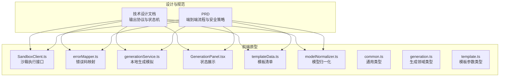
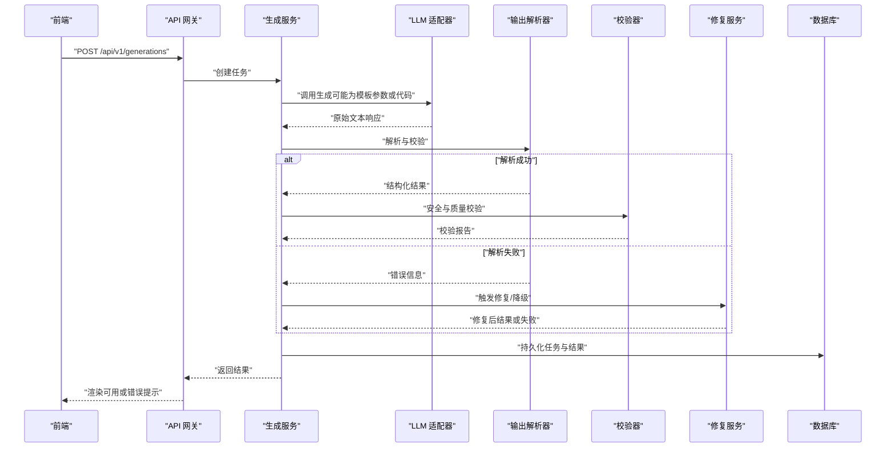
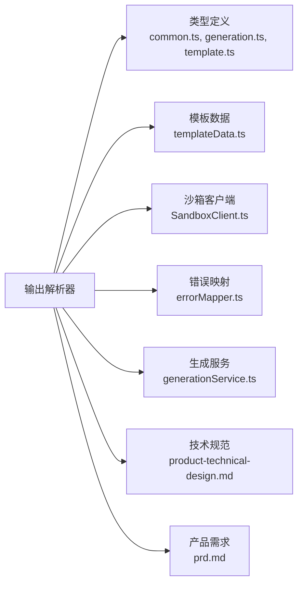
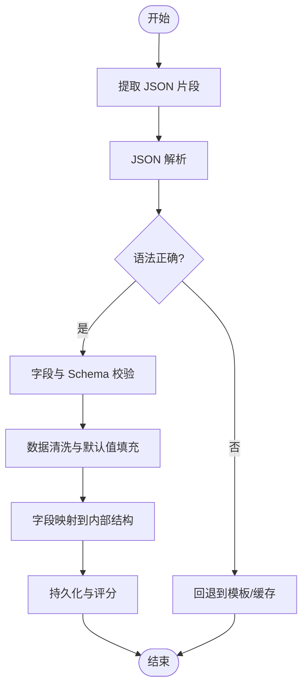

# 输出解析器

<cite>
**本文引用的文件**   
- [product-technical-design.md](file://tech/product-technical-design.md)
- [prd.md](file://prd.md)
- [SandboxClient.ts](file://src/modules/sandbox/SandboxClient.ts)
- [errorMapper.ts](file://src/modules/sandbox/errorMapper.ts)
- [generationService.ts](file://src/modules/studio/services/generationService.ts)
- [GenerationPanel.tsx](file://src/modules/studio/components/GenerationPanel.tsx)
- [templateData.ts](file://src/modules/templates/templateData.ts)
- [modelNormalizer.ts](file://src/modules/viewer/utils/modelNormalizer.ts)
- [common.ts](file://src/shared/types/common.ts)
- [generation.ts](file://src/shared/types/generation.ts)
- [template.ts](file://src/shared/types/template.ts)
</cite>

## 目录
1. [引言](#引言)
2. [项目结构](#项目结构)
3. [核心组件](#核心组件)
4. [架构总览](#架构总览)
5. [详细组件分析](#详细组件分析)
6. [依赖分析](#依赖分析)
7. [性能考虑](#性能考虑)
8. [故障排查指南](#故障排查指南)
9. [结论](#结论)
10. [附录](#附录)

## 引言
本文件聚焦于 ApexForge 的“输出解析器”能力，围绕 LLM 响应格式验证、JSON 结构解析、字段映射与数据清洗、多协议支持、错误恢复与降级策略、结构化存储、版本兼容性与向后兼容保证，以及解析规则配置与自定义扩展方法展开。文档同时结合现有代码与设计文档，给出可落地的实现建议与图示说明。

## 项目结构
当前仓库包含产品与技术设计文档及前端原型模块。输出解析器在整体生成链路中承担关键角色：负责将 LLM 返回的原始文本转换为平台内部统一的结构化结果，并驱动后续校验、修复、评分与持久化流程。

图表来源
- [product-technical-design.md:327-425](file://tech/product-technical-design.md#L327-L425)
- [prd.md:126-140](file://prd.md#L126-L140)
- [SandboxClient.ts:1-19](file://src/modules/sandbox/SandboxClient.ts#L1-L19)
- [errorMapper.ts:1-11](file://src/modules/sandbox/errorMapper.ts#L1-L11)
- [generationService.ts:1-29](file://src/modules/studio/services/generationService.ts#L1-L29)
- [GenerationPanel.tsx:1-21](file://src/modules/studio/components/GenerationPanel.tsx#L1-L21)
- [templateData.ts:1-54](file://src/modules/templates/templateData.ts#L1-L54)
- [modelNormalizer.ts:1-15](file://src/modules/viewer/utils/modelNormalizer.ts#L1-L15)
- [common.ts:1-10](file://src/shared/types/common.ts#L1-L10)
- [generation.ts:1-28](file://src/shared/types/generation.ts#L1-L28)
- [template.ts:1-19](file://src/shared/types/template.ts#L1-L19)

章节来源
- [product-technical-design.md:327-425](file://tech/product-technical-design.md#L327-L425)
- [prd.md:126-140](file://prd.md#L126-L140)

## 核心组件
- 输出协议定义与约束：明确 LLM 必须输出的 JSON 结构与字段语义，包括 mode、templateId、params、code、explanation、warnings 等。
- 解析器职责：对 LLM 原始响应进行格式校验、JSON 解析、字段映射、默认值填充、数据清洗与规范化，产出内部统一的 GenerationResult。
- 错误恢复与降级：当解析失败或字段缺失时，尝试回退到模板模式或缓存命中；必要时触发修复服务与重试。
- 结构化存储：将解析后的结果与任务上下文、质量评分、校验报告关联保存，确保可追溯与可回放。
- 版本与兼容性：通过 promptVersion、templateVersion 与 schema 版本控制，保障向后兼容与回归测试。

章节来源
- [product-technical-design.md:403-425](file://tech/product-technical-design.md#L403-L425)
- [product-technical-design.md:340-390](file://tech/product-technical-design.md#L340-L390)
- [prd.md:126-140](file://prd.md#L126-L140)

## 架构总览
输出解析器位于 LLM Adapter 之后、Validator 之前，承接 LLM 原始输出，完成协议校验与结构化转换，再交由校验与修复流程处理。

图表来源
- [product-technical-design.md:359-390](file://tech/product-technical-design.md#L359-L390)
- [prd.md:126-140](file://prd.md#L126-L140)

## 详细组件分析

### 输出协议与字段映射
- 协议字段
  - mode：template | code | hybrid，决定后续走模板渲染、代码执行或混合路径。
  - templateId：模板标识，用于定位模板与参数 Schema。
  - params：模板参数对象，需按模板 Schema 校验与清洗。
  - code：Three.js 构建函数源码，需在沙箱中执行。
  - explanation：人类可读的模型结构说明。
  - warnings：非阻断性警告列表。
- 字段映射与清洗
  - 缺失字段回退：若缺少 templateId 或 params，且 mode 允许，则回退到模板匹配或缓存命中。
  - 类型归一化：颜色字符串标准化、数值范围裁剪、枚举值映射。
  - 空值与默认值：根据模板 defaultParams 填充。
  - 白名单过滤：仅保留模板 Schema 定义的字段，丢弃未知键。

章节来源
- [product-technical-design.md:403-425](file://tech/product-technical-design.md#L403-L425)
- [template.ts:13-18](file://src/shared/types/template.ts#L13-L18)

### JSON 结构解析与验证
- 解析步骤
  - 提取 JSON 片段：从 LLM 文本中定位首个合法 JSON 块。
  - 语法校验：使用 JSON.parse 或轻量解析器验证结构。
  - 字段校验：依据 mode 与模板 Schema 进行必填项、类型与范围检查。
  - 异常捕获：记录错误详情，进入错误恢复流程。
- 复杂度限制
  - 最大 JSON 大小、嵌套深度与键数量限制，防止恶意或异常大响应。

章节来源
- [product-technical-design.md:430-470](file://tech/product-technical-design.md#L430-L470)

### 多协议支持与降级策略
- 协议支持
  - 模板参数协议：mode=template，仅返回 templateId 与 params。
  - 代码协议：mode=code，返回完整 buildModel 函数源码。
  - 混合协议：mode=hybrid，同时提供模板选择与局部代码补充。
- 降级策略
  - 解析失败 → 尝试模板匹配与默认参数渲染。
  - 模板渲染失败 → 回退到缓存命中或最近成功版本。
  - 全部失败 → 标记 failed，记录错误原因，触发人工审核或重试队列。

章节来源
- [product-technical-design.md:330-338](file://tech/product-technical-design.md#L330-L338)
- [product-technical-design.md:340-357](file://tech/product-technical-design.md#L340-L357)

### 错误恢复机制
- 错误分类
  - SANDBOX_TIMEOUT：执行超时，终止并提示降低复杂度。
  - SANDBOX_RUNTIME_ERROR：运行时报错，建议重试或调整 Prompt。
  - MODEL_JSON_INVALID：模型数据结构无效，系统自动重新生成。
- 恢复流程
  - 记录 traceId 与错误码，更新任务状态为 repairing。
  - 触发修复服务：修正参数、替换模板或简化代码。
  - 重试上限与退避策略，避免雪崩。

章节来源
- [errorMapper.ts:1-11](file://src/modules/sandbox/errorMapper.ts#L1-L11)
- [product-technical-design.md:508-517](file://tech/product-technical-design.md#L508-L517)

### 结构化存储与版本兼容
- 存储内容
  - 任务上下文：traceId、prompt、category、mode、templateId、templateVersionId。
  - 解析结果：params、code、explanation、warnings。
  - 校验与评分：validationReport、qualityScore。
  - 指标与截图：metrics、screenshotUrl、modelJsonUrl。
- 版本管理
  - promptVersion、templateVersion 与 schemaVersion 共同保证向后兼容。
  - 质量回归测试按版本执行，支持快速回滚。

章节来源
- [product-technical-design.md:215-324](file://tech/product-technical-design.md#L215-L324)
- [product-technical-design.md:419-425](file://tech/product-technical-design.md#L419-L425)

### 解析规则配置与自定义扩展
- 配置项
  - maxJsonSize、maxDepth、allowedKeys、defaultParams、fallbackMode。
  - 模板白名单与黑名单、参数校验规则。
- 自定义解析器
  - 实现 IOutputParser 接口：parse(raw)、validate(schema)、normalize(result)。
  - 注册解析器工厂：按 mode 与 templateId 路由到具体解析器。
  - 插件化扩展：新增协议或模板变体无需改动核心流程。

章节来源
- [product-technical-design.md:760-800](file://tech/product-technical-design.md#L760-L800)

### 前端集成与可视化
- 沙箱执行
  - SandboxClient 封装执行请求与结果，返回 executionId 与 modelJson。
  - 错误映射 errorMapper 将错误码转为用户友好消息。
- 生成面板
  - GenerationPanel 根据 GenerationStatus 显示不同状态与图标。
- 模型归一化
  - normalizeModel 计算边界盒、居中与缩放，提升展示一致性。

章节来源
- [SandboxClient.ts:1-19](file://src/modules/sandbox/SandboxClient.ts#L1-L19)
- [errorMapper.ts:1-11](file://src/modules/sandbox/errorMapper.ts#L1-L11)
- [GenerationPanel.tsx:1-21](file://src/modules/studio/components/GenerationPanel.tsx#L1-L21)
- [modelNormalizer.ts:1-15](file://src/modules/viewer/utils/modelNormalizer.ts#L1-L15)

## 依赖分析
输出解析器依赖以下模块与类型：
- 类型定义：common.ts、generation.ts、template.ts。
- 模板数据：templateData.ts。
- 沙箱执行：SandboxClient.ts、errorMapper.ts。
- 生成服务：generationService.ts。
- 设计规范：product-technical-design.md、prd.md。

图表来源
- [common.ts:1-10](file://src/shared/types/common.ts#L1-L10)
- [generation.ts:1-28](file://src/shared/types/generation.ts#L1-L28)
- [template.ts:1-19](file://src/shared/types/template.ts#L1-L19)
- [templateData.ts:1-54](file://src/modules/templates/templateData.ts#L1-L54)
- [SandboxClient.ts:1-19](file://src/modules/sandbox/SandboxClient.ts#L1-L19)
- [errorMapper.ts:1-11](file://src/modules/sandbox/errorMapper.ts#L1-L11)
- [generationService.ts:1-29](file://src/modules/studio/services/generationService.ts#L1-L29)
- [product-technical-design.md:327-425](file://tech/product-technical-design.md#L327-L425)
- [prd.md:126-140](file://prd.md#L126-L140)

章节来源
- [common.ts:1-10](file://src/shared/types/common.ts#L1-L10)
- [generation.ts:1-28](file://src/shared/types/generation.ts#L1-L28)
- [template.ts:1-19](file://src/shared/types/template.ts#L1-L19)
- [templateData.ts:1-54](file://src/modules/templates/templateData.ts#L1-L54)
- [SandboxClient.ts:1-19](file://src/modules/sandbox/SandboxClient.ts#L1-L19)
- [errorMapper.ts:1-11](file://src/modules/sandbox/errorMapper.ts#L1-L11)
- [generationService.ts:1-29](file://src/modules/studio/services/generationService.ts#L1-L29)
- [product-technical-design.md:327-425](file://tech/product-technical-design.md#L327-L425)
- [prd.md:126-140](file://prd.md#L126-L140)

## 性能考虑
- 解析阶段
  - 限制 JSON 大小与深度，避免大响应阻塞。
  - 增量解析与流式处理（如 SSE）可降低首字节延迟。
- 模板优先
  - 模板模式仅需参数解析与渲染，显著减少 LLM 调用与代码执行开销。
- 缓存命中
  - 相似 Prompt 直接复用历史结果，跳过解析与校验。
- 前端渲染
  - 模型反序列化放入 Worker，主线程专注渲染。
  - 使用 InstancedMesh 与 LOD 优化复杂场景。

[本节为通用指导，不直接分析具体文件]

## 故障排查指南
- 常见错误码与处理
  - SANDBOX_TIMEOUT：检查模型复杂度与超时阈值，适当降低细节或切换模板。
  - SANDBOX_RUNTIME_ERROR：查看生成代码是否包含非法 API 或逻辑错误，调整 Prompt 或模板。
  - MODEL_JSON_INVALID：确认模型 JSON 结构是否符合 ObjectLoader 要求，必要时重新生成。
- 日志与追踪
  - 每个请求携带 traceId，便于全链路定位问题。
  - 记录解析失败的具体字段与错误位置，辅助修复服务精准回退。

章节来源
- [errorMapper.ts:1-11](file://src/modules/sandbox/errorMapper.ts#L1-L11)
- [product-technical-design.md:508-517](file://tech/product-technical-design.md#L508-L517)

## 结论
输出解析器是 ApexForge 生成链路的核心枢纽，承担协议校验、结构化转换、错误恢复与版本兼容等多重职责。通过模板优先、缓存命中与严格的校验策略，系统在稳定性、安全性与可扩展性之间取得平衡。未来可通过插件化解析器与更细粒度的配置项进一步提升灵活性与可维护性。

[本节为总结性内容，不直接分析具体文件]

## 附录

### 解析流程图（概念）

[此图为概念流程，不绑定具体源文件]