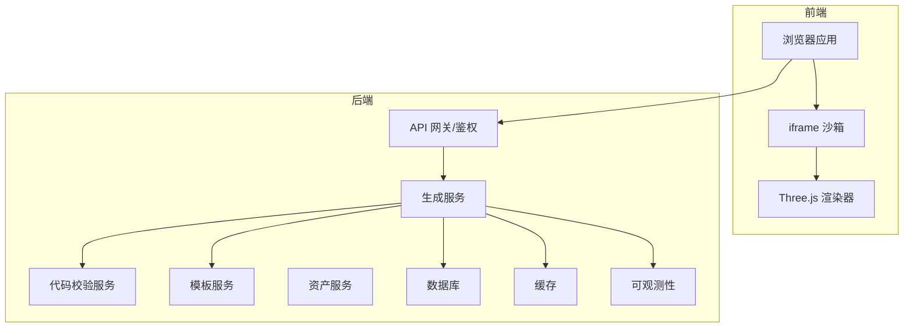
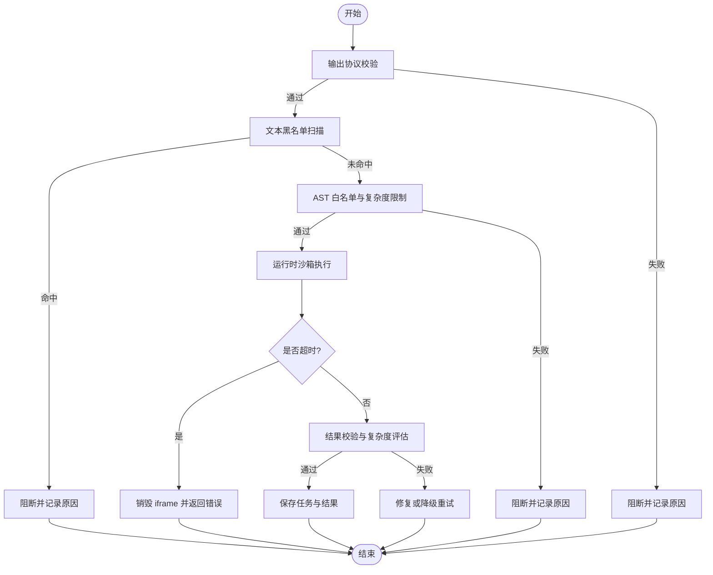
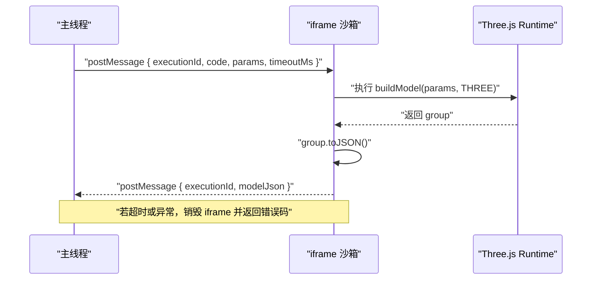
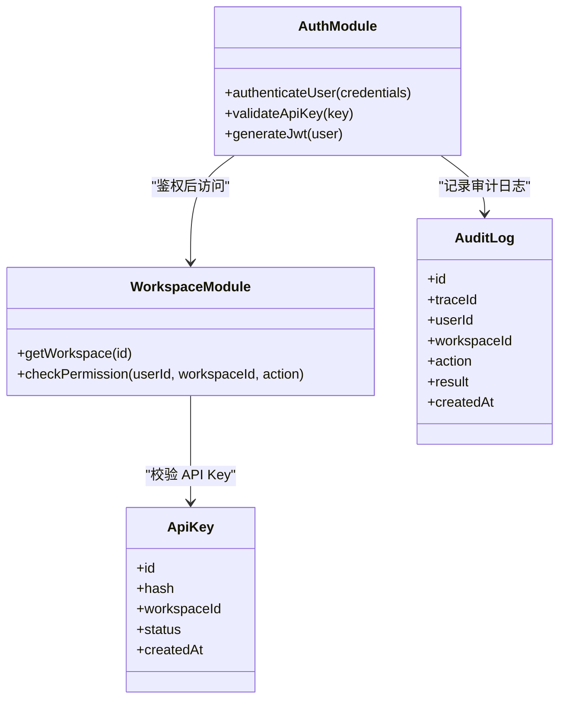
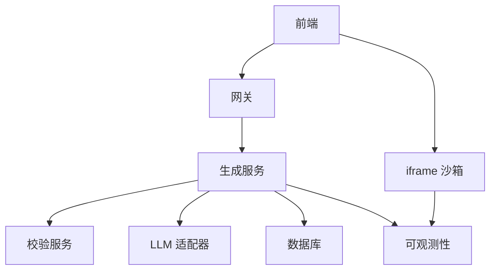
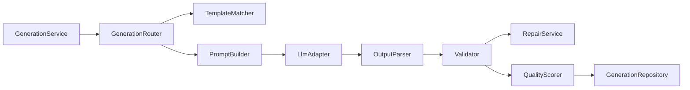

# 安全架构设计

<cite>
**本文引用的文件**
- [产品需求文档](file://prd.md)
- [产品技术设计文档](file://tech/product-technical-design.md)
</cite>

## 目录
1. [引言](#引言)
2. [项目结构](#项目结构)
3. [核心组件](#核心组件)
4. [架构总览](#架构总览)
5. [详细组件分析](#详细组件分析)
6. [依赖关系分析](#依赖关系分析)
7. [性能与安全权衡](#性能与安全权衡)
8. [故障排查指南](#故障排查指南)
9. [结论](#结论)
10. [附录](#附录)

## 引言
本文件面向 ApexForge 平台的安全架构设计与落地，聚焦多层安全防护体系：输出协议校验、文本黑名单、AST 语法树分析、运行时沙箱隔离、超时销毁与内存限制、异常处理与错误分类、认证授权与 API Key 管理、审计日志与安全监控策略。文档同时给出威胁分析与防护措施的对应关系，帮助工程团队在 MVP 到平台化演进中持续强化安全性与可观测性。

## 项目结构
从仓库现有文档可知，ApexForge 采用前后端分离与多服务解耦的架构方向，前端以 React + Three.js 为主，后端以 NestJS 为核心，AI 生成服务负责 Prompt 编排与 LLM 调用，模板库与资产服务支撑参数化与版本化。安全能力贯穿“输入—生成—校验—执行—展示”全链路。



图表来源
- [产品技术设计文档:38-62](file://tech/product-technical-design.md#L38-L62)
- [产品技术设计文档:69-76](file://tech/product-technical-design.md#L69-L76)
- [产品技术设计文档:83-100](file://tech/product-technical-design.md#L83-L100)

章节来源
- [产品需求文档:33-41](file://prd.md#L33-L41)
- [产品技术设计文档:34-100](file://tech/product-technical-design.md#L34-L100)

## 核心组件
- 输出协议校验层：确保 AI 返回的结构符合固定 JSON 协议，包含 mode、templateId、params、code 等字段，并具备解释与警告字段。
- 文本黑名单层：快速阻断明显危险关键词与模式（如动态执行、网络访问、DOM 访问、原型污染等）。
- AST 白名单与复杂度限制层：精确限制允许调用的 API、语法结构与复杂度指标（最大深度、循环层数、Mesh 数量、顶点估算等）。
- 运行时沙箱隔离层：基于 iframe sandbox 与 CSP 的完全隔离执行环境，仅暴露受控 API 与 THREE 对象，通过 postMessage 通信。
- 超时销毁与资源回收层：为每次执行分配 executionId，设置超时阈值，失败或超时时销毁 iframe 并清理资源。
- 结果校验与质量评分层：对模型序列化数据与复杂度进行二次校验，结合用户反馈形成质量闭环。
- 认证授权与 API Key 管理：JWT 与 API Key 双轨认证，配额与限流控制，权限按空间与角色划分。
- 审计日志与安全监控：traceId 贯穿全链路，记录关键事件与错误码，配置告警规则。

章节来源
- [产品技术设计文档:403-425](file://tech/product-technical-design.md#L403-L425)
- [产品技术设计文档:428-470](file://tech/product-technical-design.md#L428-L470)
- [产品技术设计文档:472-518](file://tech/product-technical-design.md#L472-L518)
- [产品技术设计文档:574-610](file://tech/product-technical-design.md#L574-L610)
- [产品技术设计文档:632-757](file://tech/product-technical-design.md#L632-L757)
- [产品技术设计文档:868-908](file://tech/product-technical-design.md#L868-L908)
- [产品技术设计文档:910-931](file://tech/product-technical-design.md#L910-L931)

## 架构总览
下图展示了从用户请求到沙箱执行的端到端流程，以及安全校验在各阶段的落点。

```mermaid
sequenceDiagram
participant U as "用户"
participant FE as "前端"
participant GW as "API 网关"
participant GEN as "生成服务"
participant TPL as "模板服务"
participant LLM as "LLM 适配器"
participant VAL as "代码校验"
participant DB as "数据库"
participant BOX as "iframe 沙箱"
U->>FE : "输入描述并点击生成"
FE->>GW : "POST /api/v1/generations"
GW->>GEN : "创建任务并鉴权"
GEN->>TPL : "匹配候选模板"
TPL-->>GEN : "返回候选模板"
GEN->>LLM : "生成代码或参数"
LLM-->>GEN : "返回结构化输出"
GEN->>VAL : "协议+黑名单+AST 校验"
VAL-->>GEN : "校验报告"
GEN->>DB : "持久化任务与结果"
GEN-->>FE : "返回可执行代码/参数"
FE->>BOX : "postMessage 执行代码"
BOX-->>FE : "返回模型 JSON 或错误"
```

图表来源
- [产品技术设计文档:361-390](file://tech/product-technical-design.md#L361-L390)
- [产品技术设计文档:472-518](file://tech/product-technical-design.md#L472-L518)

## 详细组件分析

### 代码安全校验机制
- 分层校验策略
  - 输出协议校验：强制 JSON 结构、mode 枚举、必要字段存在性与类型正确。
  - 文本黑名单：正则扫描禁止项，快速拦截高风险片段。
  - AST 白名单：限定允许的语法与 API，限制复杂度指标。
  - 运行时沙箱：隔离执行环境，最小权限暴露。
  - 超时销毁：防止死循环与长时间阻塞。
  - 结果校验：检查模型 JSON 合法性与复杂度上限。
- 禁止 API 列表（示例类别）
  - 动态执行：eval、Function、setTimeout/setInterval 字符串参数。
  - 网络访问：fetch、XMLHttpRequest、WebSocket、EventSource、navigator.sendBeacon。
  - DOM 访问：document、window.top、window.parent、localStorage、sessionStorage。
  - 动态加载：import、importScripts、require。
  - 原型污染：__proto__、prototype、constructor 链式异常访问。
  - 计算风险：while(true)、无限递归、过深嵌套循环。
- AST 白名单与复杂度限制
  - 允许基础变量声明、函数声明、字面量、Math 白名单方法。
  - 允许安全的 THREE 构造与方法（Group、基础几何体、材质、Mesh、Line 等）。
  - 限制最大代码长度、AST 深度、循环层数、Mesh 数量、顶点估算。
  - 禁止访问未声明全局变量，仅允许 THREE、Math、params 及安全工具函数。



图表来源
- [产品技术设计文档:428-470](file://tech/product-technical-design.md#L428-L470)
- [产品技术设计文档:472-518](file://tech/product-technical-design.md#L472-L518)

章节来源
- [产品技术设计文档:428-470](file://tech/product-technical-design.md#L428-L470)

### iframe 沙箱实现方案
- 隔离边界
  - 使用隐藏 iframe，sandbox="allow-scripts"，禁用同源访问、表单、弹窗与顶级导航。
  - 通过 CSP 限制脚本来源，仅允许预构建 runtime。
- 通信安全
  - 主线程与 iframe 通过 postMessage 传递 { executionId, code, params, timeoutMs }。
  - 执行成功后调用 group.toJSON() 返回结构化 JSON，禁止回传函数或 DOM 引用。
- 执行流程
  - 主页面生成 executionId，发送执行指令。
  - iframe 包装代码并执行 buildModel(params, THREE)。
  - 成功则序列化模型；失败或超时时销毁 iframe 并返回错误。
- 错误分类
  - 定义统一错误码（如 SANDBOX_TIMEOUT、SANDBOX_RUNTIME_ERROR、MODEL_JSON_INVALID、MODEL_TOO_COMPLEX、MODEL_EMPTY），便于前端提示与后端统计。



图表来源
- [产品技术设计文档:478-518](file://tech/product-technical-design.md#L478-L518)

章节来源
- [产品技术设计文档:472-518](file://tech/product-technical-design.md#L472-L518)

### 认证授权与 API Key 管理
- 认证方式
  - 用户侧使用 JWT，开放平台使用 API Key。
  - 所有响应包含 traceId，错误响应统一结构。
- 权限模型
  - 角色包括 Owner、Admin、Editor、Viewer、API Client，按空间与项目维度控制。
- 配额与限流
  - 每日生成次数、每分钟请求数、并发任务数、最大模型复杂度、存储空间、API 调用量、高级模型额度。
- 密钥管理
  - 使用 KMS/Vault/云厂商 Secret Manager 管理敏感密钥。
  - API Key 只展示一次，数据库仅保存哈希。



图表来源
- [产品技术设计文档:574-593](file://tech/product-technical-design.md#L574-L593)
- [产品技术设计文档:844-866](file://tech/product-technical-design.md#L844-L866)
- [产品技术设计文档:910-931](file://tech/product-technical-design.md#L910-L931)

章节来源
- [产品技术设计文档:632-757](file://tech/product-technical-design.md#L632-L757)
- [产品技术设计文档:844-866](file://tech/product-technical-design.md#L844-L866)
- [产品技术设计文档:910-931](file://tech/product-technical-design.md#L910-L931)

### 审计日志与安全监控策略
- Trace 链路
  - 每个请求携带 traceId，贯穿前端、网关、生成服务、LLM、校验、数据库、沙箱执行。
- 日志字段
  - 包含 traceId、userId、workspaceId、taskId、provider、promptVersion、generationMode、latencyMs、status、errorCode、qualityScore。
- 告警规则
  - 生成失败率过高、LLM 延迟过高、校验失败突增、沙箱超时突增、API 错误率过高。



图表来源
- [产品技术设计文档:868-908](file://tech/product-technical-design.md#L868-L908)

章节来源
- [产品技术设计文档:868-908](file://tech/product-technical-design.md#L868-L908)

### 威胁分析与防护措施对照
- 威胁：恶意代码注入与逃逸
  - 防护：输出协议校验、文本黑名单、AST 白名单、iframe sandbox 与 CSP、无同源权限、最小 API 暴露。
- 威胁：运行时阻塞与资源耗尽
  - 防护：超时销毁、复杂度限制、Mesh/顶点估算上限、Worker 异步解析大模型 JSON。
- 威胁：越权访问与数据泄露
  - 防护：JWT/API Key 双轨认证、空间与角色权限、Secret 管理、敏感日志脱敏。
- 威胁：LLM 输出不稳定与不可渲染
  - 防护：Prompt 版本管理与 Few-shot、自动修复与降级、质量评分与回归测试集。
- 威胁：成本不可控
  - 防护：相似 Prompt 缓存、模板模式优先、供应商路由与熔断、配额与限流。

[本节为概念性总结，不直接分析具体文件]

## 依赖关系分析
- 模块耦合与内聚
  - GenerationService 依赖 TemplateMatcher、PromptBuilder、LlmAdapter、Validator、QualityScorer、Repository。
  - ValidationModule 依赖 Babel/Acorn 解析器与自定义规则引擎。
  - SandboxClient 依赖 postMessage 与 ObjectLoader，独立于业务逻辑，内聚性强。
- 外部依赖与集成点
  - LLM 供应商（DeepSeek、Qwen 等）通过 Adapter 抽象，支持失败重试与降级。
  - 数据库与缓存用于任务状态、模板与结果持久化。
  - 可观测性系统采集日志、指标与追踪。



图表来源
- [产品技术设计文档:594-610](file://tech/product-technical-design.md#L594-L610)

章节来源
- [产品技术设计文档:574-610](file://tech/product-technical-design.md#L574-L610)

## 性能与安全权衡
- 前端
  - 动态加载 Three.js 与沙箱 runtime，降低首屏体积。
  - 模型 JSON 解析放入 Worker，主线程只做渲染挂载。
  - 重复几何体使用 InstancedMesh，释放旧模型时遍历 dispose geometry/material/texture。
- 后端
  - 相似 Prompt 缓存复用结果，模板模式跳过 LLM 代码生成。
  - 生成任务异步化，避免 HTTP 长连接占用。
  - LLM 供应商并发与熔断控制，热门模板与 Schema 缓存至 Redis。
- 数据库
  - 关键索引优化查询性能，大字段迁移至对象存储，历史任务归档。

[本节提供通用指导，不直接分析具体文件]

## 故障排查指南
- 常见错误码与定位
  - SANDBOX_TIMEOUT：检查执行超时阈值与模型复杂度，必要时降级模板模式。
  - SANDBOX_RUNTIME_ERROR：查看 AST 校验报告与运行日志，确认受限 API 使用情况。
  - MODEL_JSON_INVALID：核对 group.toJSON 输出结构，验证 ObjectLoader 兼容性。
  - MODEL_TOO_COMPLEX：调整 Mesh 数量与顶点估算上限，启用 LOD 或简化几何体。
  - MODEL_EMPTY：补充 Prompt 细节，增加 Few-shot 示例与模板约束。
- 排查步骤
  - 根据 traceId 拉取全链路日志，定位失败阶段。
  - 检查 Validator 报告的 blockedReasons 与 warnings。
  - 复核 Prompt 版本与模板命中率，必要时回滚 Prompt。
  - 审查沙箱执行上下文与 postMessage 载荷，确认超时与异常路径。

章节来源
- [产品技术设计文档:508-518](file://tech/product-technical-design.md#L508-L518)
- [产品技术设计文档:868-908](file://tech/product-technical-design.md#L868-L908)

## 结论
ApexForge 的安全架构以“协议—文本—AST—沙箱—超时—结果”的多层防线为核心，结合认证授权、API Key 管理、审计日志与监控告警，形成从输入到渲染的全链路可控体系。通过模板优先与参数化生成，平衡灵活性与稳定性；通过质量评分与回归测试，持续优化 Prompt 与模板。建议在 MVP 阶段优先落地基础校验与沙箱执行，随后逐步完善配额、审计与可观测性，最终向平台化与云原生演进。

[本节为总结性内容，不直接分析具体文件]

## 附录
- 输出协议要点
  - 必须包含 mode、templateId、params、code、explanation、warnings 等字段。
  - 代码需遵循固定签名与约束，禁止访问网络、DOM、全局对象与浏览器存储。
- 模板分层与匹配
  - Skeleton、Style Variant、Detail Pack、Material Preset、Param Schema。
  - 先向量检索候选模板，再由 LLM 选择并生成参数；置信度低时切换 Hybrid 或 Code Mode。
- 质量评分体系
  - 可渲染性、Prompt 匹配度、结构完整性、性能表现、可编辑性五维加权。
  - 自动评分输入包括 AST 校验结果、几何体指标、沙箱执行结果与用户反馈。

章节来源
- [产品技术设计文档:403-425](file://tech/product-technical-design.md#L403-L425)
- [产品技术设计文档:760-804](file://tech/product-technical-design.md#L760-L804)
- [产品技术设计文档:807-841](file://tech/product-technical-design.md#L807-L841)