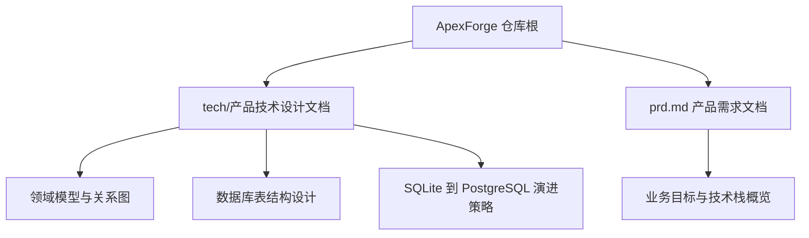
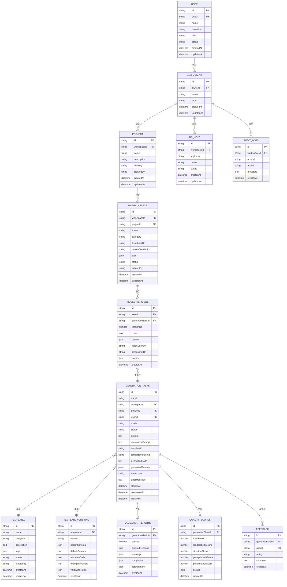
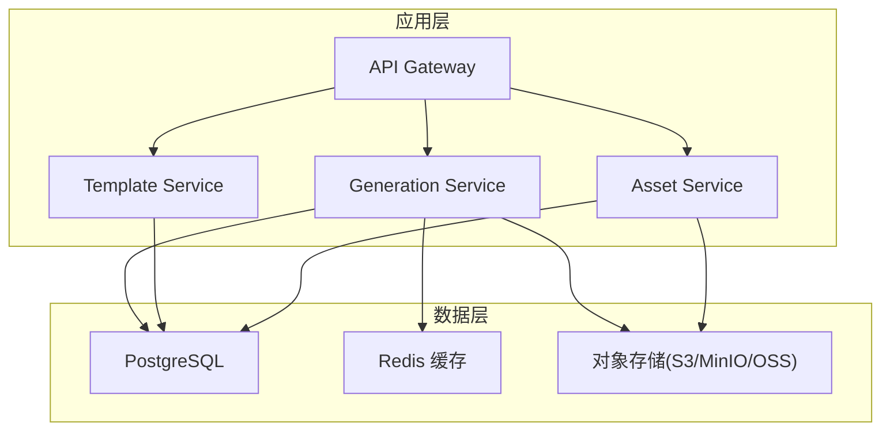
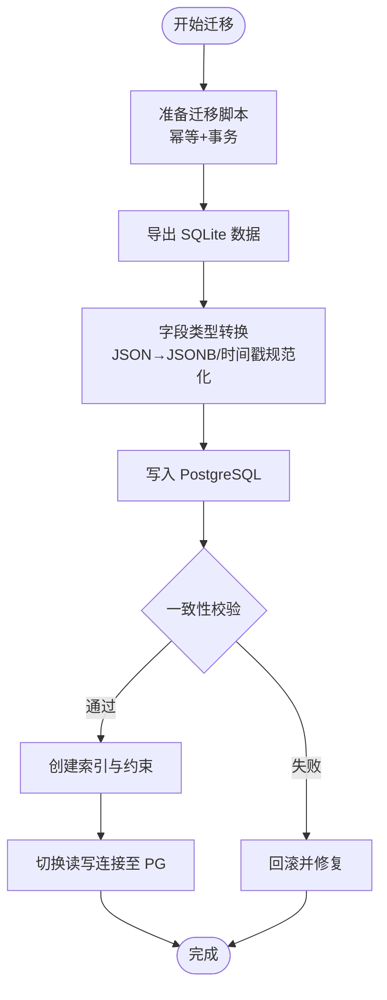
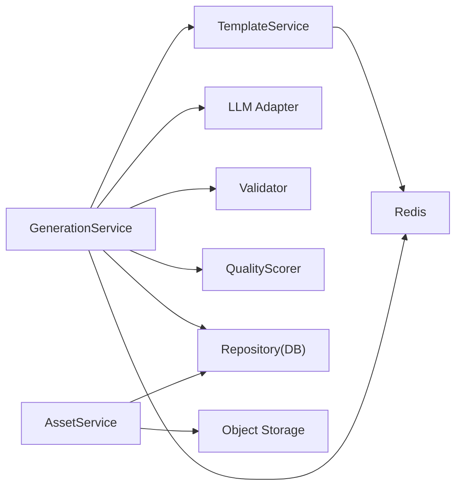
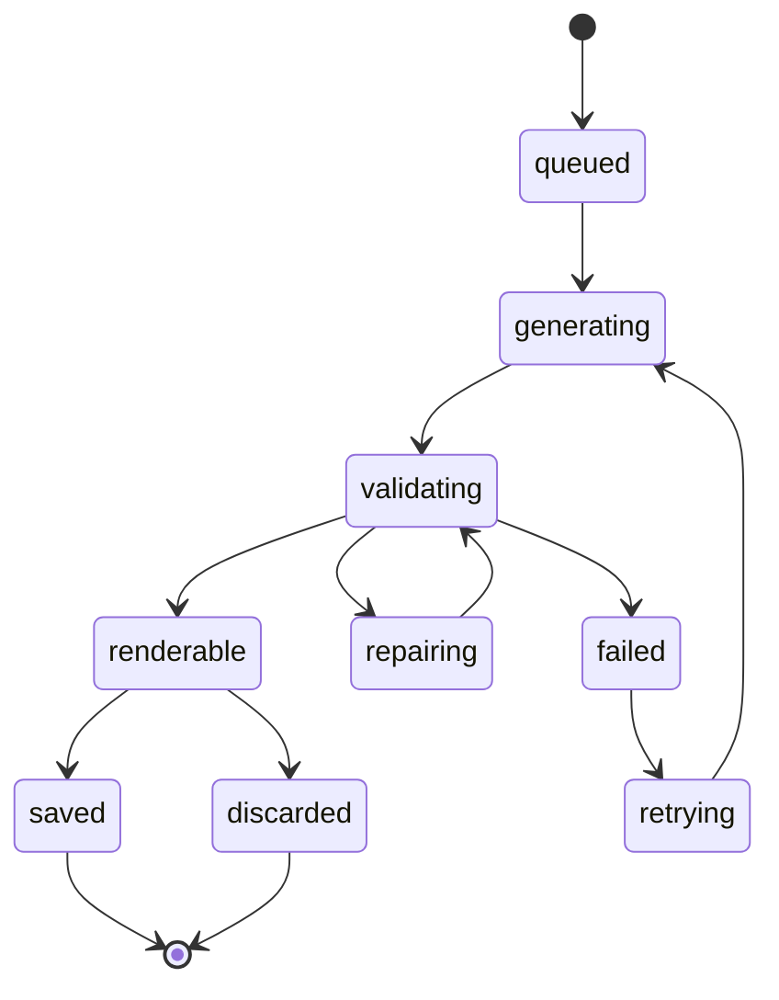

# 数据架构设计

<cite>
**本文引用的文件**
- [产品技术设计文档](file://tech/product-technical-design.md)
- [产品需求文档](file://prd.md)
</cite>

## 目录
1. [引言](#引言)
2. [项目结构](#项目结构)
3. [核心组件](#核心组件)
4. [架构总览](#架构总览)
5. [详细组件分析](#详细组件分析)
6. [依赖分析](#依赖分析)
7. [性能考虑](#性能考虑)
8. [故障排查指南](#故障排查指南)
9. [结论](#结论)
10. [附录](#附录)

## 引言
本文件面向 ApexForge 平台的数据架构，聚焦领域模型、数据库表结构、迁移策略（SQLite 到 PostgreSQL）、数据访问与缓存模式、性能优化、生命周期管理、备份恢复与安全策略。内容基于仓库中的产品与技术设计文档进行系统化整理与扩展，确保读者既能把握整体数据蓝图，也能落地实施。

## 项目结构
仓库包含两份关键文档：
- 产品技术设计文档：定义总体架构、领域模型、数据模型、生成链路、安全与可观测性、工程里程碑等。
- 产品需求文档：阐述业务目标、技术选型、前后端职责边界与关键流程。



图表来源
- [产品技术设计文档:132-170](file://tech/product-technical-design.md#L132-L170)
- [产品技术设计文档:174-325](file://tech/product-technical-design.md#L174-L325)
- [产品技术设计文档:122-129](file://tech/product-technical-design.md#L122-L129)
- [产品需求文档:33-54](file://prd.md#L33-L54)

章节来源
- [产品技术设计文档:132-170](file://tech/product-technical-design.md#L132-L170)
- [产品技术设计文档:174-325](file://tech/product-technical-design.md#L174-L325)
- [产品技术设计文档:122-129](file://tech/product-technical-design.md#L122-L129)
- [产品需求文档:33-54](file://prd.md#L33-L54)

## 核心组件
本节梳理核心领域实体及其关系，并给出对应的数据库表结构与约束建议。

- 领域实体
  - User：用户主体
  - Workspace：团队或个人空间
  - Project：模型资产项目
  - GenerationTask：一次生成任务
  - ModelAsset：成功生成的模型资产
  - ModelVersion：模型版本
  - Template：程序化模板
  - TemplateVersion：模板版本
  - ValidationReport：代码校验报告
  - QualityScore：质量评分结果
  - Feedback：用户反馈
  - ApiKey：开放 API 调用凭证
  - AuditLog：审计日志

- 核心关系
  - User 拥有 Workspace；Workspace 下包含多个 Project
  - Project 下包含多个 ModelAsset；ModelAsset 有多个 ModelVersion
  - ModelVersion 来源于 GenerationTask；GenerationTask 关联 Template/TemplateVersion
  - GenerationTask 产出 ValidationReport 与 QualityScore
  - Workspace 关联 ApiKey 与 AuditLog



图表来源
- [产品技术设计文档:174-325](file://tech/product-technical-design.md#L174-L325)

章节来源
- [产品技术设计文档:132-170](file://tech/product-technical-design.md#L132-L170)
- [产品技术设计文档:174-325](file://tech/product-technical-design.md#L174-L325)

## 架构总览
从数据视角看，系统由“生成服务 + 模板服务 + 资产服务”共同维护持久化数据，并通过缓存与对象存储协同提升性能与可扩展性。



图表来源
- [产品技术设计文档:82-100](file://tech/product-technical-design.md#L82-L100)
- [产品技术设计文档:104-121](file://tech/product-technical-design.md#L104-L121)

章节来源
- [产品技术设计文档:82-100](file://tech/product-technical-design.md#L82-L100)
- [产品技术设计文档:104-121](file://tech/product-technical-design.md#L104-L121)

## 详细组件分析

### 领域模型与数据表映射
- 用户与空间
  - users.id 作为主键，email 唯一索引；status 用于账号状态控制。
  - workspaces.ownerId 引用 users.id；type 区分 personal/team/enterprise。
- 项目与资产
  - projects.workspaceId 引用 workspaces.id；visibility 控制可见性。
  - model_assets.projectId 引用 projects.id；currentVersionId 指向最新 model_versions.id。
- 版本与任务
  - model_versions.generationTaskId 引用 generation_tasks.id；versionNo 递增。
  - generation_tasks.templateId/templateVersionId 指向模板及版本；generatedParams 为 JSON。
- 模板体系
  - templates.status 控制发布状态；template_versions.paramSchema/defaultParams 描述参数契约。
- 质量与审计
  - validation_reports.quality_scores.feedback/audit_logs/api_keys 支撑质量闭环与合规审计。

章节来源
- [产品技术设计文档:174-325](file://tech/product-technical-design.md#L174-L325)

### 数据迁移策略（SQLite → PostgreSQL）
- ORM 抽象：MVP 阶段通过 Repository/ORM 屏蔽差异，避免 SQLite 特有 SQL。
- ID 规范：统一使用 UUID/CUID，避免自增依赖。
- JSON 兼容：SQLite 以 TEXT 存储 JSON，PostgreSQL 使用 JSONB；迁移脚本需做类型转换与索引重建。
- 增量迁移：Beta 阶段提供迁移脚本，将历史生成记录、模板与资产导入 PostgreSQL，并校验一致性。
- 回滚预案：保留 SQLite 快照与迁移脚本幂等执行能力，支持快速回滚。



图表来源
- [产品技术设计文档:122-129](file://tech/product-technical-design.md#L122-L129)

章节来源
- [产品技术设计文档:122-129](file://tech/product-technical-design.md#L122-L129)

### 数据访问模式与缓存策略
- 访问模式
  - 生成任务：按 traceId/workspaceId/projectId 查询；createdAt 排序分页。
  - 资产与版本：按 workspaceId/projectId 聚合查询；currentVersionId 加速当前版本读取。
  - 模板匹配：按 category/tags/status 检索，结合向量相似度缓存候选集。
- 缓存策略
  - Redis 缓存相似 Prompt 的生成结果（相似度阈值命中直接返回）。
  - 热门模板与参数 Schema 常驻缓存，降低 DB 压力。
  - 任务状态与 SSE 事件推送借助内存/队列缓存。
- 大对象处理
  - 代码、模型 JSON、截图等大字段优先落对象存储，数据库仅保存 URL 与摘要。

章节来源
- [产品技术设计文档:933-958](file://tech/product-technical-design.md#L933-L958)
- [产品技术设计文档:104-121](file://tech/product-technical-design.md#L104-L121)

### 数据生命周期管理
- 创建：用户提交 Prompt → 生成任务入队 → 异步执行 → 结果持久化。
- 活跃期：资产与版本在有效期内可编辑、回滚、导出。
- 归档：历史任务按时间归档，冷数据迁移至低成本存储。
- 清理：软删除标记（如 assets.status=deleted/archived），定期清理过期审计日志与临时文件。

章节来源
- [产品技术设计文档:174-325](file://tech/product-technical-design.md#L174-L325)

### 备份恢复方案
- 全量备份：每日对 PostgreSQL 执行逻辑或物理备份，保留多周期副本。
- 增量备份：基于 WAL 或时间点恢复（PITR）保障 RPO/RTO。
- 对象存储备份：对模型 JSON、截图等静态资源开启跨区复制与版本控制。
- 恢复演练：定期演练恢复流程，验证数据一致性与可用性。

[本节为通用实践说明，不直接分析具体文件]

### 数据安全策略
- 密钥管理：KMS/Vault/云厂商 Secret Manager 管理 LLM Key、DB 凭据。
- 敏感数据脱敏：日志中不记录完整密钥与鉴权头；API Key 仅存哈希。
- 传输加密：全站 HTTPS，内网服务间 mTLS。
- 访问控制：RBAC 权限模型，最小权限原则；审计日志记录关键操作。

章节来源
- [产品技术设计文档:910-931](file://tech/product-technical-design.md#L910-L931)

## 依赖分析
- 模块耦合
  - GenerationService 依赖 TemplateService、LLM Adapter、Validator、QualityScorer 与 Repository。
  - AssetService 依赖 Object Storage 与 Database。
  - TemplateService 依赖 Database 与 Cache。
- 外部依赖
  - LLM 供应商（DeepSeek/Qwen 等）
  - 对象存储（S3/MinIO/OSS）
  - 缓存（Redis）
  - 消息队列（BullMQ/RabbitMQ/Kafka）



图表来源
- [产品技术设计文档:594-610](file://tech/product-technical-design.md#L594-L610)
- [产品技术设计文档:104-121](file://tech/product-technical-design.md#L104-L121)

章节来源
- [产品技术设计文档:594-610](file://tech/product-technical-design.md#L594-L610)
- [产品技术设计文档:104-121](file://tech/product-technical-design.md#L104-L121)

## 性能考虑
- 前端
  - Three.js runtime 按需加载；旧模型释放 geometry/material/texture；复杂模型解析放入 Worker。
- 后端
  - 相似 Prompt 缓存复用；模板模式跳过 LLM 调用；生成任务异步化；并发与熔断控制。
- 数据库
  - 针对 traceId、workspaceId、projectId、updatedAt、createdAt 建索引；大字段外置对象存储；历史任务归档。

章节来源
- [产品技术设计文档:933-958](file://tech/product-technical-design.md#L933-L958)

## 故障排查指南
- 生成失败率过高：检查 LLM 延迟、校验失败突增、沙箱超时比例。
- 渲染异常：查看 ValidationReport 与 QualityScore 详情，定位 AST 阻断原因或复杂度超限。
- 缓存未命中：确认相似度阈值与缓存键设计；核对 Redis 连通性与容量。
- 迁移问题：校验 JSONB 转换与索引重建；对比源库与目标库行数与抽样一致性。

章节来源
- [产品技术设计文档:898-907](file://tech/product-technical-design.md#L898-L907)
- [产品技术设计文档:933-958](file://tech/product-technical-design.md#L933-L958)

## 结论
本数据架构以“模板优先、结构化保存、可插拔、渐进式演进”为原则，围绕用户、空间、项目、任务、资产与模板构建稳定可扩展的数据基座。通过 ORM 抽象与迁移策略实现 SQLite 到 PostgreSQL 的平滑过渡；借助缓存与对象存储优化性能；以质量评分与审计日志形成持续改进闭环。

[本节为总结性内容，不直接分析具体文件]

## 附录

### 生成任务状态机（数据侧）


图表来源
- [产品技术设计文档:340-357](file://tech/product-technical-design.md#L340-L357)

### 生成链路时序（数据持久化点）
```mermaid
sequenceDiagram
participant FE as "前端"
participant API as "API 网关"
participant GEN as "生成服务"
participant CACHE as "缓存"
participant TPL as "模板服务"
participant LLM as "LLM 适配器"
participant VAL as "校验器"
participant DB as "数据库"
participant BOX as "沙箱"
FE->>API : "POST /api/v1/generations"
API->>GEN : "createGenerationTask"
GEN->>CACHE : "querySimilarPrompt"
alt "缓存命中"
CACHE-->>GEN : "缓存结果"
else "缓存未命中"
GEN->>TPL : "findCandidateTemplate"
TPL-->>GEN : "候选模板"
GEN->>LLM : "generate code or params"
LLM-->>GEN : "生成输出"
GEN->>VAL : "validate output"
VAL-->>GEN : "校验报告"
end
GEN->>DB : "持久化任务与结果"
GEN-->>API : "结果"
API-->>FE : "生成载荷"
FE->>BOX : "iframe 执行"
BOX-->>FE : "模型 JSON 或错误"
```

图表来源
- [产品技术设计文档:359-390](file://tech/product-technical-design.md#L359-L390)