# 整体架构概览

<cite>
**本文引用的文件**   
- [产品技术设计文档](file://tech/product-technical-design.md)
- [产品需求文档](file://prd.md)
</cite>

## 目录
1. [引言](#引言)
2. [项目结构](#项目结构)
3. [核心组件](#核心组件)
4. [架构总览](#架构总览)
5. [详细组件分析](#详细组件分析)
6. [依赖关系分析](#依赖关系分析)
7. [性能与可扩展性](#性能与可扩展性)
8. [部署拓扑与演进](#部署拓扑与演进)
9. [故障排查指南](#故障排查指南)
10. [结论](#结论)
11. [附录：数据模型与接口契约](#附录数据模型与接口契约)

## 引言
本文件为 ApexForge 平台提供整体架构概览，面向产品经理、工程团队与运维人员。内容覆盖前后端分离、模块化与微服务化演进路径；说明用户界面、API 网关、业务服务、数据持久化层之间的通信机制与数据流向；解释关键技术选型权衡（React + Three.js 前端、NestJS 后端、SQLite/PostgreSQL 数据库等）；并给出 MVP 与平台化两种部署架构对比、系统上下文图与组件分解图，以及基础设施需求、可扩展性与部署拓扑建议。

## 项目结构
仓库包含两份关键设计文档：
- 产品技术设计文档：定义从 MVP 到平台化的总体架构、模块划分、数据模型、生成链路、安全与可观测性等。
- 产品需求文档：阐述业务目标、差异化价值、核心流程与技术选型要点。

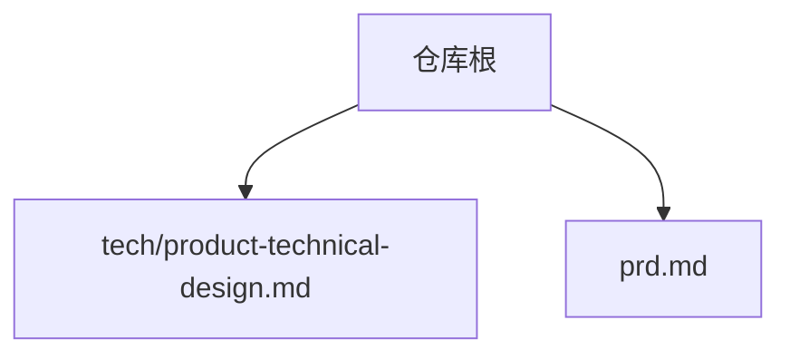

图表来源
- [产品技术设计文档:1-1149](file://tech/product-technical-design.md#L1-L1149)
- [产品需求文档:1-168](file://prd.md#L1-L168)

章节来源
- [产品技术设计文档:1-1149](file://tech/product-technical-design.md#L1-L1149)
- [产品需求文档:1-168](file://prd.md#L1-L168)

## 核心组件
- 前端应用（ApexForge Studio）
  - 基于 React + TypeScript，使用 Vite 构建；Three.js 负责 3D 渲染；通过 iframe 沙箱执行 AI 生成的代码，返回结构化 JSON 后由主线程加载展示。
  - 关键前端服务：ApiClient、GenerationStore、SceneManager、SandboxClient、ModelNormalizer、AssetStore、TemplateStore。
- API 网关与认证
  - 统一入口，鉴权（JWT/API Key）、限流、路由分发，透传 traceId。
- 业务服务（微服务化）
  - 认证服务、资产服务、模板服务、生成编排服务、LLM 适配层、校验服务、质量评分、导出服务、计费与可观测性。
- 数据与中间件
  - 数据库（MVP：SQLite；平台化：PostgreSQL）、缓存（内存/Redis）、消息队列（BullMQ/RabbitMQ/Kafka）、对象存储（本地/S3/MinIO/OSS）。
- 可观测与安全
  - 全链路追踪、日志指标告警；多层代码安全校验与运行时隔离。

章节来源
- [产品技术设计文档:104-130](file://tech/product-technical-design.md#L104-L130)
- [产品技术设计文档:520-572](file://tech/product-technical-design.md#L520-L572)
- [产品技术设计文档:574-630](file://tech/product-technical-design.md#L574-L630)
- [产品技术设计文档:428-470](file://tech/product-technical-design.md#L428-L470)
- [产品技术设计文档:472-518](file://tech/product-technical-design.md#L472-L518)
- [产品需求文档:33-54](file://prd.md#L33-L54)

## 架构总览
下图展示逻辑架构、MVP 与平台化部署形态的对比，以及前后端与外部 LLM 供应商的交互。

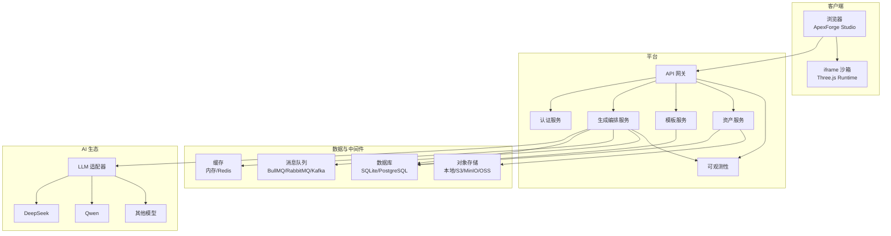

图表来源
- [产品技术设计文档:34-101](file://tech/product-technical-design.md#L34-L101)
- [产品技术设计文档:574-630](file://tech/product-technical-design.md#L574-L630)
- [产品技术设计文档:104-130](file://tech/product-technical-design.md#L104-L130)

章节来源
- [产品技术设计文档:34-101](file://tech/product-technical-design.md#L34-L101)
- [产品技术设计文档:574-630](file://tech/product-technical-design.md#L574-L630)

## 详细组件分析

### 生成链路时序（端到端）
该时序描述一次“自然语言 → 生成结果 → 沙箱渲染”的完整调用链。

```mermaid
sequenceDiagram
participant FE as "前端"
participant GW as "API 网关"
participant GEN as "生成编排服务"
participant CACHE as "缓存"
participant TPL as "模板服务"
participant LLM as "LLM 适配器"
participant VAL as "校验服务"
participant DB as "数据库"
participant BOX as "iframe 沙箱"
FE->>GW : "POST /api/v1/generations"
GW->>GEN : "创建生成任务"
GEN->>CACHE : "查询相似 Prompt"
alt "命中缓存"
CACHE-->>GEN : "返回缓存结果"
else "未命中"
GEN->>TPL : "候选模板匹配"
TPL-->>GEN : "候选模板列表"
GEN->>LLM : "生成代码或参数"
LLM-->>GEN : "输出结果"
GEN->>VAL : "AST/黑名单/协议校验"
VAL-->>GEN : "校验报告"
end
GEN->>DB : "持久化任务与结果"
GEN-->>GW : "返回任务结果"
GW-->>FE : "返回 payload"
FE->>BOX : "在 iframe 中执行代码"
BOX-->>FE : "返回模型 JSON 或错误"
```

图表来源
- [产品技术设计文档:359-391](file://tech/product-technical-design.md#L359-L391)
- [产品技术设计文档:632-757](file://tech/product-technical-design.md#L632-L757)

章节来源
- [产品技术设计文档:359-391](file://tech/product-technical-design.md#L359-L391)
- [产品技术设计文档:632-757](file://tech/product-technical-design.md#L632-L757)

### 代码安全校验分层与策略
- 分层：输出协议校验、文本黑名单、AST 白名单、运行时沙箱、超时销毁、结果校验。
- 黑名单：禁止动态执行、网络访问、DOM 访问、动态加载、原型污染、计算风险。
- AST 白名单：允许基础语法与受限 THREE API，限制复杂度、循环深度、Mesh 数量等。

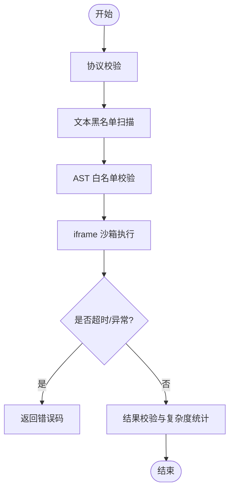

图表来源
- [产品技术设计文档:428-470](file://tech/product-technical-design.md#L428-L470)
- [产品技术设计文档:472-518](file://tech/product-technical-design.md#L472-L518)

章节来源
- [产品技术设计文档:428-470](file://tech/product-technical-design.md#L428-L470)
- [产品技术设计文档:472-518](file://tech/product-technical-design.md#L472-L518)

### 前端模块与 SceneManager
- 模块：Studio、资产库、模板库、API 控制台；Studio 内分 Prompt 面板、模型查看器、参数检查器、版本历史。
- SceneManager 能力：场景初始化、加载/清空模型、视角适配、背景切换、截图、资源释放。
- 性能策略：按需加载、Worker 解析、InstancedMesh、复杂度阈值提示、及时释放资源、可见性控制渲染循环。

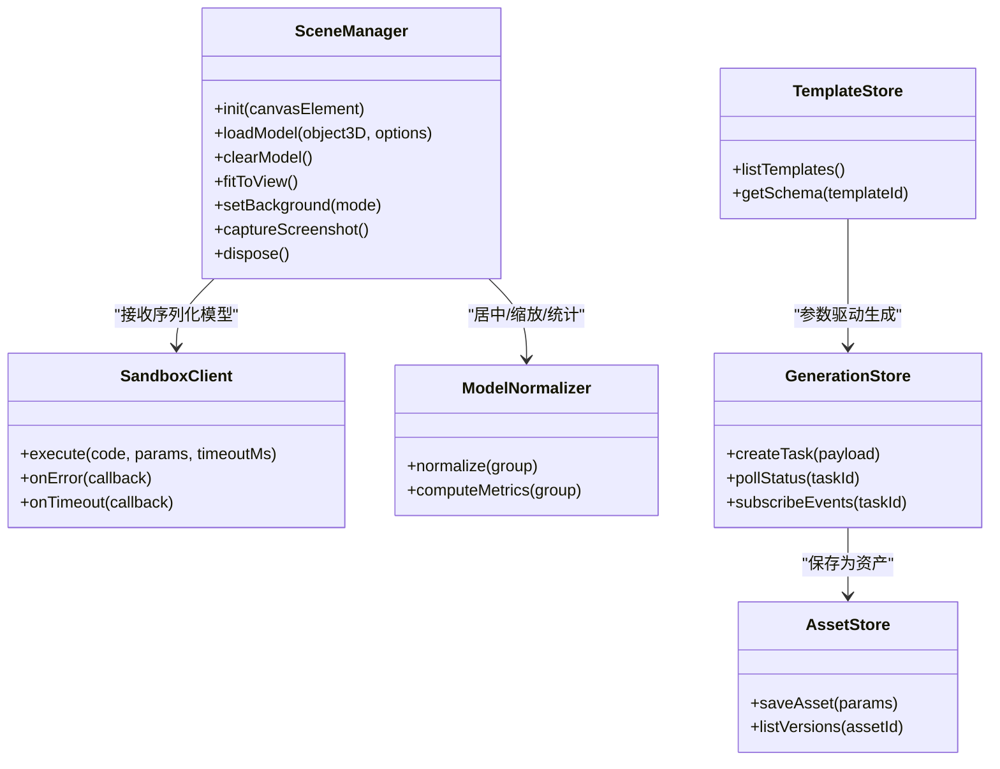

图表来源
- [产品技术设计文档:520-572](file://tech/product-technical-design.md#L520-L572)

章节来源
- [产品技术设计文档:520-572](file://tech/product-technical-design.md#L520-L572)

### 后端模块与 Generation Service 内部
- NestJS 模块：Auth、Workspace、Project、Generation、Prompt、Llm、Validation、Template、Asset、Feedback、Export、Billing、Observability。
- Generation Service 内部：控制器 → 服务 → 相似度缓存 → 路由（模板匹配/Prompt 构建）→ LLM 适配器 → 输出解析 → 校验 → 修复/评分 → 持久化。

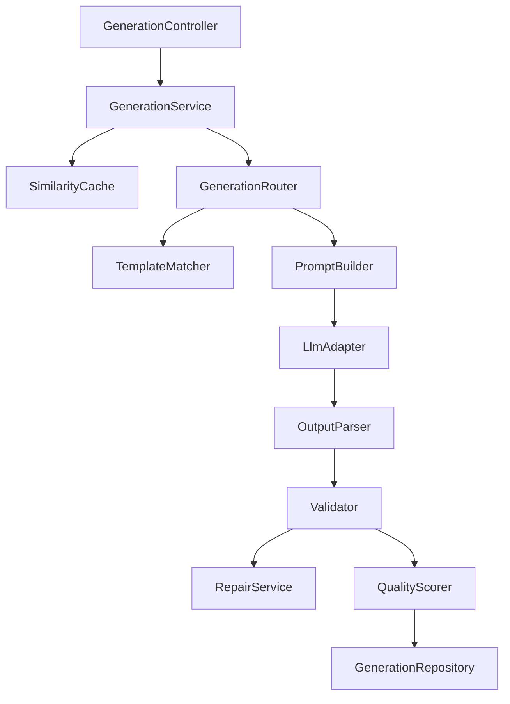

图表来源
- [产品技术设计文档:574-630](file://tech/product-technical-design.md#L574-L630)

章节来源
- [产品技术设计文档:574-630](file://tech/product-technical-design.md#L574-L630)

### 多供应商 LLM 适配器
- 统一接口：provider、generate、可选 stream。
- 选择策略：按任务类型、成本与延迟选择供应商；失败重试与降级；记录 token、耗时、错误码与质量。

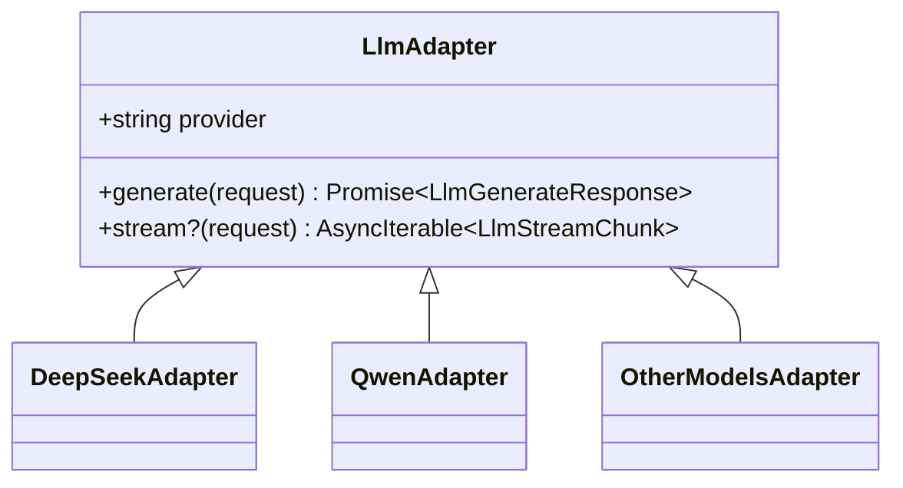

图表来源
- [产品技术设计文档:611-630](file://tech/product-technical-design.md#L611-L630)

章节来源
- [产品技术设计文档:611-630](file://tech/product-technical-design.md#L611-L630)

### 模板系统与匹配策略
- 模板结构：templateId、version、category、paramSchema、defaultParams、renderer。
- 分层：Skeleton、Style Variant、Detail Pack、Material Preset、Param Schema。
- 匹配：类别识别与关键词抽取 → 标签/向量检索候选 → LLM 选择最匹配模板并生成参数 → 置信度低则回退 Hybrid/Code 模式。

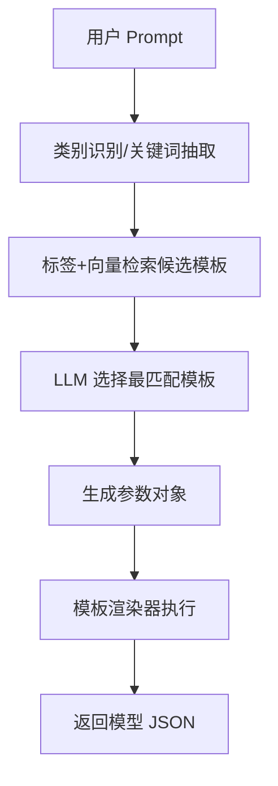

图表来源
- [产品技术设计文档:760-804](file://tech/product-technical-design.md#L760-L804)

章节来源
- [产品技术设计文档:760-804](file://tech/product-technical-design.md#L760-L804)

## 依赖关系分析
- 前端依赖：React/TS/Vite、Three.js、UI 库；通过 postMessage 与 iframe 沙箱通信；通过 REST/SSE/WebSocket 与后端交互。
- 后端依赖：NestJS 模块间松耦合；通过 Repository/ORM 抽象数据库；通过适配器接入多 LLM；通过缓存/队列提升吞吐与稳定性。
- 数据依赖：SQLite（MVP）→ PostgreSQL（平台化），JSON 字段兼容设计；对象存储承载大附件。
- 可观测依赖：OpenTelemetry/Prometheus/Grafana 贯穿请求链路。

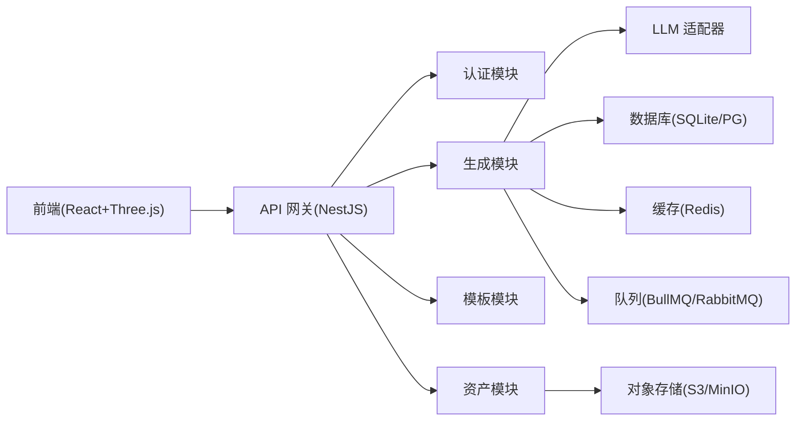

图表来源
- [产品技术设计文档:34-101](file://tech/product-technical-design.md#L34-L101)
- [产品技术设计文档:104-130](file://tech/product-technical-design.md#L104-L130)

章节来源
- [产品技术设计文档:34-101](file://tech/product-technical-design.md#L34-L101)
- [产品技术设计文档:104-130](file://tech/product-technical-design.md#L104-L130)

## 性能与可扩展性
- 前端优化
  - 动态加载 Three.js 与沙箱 runtime；模型 JSON 解析放入 Worker；重复几何体使用 InstancedMesh；加载前复杂度评估；及时释放 geometry/material/texture；页面不可见时暂停渲染。
- 后端优化
  - 相似 Prompt 缓存复用；模板模式跳过 LLM；异步任务队列；LLM 并发与熔断；热门模板与 Schema 缓存。
- 数据库优化
  - 高频查询字段建索引；大字段迁移至对象存储；历史任务归档。
- 可扩展性
  - 服务拆分与无状态化；水平扩容生成与渲染相关服务；多 LLM 供应商路由与降级；配额与限流保障公平性。

章节来源
- [产品技术设计文档:563-572](file://tech/product-technical-design.md#L563-L572)
- [产品技术设计文档:933-958](file://tech/product-technical-design.md#L933-L958)

## 部署拓扑与演进

### 系统上下文图（概念）
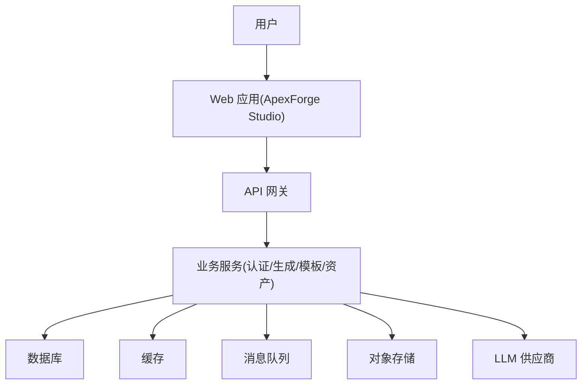

[此图为概念性上下文图，不直接映射具体源码文件]

### MVP 部署架构
- 单体后端（NestJS）+ SQLite + 本地文件存储；前端 SPA；LLM 直连；iframe 沙箱运行 Three.js 静态运行时。

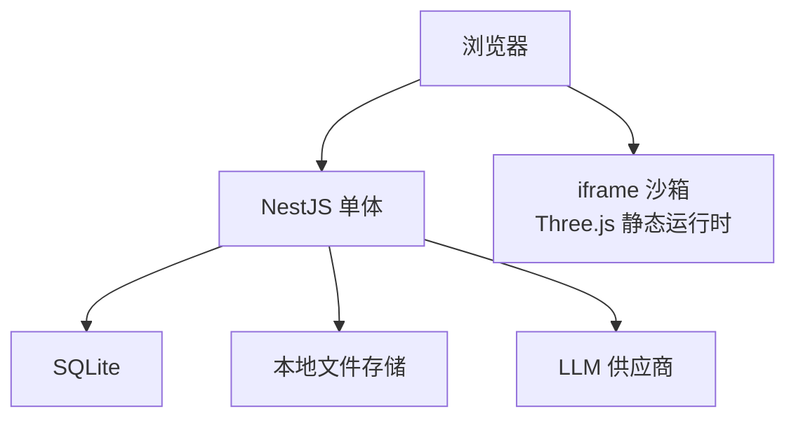

图表来源
- [产品技术设计文档:64-76](file://tech/product-technical-design.md#L64-L76)

章节来源
- [产品技术设计文档:64-76](file://tech/product-technical-design.md#L64-L76)

### 平台化部署架构
- 前端 CDN 加速；API 网关；认证/生成/资产/模板微服务；消息队列与 Worker；PostgreSQL/Redis；对象存储；可观测体系。

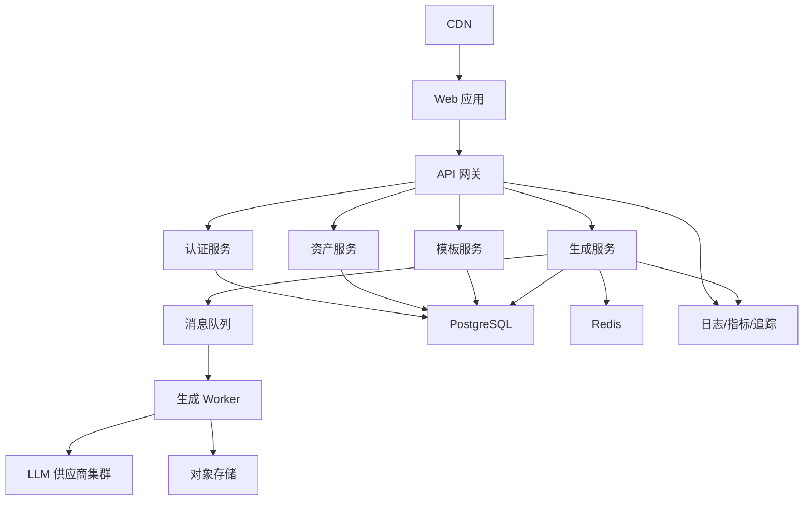

图表来源
- [产品技术设计文档:78-100](file://tech/product-technical-design.md#L78-L100)

章节来源
- [产品技术设计文档:78-100](file://tech/product-technical-design.md#L78-L100)

### 技术选型权衡
- 前端：React + TS + Vite 利于组件化与类型安全；Three.js 成熟稳定，适合复杂 3D 交互；iframe 沙箱比纯 Worker 更易实现强隔离与超时销毁。
- 后端：NestJS 与前端同栈，生态统一，便于微服务拆分与模块化管理。
- 数据库：MVP 用 SQLite 降低运维成本；平台化迁移 PostgreSQL，保证高可用与扩展性；JSON 字段兼容设计避免绑定。
- 缓存/队列/对象存储：根据负载逐步引入，平衡成本与性能。

章节来源
- [产品技术设计文档:104-130](file://tech/product-technical-design.md#L104-L130)
- [产品需求文档:43-54](file://prd.md#L43-L54)

## 故障排查指南
- 常见错误分类（沙箱侧）
  - 执行超时、运行时报错、模型 JSON 非法、模型过于复杂、未生成有效对象。
- 可观测与定位
  - 全链路 traceId 贯穿前端、网关、服务、LLM、数据库与沙箱；记录耗时、状态、错误码与质量分。
- 告警规则
  - 生成失败率过高、LLM 延迟过高、校验失败突增、沙箱超时突增、API 错误率过高。

章节来源
- [产品技术设计文档:472-518](file://tech/product-technical-design.md#L472-L518)
- [产品技术设计文档:868-907](file://tech/product-technical-design.md#L868-L907)

## 结论
ApexForge 以“模板优先、代码为辅”的策略，结合严格的代码安全校验与 iframe 沙箱，实现了从自然语言到可交互 3D 模型的闭环。架构上支持从轻量 MVP 平滑演进到云原生微服务，兼顾安全性、稳定性与可扩展性。通过全链路可观测与质量评分闭环，持续优化生成效果与用户体验。

## 附录：数据模型与接口契约

### 领域实体关系（简化）
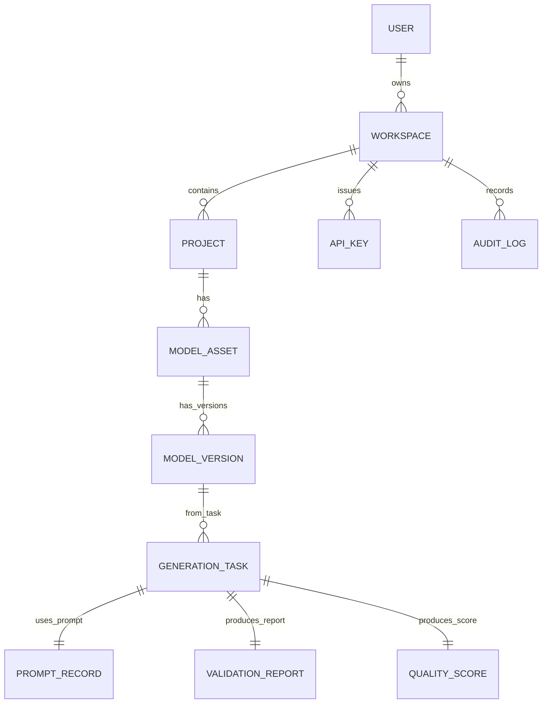

图表来源
- [产品技术设计文档:153-170](file://tech/product-technical-design.md#L153-L170)

章节来源
- [产品技术设计文档:153-170](file://tech/product-technical-design.md#L153-L170)

### 核心表结构（节选）
- users、workspaces、projects、generation_tasks、model_assets、model_versions、templates、template_versions、validation_reports、quality_scores 等字段与约束详见设计文档。

章节来源
- [产品技术设计文档:178-324](file://tech/product-technical-design.md#L178-L324)

### API 规范与示例
- 通用规范：Base URL、认证方式、traceId、统一错误结构。
- 关键接口：创建生成任务、查询任务、保存资产、查询资产版本、模板接口、SSE 事件。

章节来源
- [产品技术设计文档:632-757](file://tech/product-technical-design.md#L632-L757)