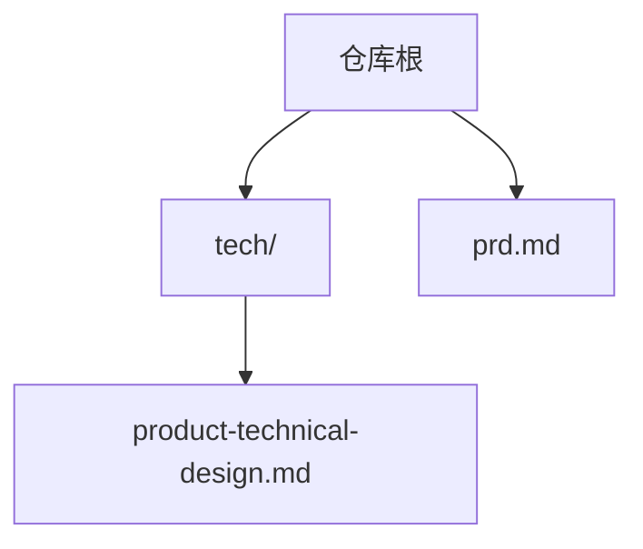
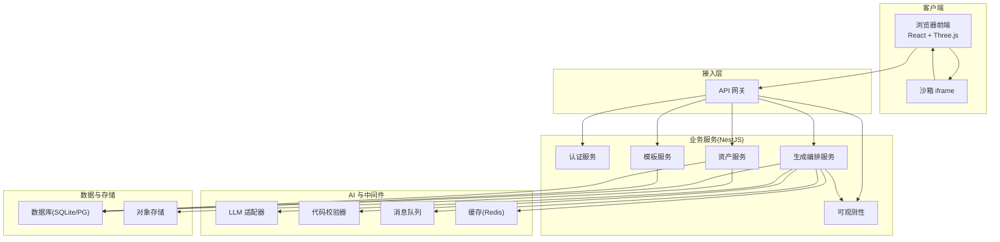
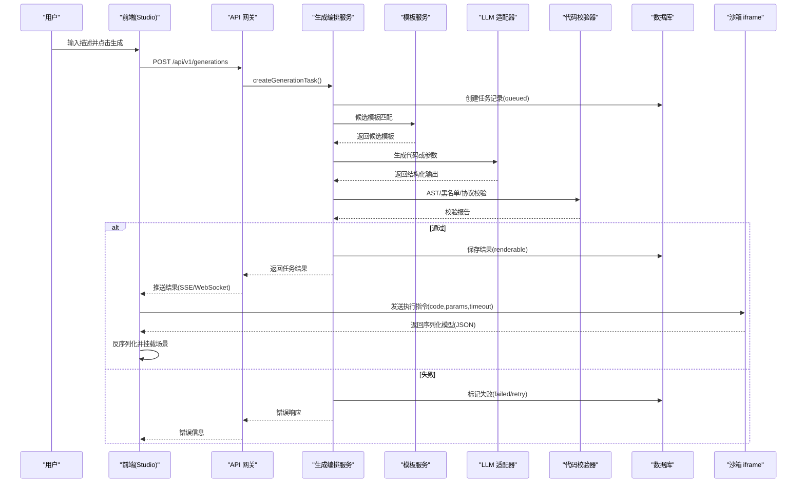
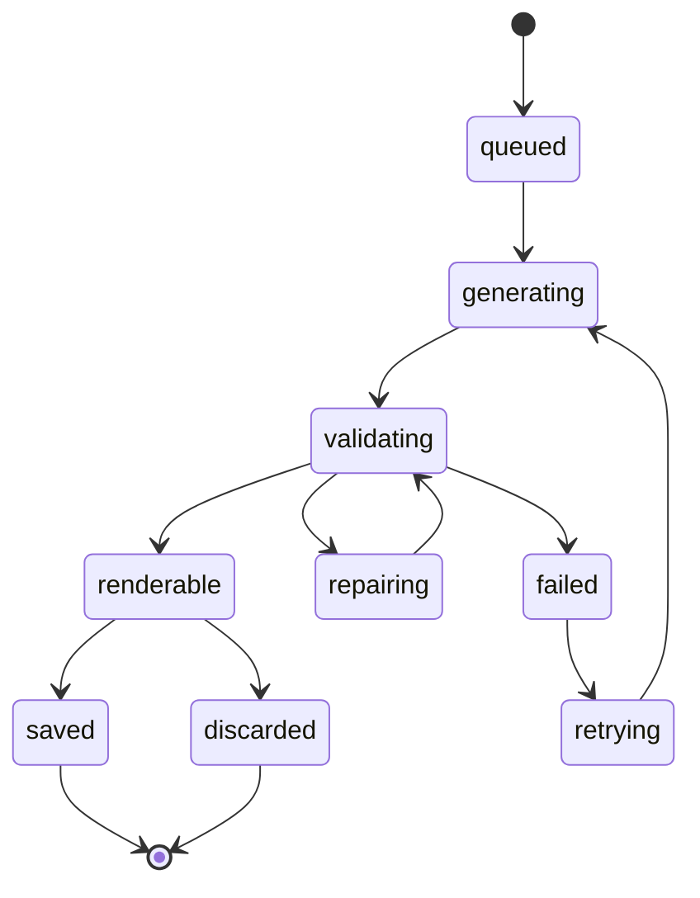
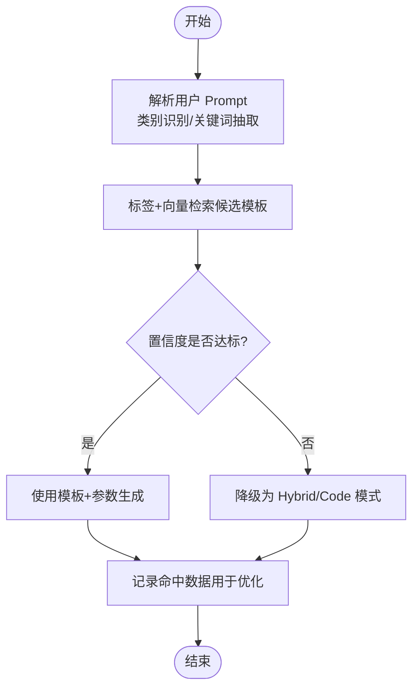
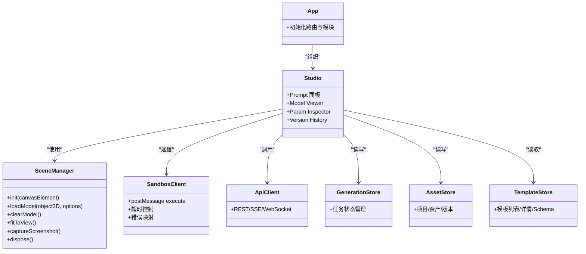
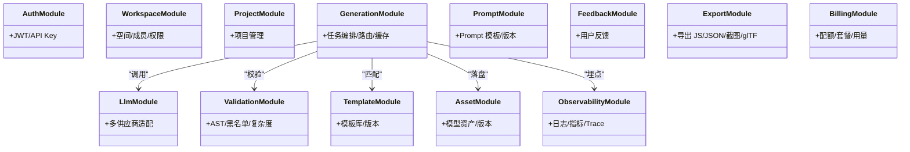
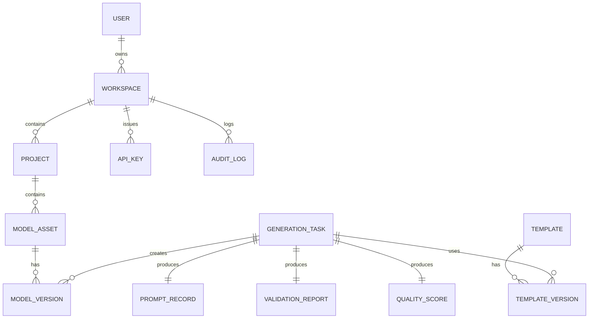
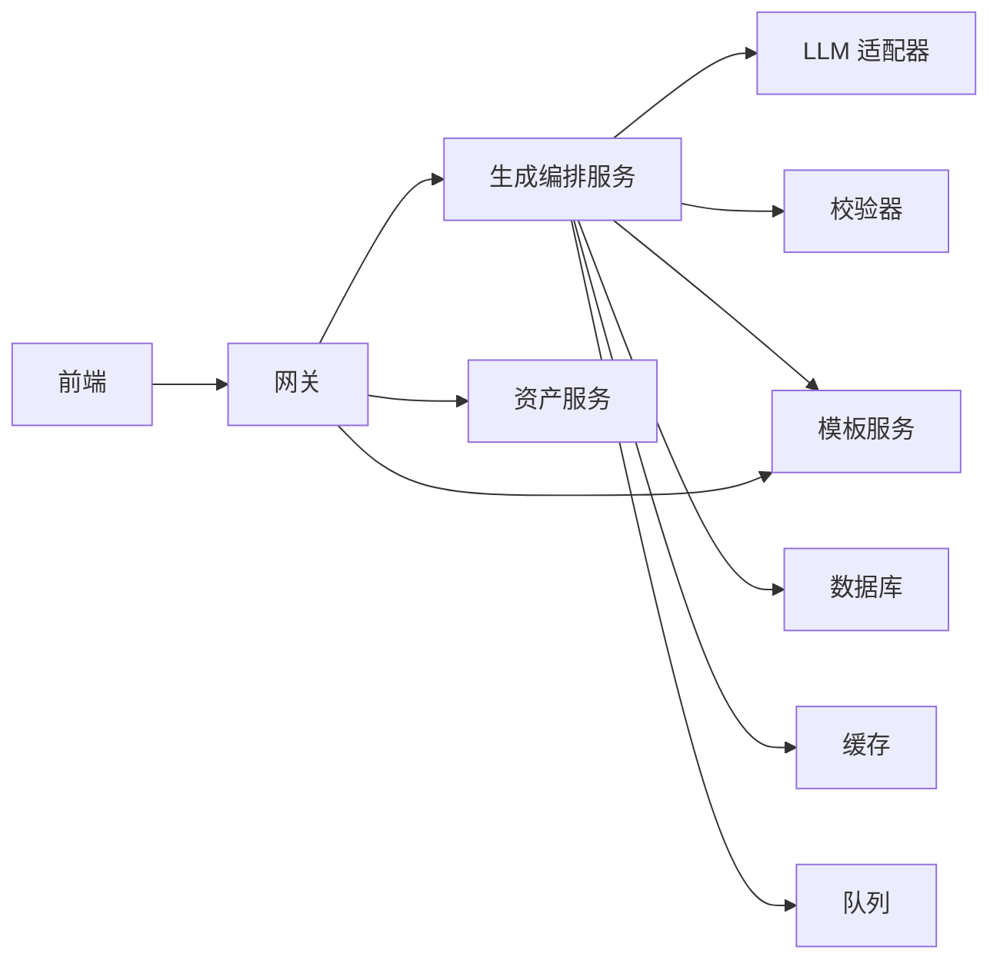
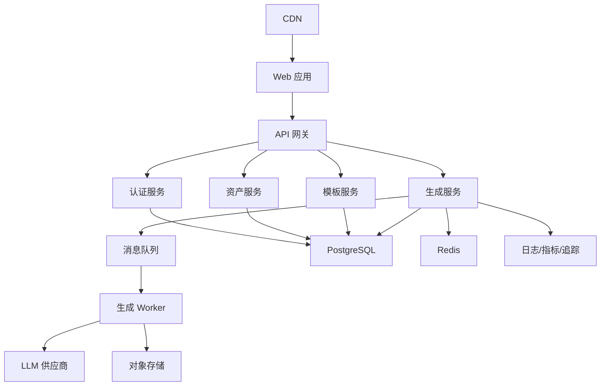

# 系统架构设计

<cite>
**本文引用的文件**   
- [产品技术设计文档](file://tech/product-technical-design.md)
- [产品需求文档](file://prd.md)
</cite>

## 目录
1. [引言](#引言)
2. [项目结构](#项目结构)
3. [核心组件](#核心组件)
4. [架构总览](#架构总览)
5. [详细组件分析](#详细组件分析)
6. [依赖关系分析](#依赖关系分析)
7. [性能与可扩展性](#性能与可扩展性)
8. [安全、监控与灾难恢复](#安全监控与灾难恢复)
9. [部署拓扑与基础设施](#部署拓扑与基础设施)
10. [结论](#结论)
11. [附录：技术栈与兼容性](#附录技术栈与兼容性)

## 引言
本架构文档面向 ApexForge 平台，围绕“从自然语言到可交互 Three.js 模型”的端到端闭环，给出高层设计、架构模式、系统边界、组件交互、数据流向与集成模式。文档同时覆盖技术选型权衡、基础设施与部署拓扑、横切关注点（安全、监控、灾备）以及技术栈与第三方依赖说明，帮助产品、研发与运维团队在 MVP 到平台化演进中保持一致的技术决策与落地路径。

## 项目结构
仓库当前包含两份关键设计文档：
- 产品技术设计文档：定义总体架构、模块划分、领域模型、生成链路、模板体系、API 契约、质量评分、权限计费、可观测性、工程里程碑与目录结构等。
- 产品需求文档：阐述业务目标、差异化价值、前后端职责、沙箱方案、Prompt 策略、模板分层、性能优化与安全策略等。

**图表来源** 
- [产品技术设计文档:1-120](file://tech/product-technical-design.md#L1-L120)
- [产品需求文档:1-60](file://prd.md#L1-L60)

**章节来源**
- [产品技术设计文档:1-120](file://tech/product-technical-design.md#L1-L120)
- [产品需求文档:1-60](file://prd.md#L1-L60)

## 核心组件
- 前端 Studio：React + TypeScript + Vite，Three.js 渲染，Sandbox iframe 执行 AI 代码，提供 Prompt 输入、参数面板、版本历史与导出能力。
- API 网关：统一鉴权、限流、路由、traceId 透传。
- 业务服务：认证、空间与项目、资产、模板、生成编排、LLM 适配、校验、反馈、导出、计费、可观测性等 NestJS 模块。
- 数据层：SQLite（MVP）、PostgreSQL（平台化），Redis 缓存，对象存储（截图/导出/模型 JSON）。
- 任务队列：BullMQ/RabbitMQ/Kafka（按规模演进）。
- LLM 适配器：多供应商抽象与选择策略。
- 可观测性：Pino/OpenTelemetry/Prometheus/Grafana。

**章节来源**
- [产品技术设计文档:104-130](file://tech/product-technical-design.md#L104-L130)
- [产品技术设计文档:576-630](file://tech/product-technical-design.md#L576-L630)
- [产品需求文档:43-54](file://prd.md#L43-L54)

## 架构总览
ApexForge 采用前后端分离、模块化与渐进式微服务架构，并在生成链路中引入事件驱动（SSE/队列）以解耦高耗时步骤。

**图表来源** 
- [产品技术设计文档:34-101](file://tech/product-technical-design.md#L34-L101)
- [产品技术设计文档:576-630](file://tech/product-technical-design.md#L576-L630)

**章节来源**
- [产品技术设计文档:34-101](file://tech/product-technical-design.md#L34-L101)

## 详细组件分析

### 生成链路（序列图）
展示一次完整生成请求从前端到后端、LLM、校验、持久化与前端渲染的关键调用链。

**图表来源** 
- [产品技术设计文档:359-391](file://tech/product-technical-design.md#L359-L391)
- [产品技术设计文档:632-757](file://tech/product-technical-design.md#L632-L757)

**章节来源**
- [产品技术设计文档:359-391](file://tech/product-technical-design.md#L359-L391)
- [产品技术设计文档:632-757](file://tech/product-technical-design.md#L632-L757)

### 生成状态机（流程图）

**图表来源** 
- [产品技术设计文档:342-357](file://tech/product-technical-design.md#L342-L357)

**章节来源**
- [产品技术设计文档:342-357](file://tech/product-technical-design.md#L342-L357)

### 模板匹配策略（流程图）

**图表来源** 
- [产品技术设计文档:797-804](file://tech/product-technical-design.md#L797-L804)

**章节来源**
- [产品技术设计文档:797-804](file://tech/product-technical-design.md#L797-L804)

### 前端模块与关键服务（类图）

**图表来源** 
- [产品技术设计文档:524-571](file://tech/product-technical-design.md#L524-L571)

**章节来源**
- [产品技术设计文档:524-571](file://tech/product-technical-design.md#L524-L571)

### 后端模块划分（类图）

**图表来源** 
- [产品技术设计文档:576-630](file://tech/product-technical-design.md#L576-L630)

**章节来源**
- [产品技术设计文档:576-630](file://tech/product-technical-design.md#L576-L630)

### 领域模型（ER 图）

**图表来源** 
- [产品技术设计文档:155-170](file://tech/product-technical-design.md#L155-L170)

**章节来源**
- [产品技术设计文档:155-170](file://tech/product-technical-design.md#L155-L170)

## 依赖关系分析
- 模块内聚与耦合
  - 生成编排模块高度依赖 LLM 适配器、校验器与模板服务；通过接口抽象降低供应商与模板实现耦合。
  - 前端 SceneManager 与 SandboxClient 解耦渲染与执行上下文，避免主线程阻塞。
- 外部依赖
  - LLM 供应商（DeepSeek、Qwen 等）通过适配器统一封装，支持失败重试与降级。
  - 存储层通过 ORM 抽象，便于 SQLite 到 PostgreSQL 迁移。
- 潜在循环依赖
  - 通过明确的服务边界与接口契约避免循环引用；如生成服务不直接访问数据库细节，而是通过仓储接口。

**图表来源** 
- [产品技术设计文档:34-101](file://tech/product-technical-design.md#L34-L101)
- [产品技术设计文档:576-630](file://tech/product-technical-design.md#L576-L630)

**章节来源**
- [产品技术设计文档:34-101](file://tech/product-technical-design.md#L34-L101)
- [产品技术设计文档:576-630](file://tech/product-technical-design.md#L576-L630)

## 性能与可扩展性
- 前端性能
  - 动态加载 Three.js 与沙箱运行时，Worker 处理大模型解析，InstancedMesh/LOD 优化渲染，释放旧模型资源。
- 后端性能
  - 相似 Prompt 缓存、模板模式跳过 LLM、异步任务队列、供应商并发与熔断、热点 Schema 缓存。
- 数据库优化
  - 索引设计、大字段外迁对象存储、历史归档。
- 可扩展性
  - 从单体到微服务：网关+多服务+队列+缓存+对象存储；水平扩容生成 Worker 与 LLM 路由。

**章节来源**
- [产品技术设计文档:563-571](file://tech/product-technical-design.md#L563-L571)
- [产品技术设计文档:933-958](file://tech/product-technical-design.md#L933-L958)

## 安全、监控与灾难恢复
- 安全
  - 输入长度限制与敏感词过滤；输出协议校验、黑名单扫描、AST 白名单；iframe sandbox+CSP；密钥托管与脱敏日志。
- 监控
  - traceId 贯穿全链路；日志关键字段；告警规则（失败率、延迟、错误率突增）。
- 灾难恢复
  - 任务状态机与重试机制；对象存储冗余；数据库备份与回滚；灰度发布与快速回退。

**章节来源**
- [产品技术设计文档:428-470](file://tech/product-technical-design.md#L428-L470)
- [产品技术设计文档:868-908](file://tech/product-technical-design.md#L868-L908)
- [产品技术设计文档:910-931](file://tech/product-technical-design.md#L910-L931)

## 部署拓扑与基础设施
- MVP 部署
  - 浏览器直连 NestJS API，SQLite 本地存储，本地文件存储，LLM 供应商直调。
- 平台化部署
  - CDN 分发静态资源，Web 应用经 API 网关路由至各微服务；生成任务入队由 Worker 消费；PostgreSQL/Redis/对象存储支撑持久化与缓存；OpenTelemetry 采集日志/指标/追踪。

**图表来源** 
- [产品技术设计文档:82-100](file://tech/product-technical-design.md#L82-L100)

**章节来源**
- [产品技术设计文档:82-100](file://tech/product-technical-design.md#L82-L100)

## 结论
ApexForge 以“模板优先、代码为辅、安全可控、可观测可演进”为核心原则，通过前后端分离与模块化设计，在 MVP 阶段快速验证，在平台化阶段平滑演进为微服务与事件驱动架构。其关键技术决策（React+Three.js、NestJS、SQLite/PostgreSQL、iframe 沙箱、多供应商 LLM 适配）兼顾了稳定性、安全性与扩展性，配合完善的质量评分与反馈闭环，形成可持续优化的产品飞轮。

## 附录：技术栈与兼容性
- 前端
  - React 18、TypeScript、Vite；Three.js r160+；Tailwind CSS/Ant Design；SSE/WebSocket。
- 后端
  - NestJS 微服务；Prisma/TypeORM（建议）；BullMQ/RabbitMQ/Kafka（按规模）。
- 数据与中间件
  - SQLite（MVP）→ PostgreSQL（平台化）；Redis；对象存储（S3/MinIO/OSS）。
- 可观测性
  - Pino、OpenTelemetry、Prometheus、Grafana。
- LLM 供应商
  - DeepSeek、Qwen 等，通过适配器统一封装，支持失败重试与降级。

**章节来源**
- [产品技术设计文档:104-130](file://tech/product-technical-design.md#L104-L130)
- [产品需求文档:43-54](file://prd.md#L43-L54)