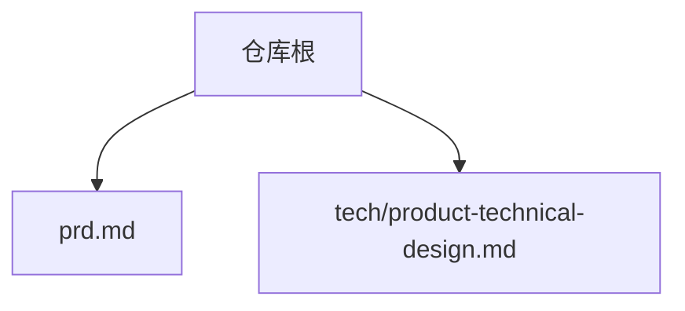
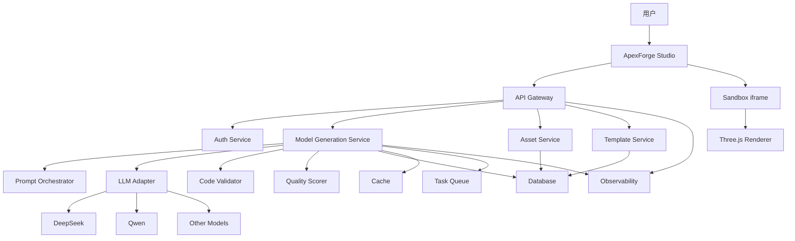
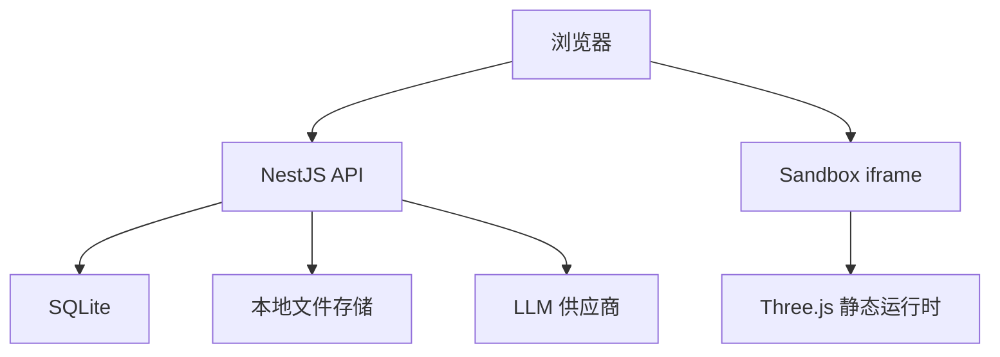
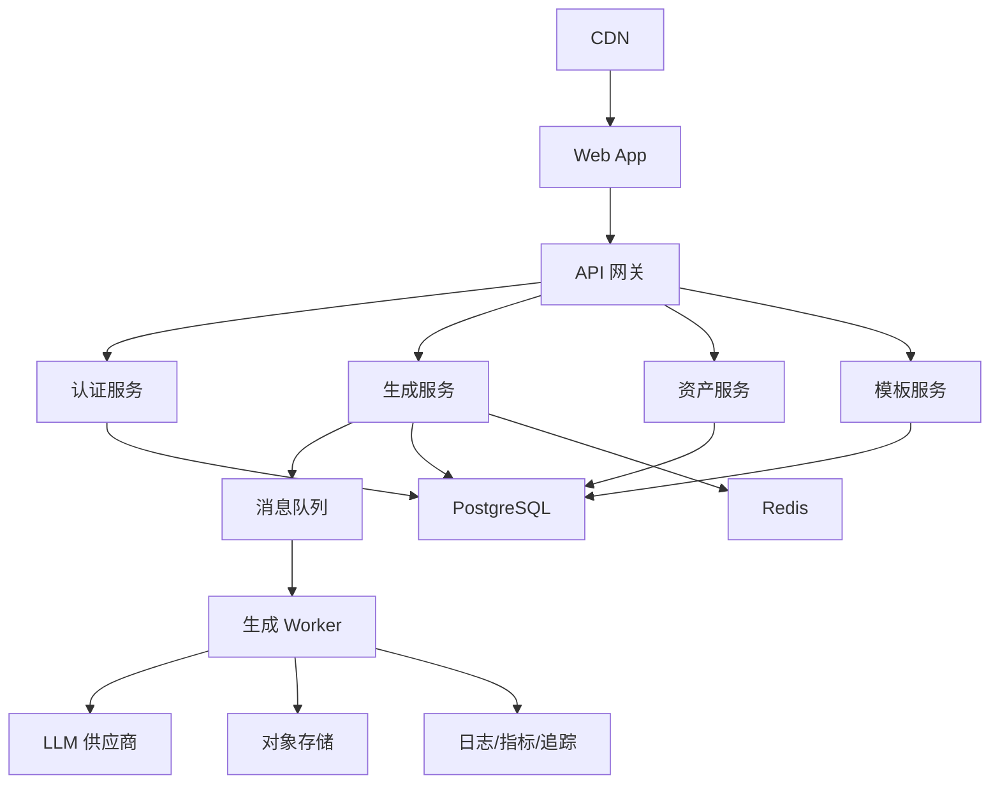
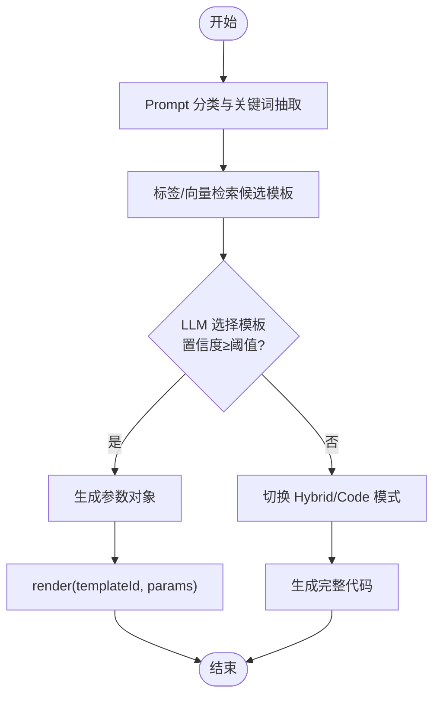
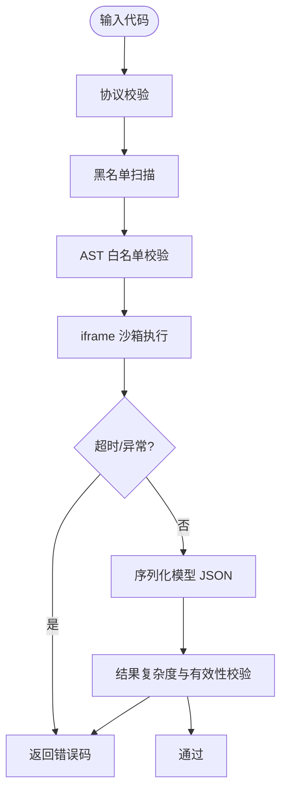
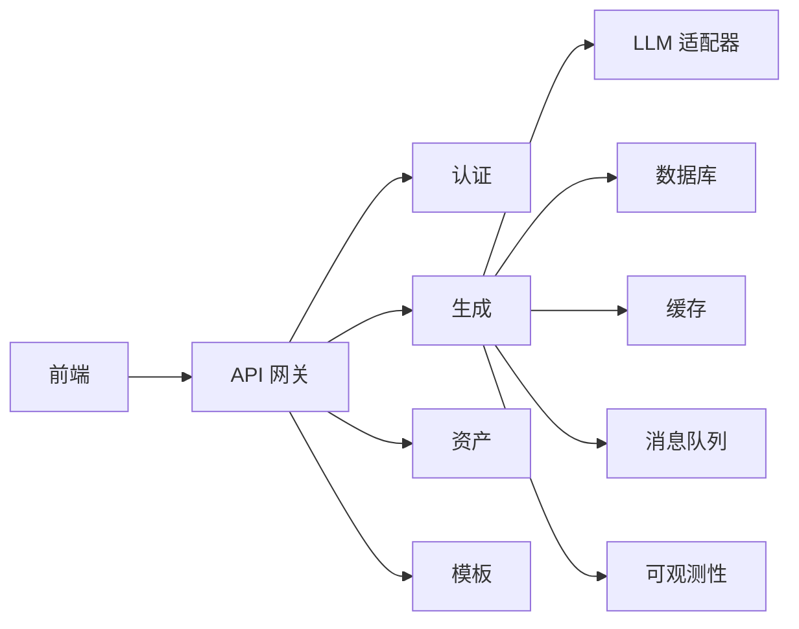

# 部署架构设计

<cite>
**本文引用的文件**
- [产品需求文档](file://prd.md)
- [产品技术设计文档](file://tech/product-technical-design.md)
</cite>

## 目录
1. [引言](#引言)
2. [项目结构](#项目结构)
3. [核心组件](#核心组件)
4. [架构总览](#架构总览)
5. [详细组件分析](#详细组件分析)
6. [依赖关系分析](#依赖关系分析)
7. [性能与容量规划](#性能与容量规划)
8. [监控、日志与可观测性](#监控日志与可观测性)
9. [故障排查指南](#故障排查指南)
10. [结论](#结论)
11. [附录：部署清单与演进路径](#附录部署清单与演进路径)

## 引言
本文件面向 ApexForge 平台的运维与平台工程团队，聚焦“部署架构设计”，覆盖从 MVP 到平台化阶段的部署拓扑差异、基础设施需求、容器化与编排方案、数据库与缓存策略、以及监控告警与排障体系。内容基于仓库中的产品需求与技术设计文档进行系统化整理与落地指导，确保读者既能把握整体演进路线，也能按阶段实施具体部署方案。

## 项目结构
仓库包含两份关键文档：
- 产品需求文档：定义业务目标、系统概览、前端/后端/AI 生成服务职责、安全与性能要点等。
- 产品技术设计文档：给出逻辑架构、MVP 与平台化部署图、数据模型、生成链路、模板系统、API 规范、质量评分、可观测性与工程里程碑等。



章节来源
- [产品需求文档:1-168](file://prd.md#L1-L168)
- [产品技术设计文档:1-120](file://tech/product-technical-design.md#L1-L120)

## 核心组件
- 前端（ApexForge Studio）：React + Three.js，负责交互与渲染，AI 代码在 iframe 沙箱中执行并返回序列化模型数据。
- 后端（NestJS）：提供 API 网关、鉴权、任务编排、模板与资产管理等能力；MVP 使用 SQLite，平台化迁移至 PostgreSQL。
- AI 生成服务：Prompt 编排、LLM 适配（DeepSeek/Qwen 等）、输出校验与质量评分。
- 模板库与参数化系统：分层模板、参数 Schema、匹配与渲染。
- 存储与缓存：SQLite/本地文件（MVP），PostgreSQL/对象存储/Redis（平台化）。
- 可观测性：traceId、指标、日志、SSE/WebSocket 事件推送。

章节来源
- [产品需求文档:33-54](file://prd.md#L33-L54)
- [产品技术设计文档:34-101](file://tech/product-technical-design.md#L34-L101)

## 架构总览
### 逻辑架构


图表来源
- [产品技术设计文档:38-62](file://tech/product-technical-design.md#L38-L62)

章节来源
- [产品技术设计文档:34-101](file://tech/product-technical-design.md#L34-L101)

### MVP 部署架构（单体）


图表来源
- [产品技术设计文档:68-76](file://tech/product-technical-design.md#L68-L76)

章节来源
- [产品技术设计文档:64-76](file://tech/product-technical-design.md#L64-L76)

### 平台化部署架构（服务化）


图表来源
- [产品技术设计文档:82-100](file://tech/product-technical-design.md#L82-L100)

章节来源
- [产品技术设计文档:78-101](file://tech/product-technical-design.md#L78-L101)

## 详细组件分析

### 生成链路与服务编排
- 模式优先级：缓存命中 > 模板模式 > 混合模式 > 纯代码模式。
- 状态机：queued → generating → validating → renderable/saved/failed/repairing/retrying。
- 时序：前端创建任务 → 网关鉴权限流 → 生成服务路由 → 缓存/模板/LLM → 校验与评分 → 持久化 → SSE/WebSocket 推送 → 前端沙箱执行与渲染。

```mermaid
sequenceDiagram
participant FE as "前端"
participant GW as "API 网关"
participant GEN as "生成服务"
participant CACHE as "缓存"
participant TPL as "模板服务"
participant LLM as "LLM 适配器"
participant VAL as "校验器"
participant DB as "数据库"
participant BOX as "沙箱"
FE->>GW : "POST /api/v1/generations"
GW->>GEN : "createGenerationTask"
GEN->>CACHE : "querySimilarPrompt"
alt "缓存命中"
CACHE-->>GEN : "复用结果"
else "缓存未命中"
GEN->>TPL : "findCandidateTemplate"
TPL-->>GEN : "候选模板"
GEN->>LLM : "generate code or params"
LLM-->>GEN : "生成输出"
GEN->>VAL : "validate output"
VAL-->>GEN : "校验报告"
end
GEN->>DB : "持久化任务与结果"
GEN-->>GW : "返回结果"
GW-->>FE : "generation payload"
FE->>BOX : "iframe 执行"
BOX-->>FE : "模型 JSON 或错误"
```

图表来源
- [产品技术设计文档:361-390](file://tech/product-technical-design.md#L361-L390)

章节来源
- [产品技术设计文档:327-390](file://tech/product-technical-design.md#L327-L390)

### 模板系统与参数化渲染
- 模板分层：骨架（Skeleton）→ 风格变体（Style Variant）→ 细节包（Detail Pack）→ 材质预设（Material Preset）→ 参数 Schema。
- 匹配策略：类别识别与关键词抽取 → 标签/向量检索候选 → LLM 选择模板并生成参数 → 置信度阈值控制回退到 Hybrid/Code 模式。
- 渲染流程：render(templateId, params) 或直接 buildModel(params, THREE)。



图表来源
- [产品技术设计文档:797-804](file://tech/product-technical-design.md#L797-L804)

章节来源
- [产品技术设计文档:760-804](file://tech/product-technical-design.md#L760-L804)

### 代码安全与沙箱执行
- 校验分层：协议校验 → 文本黑名单 → AST 白名单 → 运行时沙箱 → 超时销毁 → 结果校验。
- 黑名单 API：动态执行、网络访问、DOM 访问、动态加载、原型污染、计算风险。
- 沙箱方案：隐藏 iframe + sandbox + CSP，仅暴露受限全局与 Three.js 运行时，postMessage 传递执行指令与结果。



图表来源
- [产品技术设计文档:428-470](file://tech/product-technical-design.md#L428-L470)
- [产品技术设计文档:472-518](file://tech/product-technical-design.md#L472-L518)

章节来源
- [产品技术设计文档:428-518](file://tech/product-technical-design.md#L428-L518)

### API 与事件通道
- 通用规范：Base URL、JWT/API Key 鉴权、traceId 贯穿、统一错误结构。
- 主要接口：创建生成任务、查询任务、保存为资产、查询版本、模板 CRUD 与渲染、SSE 事件流。
- 事件类型：queued、generating、validating、repairing、renderable、failed。

章节来源
- [产品技术设计文档:632-757](file://tech/product-technical-design.md#L632-L757)

## 依赖关系分析
- 前后端解耦：前端通过 REST/SSE/WebSocket 与后端交互，渲染在客户端完成。
- 服务边界清晰：认证、生成、资产、模板、导出、计费、可观测性等模块职责明确。
- 外部依赖：LLM 供应商、对象存储、数据库、缓存、消息队列、CDN。



图表来源
- [产品技术设计文档:38-62](file://tech/product-technical-design.md#L38-L62)

章节来源
- [产品技术设计文档:34-101](file://tech/product-technical-design.md#L34-L101)

## 性能与容量规划
- 前端优化：按需加载 Three.js 与沙箱 runtime、Worker 解析大模型、InstancedMesh/LOD、释放旧资源。
- 服务端优化：相似 Prompt 缓存、模板模式跳过 LLM、异步任务、并发与熔断、热门模板缓存。
- 数据库优化：索引设计、大字段外迁对象存储、历史归档。
- 网络优化：静态资源 CDN、Gzip/Brotli、增量更新。

章节来源
- [产品需求文档:155-165](file://prd.md#L155-L165)
- [产品技术设计文档:933-958](file://tech/product-technical-design.md#L933-L958)

## 监控、日志与可观测性
- Trace 链路：traceId 贯穿前端、网关、生成服务、LLM、校验、数据库、沙箱执行。
- 日志字段：traceId、userId、workspaceId、taskId、provider、promptVersion、generationMode、latencyMs、status、errorCode、qualityScore。
- 告警规则：生成失败率过高、LLM 延迟过高、校验失败突增、沙箱超时突增、API 错误率过高。
- 事件通道：SSE 推送任务状态变化，便于前端实时反馈。

章节来源
- [产品技术设计文档:868-908](file://tech/product-technical-design.md#L868-L908)
- [产品技术设计文档:734-757](file://tech/product-technical-design.md#L734-L757)

## 故障排查指南
- 常见错误码与提示：
  - SANDBOX_TIMEOUT：执行超时，建议降低复杂度或重试。
  - SANDBOX_RUNTIME_ERROR：运行时报错，检查生成代码与参数。
  - MODEL_JSON_INVALID：返回结构非法，触发重新生成。
  - MODEL_TOO_COMPLEX：复杂度超限，建议使用模板模式。
  - MODEL_EMPTY：未生成有效对象，补充描述。
- 排查步骤：
  - 根据 traceId 定位全链路日志与指标。
  - 检查 LLM 供应商响应与错误码。
  - 查看校验报告与质量评分详情。
  - 确认沙箱执行是否超时或抛出异常。
  - 评估模型复杂度与资源占用。

章节来源
- [产品技术设计文档:508-518](file://tech/product-technical-design.md#L508-L518)
- [产品技术设计文档:898-908](file://tech/product-technical-design.md#L898-L908)

## 结论
ApexForge 的部署架构遵循“渐进式演进”原则：MVP 采用单体后端加 SQLite/本地存储快速验证核心价值；平台化阶段拆分为微服务，引入 PostgreSQL、Redis、消息队列与对象存储，并通过 CDN 与可观测性体系保障高可用与可维护性。通过模板优先、安全校验与质量闭环，平台在稳定性与创造力之间取得平衡，具备向企业级私有化与多租户扩展的能力。

## 附录：部署清单与演进路径

### 基础设施需求
- 服务器配置（参考）
  - CPU：4–8 核（后端/Worker），GPU 可选用于本地推理（若自部署模型）。
  - 内存：8–16 GB（后端/Worker），Redis 与数据库独立实例更佳。
  - 磁盘：SSD，对象存储替代本地文件（平台化）。
- 网络架构
  - 入口：负载均衡（Nginx/云 LB）+ WAF。
  - 内网：服务间通信走 VPC，数据库/缓存/对象存储隔离。
  - 出口：仅允许访问 LLM 供应商与必要第三方。
- CDN 加速
  - 静态资源（前端构建产物、Three.js 运行时）上 CDN，开启 Gzip/Brotli 与缓存策略。
- 负载均衡
  - 前端与 API 网关前挂 LB，支持健康检查与滚动升级。

章节来源
- [产品技术设计文档:82-100](file://tech/product-technical-design.md#L82-L100)

### 容器化与编排
- Docker 镜像
  - 前端：Node 构建产物 + Nginx 静态托管。
  - 后端：NestJS 应用镜像，环境变量注入密钥与连接串。
  - Worker：生成 Worker 镜像，拉取队列任务执行。
- Kubernetes 编排
  - Deployment/StatefulSet：后端、Worker、Redis、PostgreSQL（托管或自建）。
  - Service/Ingress：对外暴露 API 与 Web 入口。
  - ConfigMap/Secret：配置与敏感信息分离管理。
  - HPA：按 CPU/内存或自定义指标自动扩缩容。
- 服务发现
  - K8s Service DNS 作为内部服务发现。
  - 网关层统一路由与鉴权。

章节来源
- [产品技术设计文档:82-100](file://tech/product-technical-design.md#L82-L100)

### 数据库部署策略
- MVP：SQLite 本地存储，ORM 抽象避免方言绑定，ID 使用 UUID/CUID，JSON 字段以 TEXT 存储。
- 平台化：PostgreSQL 集群（主备/多副本），迁移脚本将历史数据导入，保留 JSONB 字段优势。
- 索引与归档：对常用查询列建索引，大字段外迁对象存储，历史任务按时间归档。

章节来源
- [产品技术设计文档:122-129](file://tech/product-technical-design.md#L122-L129)
- [产品技术设计文档:952-958](file://tech/product-technical-design.md#L952-L958)

### 缓存服务 Redis 配置与高可用
- 用途：相似 Prompt 缓存、任务状态、限流计数、热门模板与 Schema 缓存。
- 配置要点：持久化（AOF/RDB）、内存上限与淘汰策略、连接池与超时。
- 高可用：哨兵或集群模式，跨 AZ 部署，读写分离与故障转移。

章节来源
- [产品技术设计文档:944-951](file://tech/product-technical-design.md#L944-L951)

### 监控告警与排障体系
- 指标：API QPS、P95/P99 延迟、错误率、LLM 调用成功率与耗时、沙箱超时率、模型复杂度分布。
- 日志：结构化 JSON 日志，集中采集与检索，脱敏处理。
- 追踪：OpenTelemetry 上报，traceId 贯穿全链路。
- 告警：基于阈值与环比突变的规则，通知渠道（邮件/IM/电话）。

章节来源
- [产品技术设计文档:868-908](file://tech/product-technical-design.md#L868-L908)

### 安全与合规
- 输入安全：Prompt 长度限制、敏感词过滤、品牌与侵权拦截。
- 输出安全：协议校验、黑名单与 AST 白名单、模型内容审核。
- 数据安全：密钥管理（KMS/Vault）、API Key 哈希存储、敏感日志脱敏。

章节来源
- [产品技术设计文档:910-931](file://tech/product-technical-design.md#L910-L931)