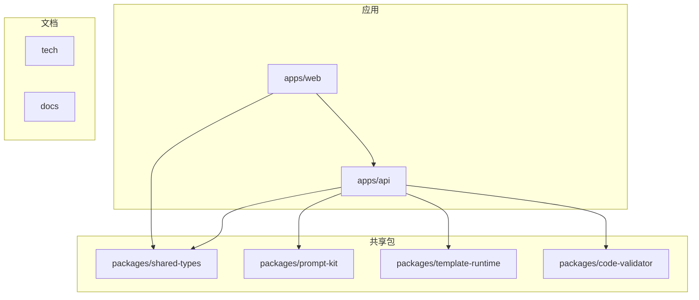
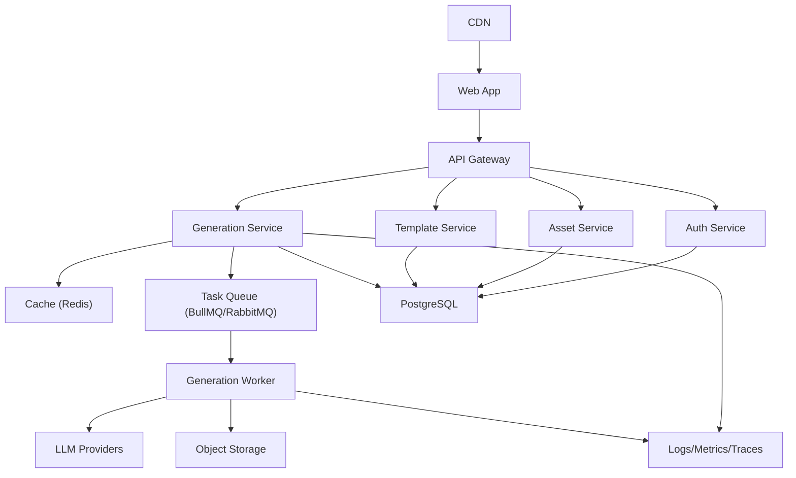
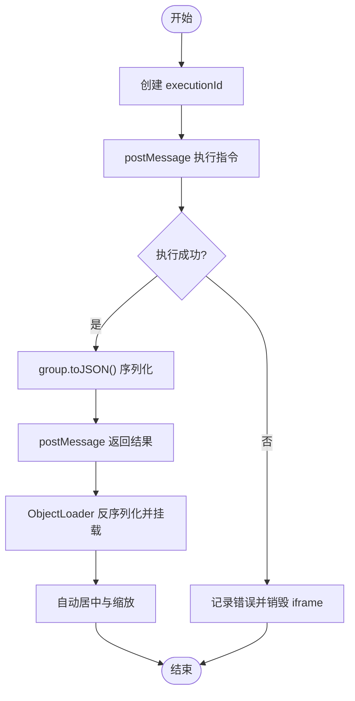
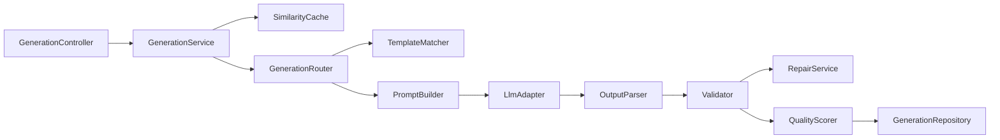

# 部署与运维

<cite>
**本文引用的文件**
- [产品需求文档](file://prd.md)
- [产品技术设计文档](file://tech/product-technical-design.md)
</cite>

## 目录
1. [引言](#引言)
2. [项目结构](#项目结构)
3. [核心组件](#核心组件)
4. [架构总览](#架构总览)
5. [详细组件分析](#详细组件分析)
6. [依赖关系分析](#依赖关系分析)
7. [性能考虑](#性能考虑)
8. [故障排查指南](#故障排查指南)
9. [结论](#结论)
10. [附录](#附录)

## 引言
本文件面向 ApexForge 平台的开发与运维团队，提供从开发环境搭建到生产部署、监控告警、容量规划、备份恢复、CI/CD 流水线与自动化测试、以及常见生产问题诊断的完整指南。内容基于平台的技术设计与业务目标，覆盖容器化（Docker + Kubernetes）、云服务部署选项、数据库配置与优化策略、可观测性与告警规则、以及稳定性与可靠性保障实践。

## 项目结构
仓库当前包含产品需求与技术设计文档，用于指导后续工程落地与运维方案制定。建议的工程目录结构如下：
- apps/web：前端应用（Studio、资产库、模板库、API 控制台）
- apps/api：后端服务（NestJS 单体或微服务）
- packages/shared-types、prompt-kit、template-runtime、code-validator：共享包与工具
- tech、docs：技术与产品文档



[本节为概念性说明，不直接分析具体代码文件]

## 核心组件
- 前端 Studio：React + Three.js，负责交互、渲染与沙箱执行。
- 后端 API：NestJS 提供鉴权、生成编排、模板管理、资产与审计等能力。
- AI 生成服务：Prompt 编排、LLM 适配、输出校验与质量评分。
- 模板系统：分层模板、参数 Schema、匹配与渲染。
- 沙箱运行时：iframe 隔离执行与结果序列化。
- 可观测性：traceId、日志、指标、链路追踪与告警。

**章节来源**
- [产品需求文档:33-53](file://prd.md#L33-L53)
- [产品技术设计文档:34-101](file://tech/product-technical-design.md#L34-L101)

## 架构总览
平台采用“前端 SPA + 后端 NestJS”的 MVP 架构，并预留向多服务、队列化与云原生演进的边界。



**图表来源**
- [产品技术设计文档:82-100](file://tech/product-technical-design.md#L82-L100)

**章节来源**
- [产品技术设计文档:64-100](file://tech/product-technical-design.md#L64-L100)

## 详细组件分析

### 容器化与编排（Docker + Kubernetes）
- 容器镜像
  - 前端静态资源构建产物由 CDN 分发；后端使用 Node 基础镜像，安装依赖并启动 NestJS 进程。
  - 可选 Worker 镜像用于异步生成任务。
- 环境变量与密钥
  - 通过 ConfigMap 注入非敏感配置（端口、缓存地址、对象存储端点）。
  - 通过 Secret 管理 LLM API Key、数据库连接串、JWT 密钥等。
- Pod 与副本
  - API 与 Worker 设置 HPA（CPU/内存与自定义指标），结合队列长度进行弹性伸缩。
- 网络与安全
  - Ingress 暴露 /api/v1 路径；启用 TLS 与 WAF。
  - NetworkPolicy 限制跨命名空间访问；仅允许网关到服务的必要端口。
- 健康检查与就绪探针
  - /healthz 返回服务状态；/readyz 检查依赖（DB、缓存、对象存储）可用性。
- 滚动更新与回滚
  - 使用 RollingUpdate 策略；发布前运行冒烟测试与灰度流量验证。

[本节为通用部署实践，未直接引用具体代码文件]

### 云服务部署选项
- 托管 K8s（如阿里云 ACK、腾讯云 TKE、AWS EKS、GCP GKE）
  - 使用托管 PostgreSQL 与 Redis；对象存储使用云厂商 OSS/S3/OSS。
  - 利用云厂商负载均衡与证书管理简化入站流量与 TLS。
- Serverless 与函数计算
  - 将生成任务下沉至函数计算或容器实例，按量计费，降低冷启动成本。
- 私有化部署
  - 使用 Helm Chart 或 Kustomize 管理多环境差异；支持离线镜像仓库与本地对象存储。

[本节为通用部署实践，未直接引用具体代码文件]

### 数据库配置与优化策略
- 选型与迁移
  - MVP 使用 SQLite，Beta 阶段迁移至 PostgreSQL；统一 ORM 抽象，避免方言绑定。
  - ID 使用 UUID/CUID，JSON 字段在 SQLite 以 TEXT 存储，PG 使用 JSONB。
- 索引与查询优化
  - 对 generation_tasks.traceId、workspaceId、createdAt 建索引。
  - 对 model_assets.workspaceId、projectId、updatedAt 建索引。
  - 大字段（代码、模型 JSON、截图）迁移至对象存储，仅保存 URL 与摘要。
- 归档与冷热分离
  - 历史任务按时间归档；热数据保留近期活跃记录。

**章节来源**
- [产品技术设计文档:122-129](file://tech/product-technical-design.md#L122-L129)
- [产品技术设计文档:952-958](file://tech/product-technical-design.md#L952-L958)

### 监控与告警
- 指标采集
  - 生成成功率、失败率、P95/P99 延迟、LLM 调用耗时、校验失败率、沙箱超时率、API 错误率。
- 日志规范
  - 每个请求携带 traceId；记录 userId、workspaceId、taskId、provider、promptVersion、generationMode、latencyMs、status、errorCode、qualityScore。
- 链路追踪
  - 贯穿前端提交、网关、生成服务、LLM 适配器、校验器、数据库与沙箱执行。
- 告警规则
  - 生成失败率过高（5 分钟内 > 30%）。
  - LLM 延迟过高（P95 > 60 秒）。
  - 校验失败突增（10 分钟内翻倍）。
  - 沙箱超时突增（10 分钟内 > 10%）。
  - API 错误率过高（5xx > 5%）。

```mermaid
sequenceDiagram
participant FE as "前端"
participant API as "API 网关"
participant GEN as "生成服务"
participant LLM as "LLM 适配器"
participant VAL as "校验器"
participant DB as "数据库"
participant BOX as "沙箱"
FE->>API : "POST /api/v1/generations"
API->>GEN : "创建生成任务"
GEN->>DB : "持久化任务"
GEN->>LLM : "调用模型生成"
LLM-->>GEN : "返回代码/参数"
GEN->>VAL : "安全与复杂度校验"
VAL-->>GEN : "校验报告"
GEN-->>API : "返回结果"
API-->>FE : "SSE/WebSocket 推送事件"
FE->>BOX : "iframe 执行并返回模型 JSON"
```

**图表来源**
- [产品技术设计文档:361-390](file://tech/product-technical-design.md#L361-L390)

**章节来源**
- [产品技术设计文档:868-907](file://tech/product-technical-design.md#L868-L907)

### 安全与合规
- 输入安全
  - Prompt 长度限制（MVP 建议 < 2000 字符）；敏感词拦截；品牌与侵权内容严格审核。
- 输出安全
  - 协议校验、黑名单扫描、AST 白名单校验；禁止动态执行、网络访问、DOM 操作。
- 数据安全
  - 密钥使用 KMS/Vault/Secret Manager；API Key 只展示一次，数据库仅存哈希；敏感日志脱敏。

**章节来源**
- [产品技术设计文档:910-930](file://tech/product-technical-design.md#L910-L930)

### 沙箱运行时与错误处理
- iframe 隔离
  - sandbox="allow-scripts"，CSP 限制脚本来源；每次执行创建 executionId，超时销毁。
- 执行流程
  - 主线程发送 {executionId, code, params, timeoutMs}；iframe 执行 buildModel(params, THREE)，返回 group.toJSON()；主线程 ObjectLoader 反序列化并居中缩放。
- 错误分类
  - SANDBOX_TIMEOUT、SANDBOX_RUNTIME_ERROR、MODEL_JSON_INVALID、MODEL_TOO_COMPLEX、MODEL_EMPTY。



**图表来源**
- [产品技术设计文档:498-506](file://tech/product-technical-design.md#L498-L506)

**章节来源**
- [产品技术设计文档:472-517](file://tech/product-technical-design.md#L472-L517)

### 模板系统与参数化
- 模板分层
  - Skeleton、Style Variant、Detail Pack、Material Preset、Param Schema。
- 匹配策略
  - 类别识别与关键词抽取；标签与向量检索候选模板；置信度阈值决定 Template/Hybrid/Code 模式。
- 渲染接口
  - render(templateId, params) 或 buildModel(params, THREE)。

**章节来源**
- [产品技术设计文档:760-804](file://tech/product-technical-design.md#L760-L804)

### 质量评分与闭环
- 评分维度
  - 可渲染性、Prompt 匹配度、结构完整性、性能表现、可编辑性。
- 自动评分输入
  - AST 校验结果、几何体数量、顶点数、材质数、沙箱执行结果、边界盒尺寸、用户反馈与保存行为。
- 闭环优化
  - 质量评分驱动 Prompt 与模板优化，回归数据集评估。

**章节来源**
- [产品技术设计文档:807-841](file://tech/product-technical-design.md#L807-L841)

## 依赖关系分析
- 模块耦合
  - GenerationService 依赖 SimilarityCache、TemplateMatcher、PromptBuilder、LlmAdapter、Validator、QualityScorer、Repository。
- 外部依赖
  - LLM 供应商（DeepSeek、Qwen 等）、对象存储、消息队列、数据库与缓存。
- 潜在风险
  - LLM 不稳定、校验失败突增、沙箱逃逸尝试、成本不可控。



**图表来源**
- [产品技术设计文档:596-609](file://tech/product-technical-design.md#L596-L609)

**章节来源**
- [产品技术设计文档:574-630](file://tech/product-technical-design.md#L574-L630)

## 性能考虑
- 前端优化
  - 按需加载 Three.js 与沙箱 runtime；Worker 解析大模型 JSON；InstancedMesh 批量渲染；释放旧模型 geometry/material/texture；requestAnimationFrame 控制渲染循环。
- 后端优化
  - 相似 Prompt 缓存复用；模板模式跳过 LLM 代码生成；异步化生成任务；并发与熔断控制；热门模板与 Schema 缓存。
- 数据库优化
  - 关键索引；大字段外置对象存储；历史任务归档。

**章节来源**
- [产品技术设计文档:933-958](file://tech/product-technical-design.md#L933-L958)

## 故障排查指南
- 常见问题定位
  - 生成失败率高：检查 LLM 延迟与错误码、校验失败原因、重试与降级策略。
  - 沙箱超时：审查模型复杂度、执行超时阈值、iframe 销毁与重建逻辑。
  - 模型无法渲染：核对 ObjectLoader 反序列化、边界盒为空、几何体数量超限。
  - API 错误率升高：查看网关限流、鉴权失败、上游依赖不可用。
- 日志与追踪
  - 依据 traceId 串联全链路日志；关注 errorCode、errorMessage、qualityScore 与 latencyMs。
- 快速恢复
  - 回滚最近变更；切换 LLM 供应商；启用模板模式优先；扩容 Worker 与缓存。

**章节来源**
- [产品技术设计文档:868-907](file://tech/product-technical-design.md#L868-L907)

## 结论
ApexForge 平台以“模板优先、代码为辅”的策略平衡生成灵活性与稳定性，并通过严格的代码安全校验与沙箱隔离确保运行安全。在生产环境中，建议采用容器化与云原生编排，结合完善的可观测性与告警体系，持续优化 Prompt、模板与模型选择策略，保障系统的稳定性、可扩展性与安全性。

[本节为总结性内容，不直接分析具体代码文件]

## 附录

### 开发环境搭建
- 前置条件
  - Node.js、包管理器、SQLite（MVP）、可选 PostgreSQL/Redis。
- 步骤
  - 初始化前后端工程；配置本地 LLM 代理或 API Key；启动后端与前端；验证生成接口与沙箱执行。
- 调试要点
  - 开启详细日志；使用 traceId 跟踪请求；模拟恶意输入与复杂模型进行压力测试。

[本节为通用实践，未直接引用具体代码文件]

### 生产环境部署清单
- 基础设施
  - K8s 集群、Ingress、TLS、WAF、NetworkPolicy。
- 中间件
  - PostgreSQL、Redis、对象存储、消息队列。
- 应用配置
  - 环境变量、Secret、健康检查、探针、HPA、滚动更新策略。
- 发布流程
  - 构建镜像、推送镜像仓库、部署到预发环境、冒烟测试、灰度发布、全量上线。

[本节为通用实践，未直接引用具体代码文件]

### CI/CD 流水线与自动化测试
- 流水线阶段
  - 代码拉取、依赖安装、单元测试、集成测试、安全扫描、构建镜像、部署预发、冒烟测试、灰度发布。
- 测试策略
  - 单元测试（PromptBuilder、Validator、Template、SceneManager、SandboxClient）。
  - 集成测试（端到端生成链路、LLM Adapter mock、鉴权与限流）。
  - 安全测试（恶意代码样本、沙箱逃逸、无限循环与复杂几何体）。
  - 质量回归测试（固定 Prompt 集，评估成功率、质量分与耗时）。

**章节来源**
- [产品技术设计文档:1040-1075](file://tech/product-technical-design.md#L1040-L1075)

### 容量规划建议
- 指标基线
  - QPS、并发任务数、LLM 调用速率、对象存储吞吐、数据库读写 IOPS。
- 扩缩容策略
  - 基于 CPU/内存与队列长度 HPA；热点模板与 Schema 缓存命中率；对象存储分片与 CDN 缓存。
- 成本优化
  - 模板模式优先；相似 Prompt 缓存；供应商路由与降级；按量计费与预留实例组合。

[本节为通用实践，未直接引用具体代码文件]

### 备份恢复与灾难恢复
- 备份策略
  - 数据库定期快照与增量备份；对象存储版本化与跨区域复制；配置文件与密钥纳入版本控制与加密存储。
- 恢复演练
  - 定期演练 RTO/RPO；验证数据一致性；回滚与切换预案。
- 灾备方案
  - 多可用区部署；跨地域容灾；故障自动转移与人工干预流程。

[本节为通用实践，未直接引用具体代码文件]

### 开放 API 与配额
- 认证与鉴权
  - JWT 用户侧；API Key 开放平台；限流与配额控制。
- 接口契约
  - Base URL /api/v1；统一错误结构与 traceId；SSE 事件推送。

**章节来源**
- [产品技术设计文档:632-757](file://tech/product-technical-design.md#L632-L757)