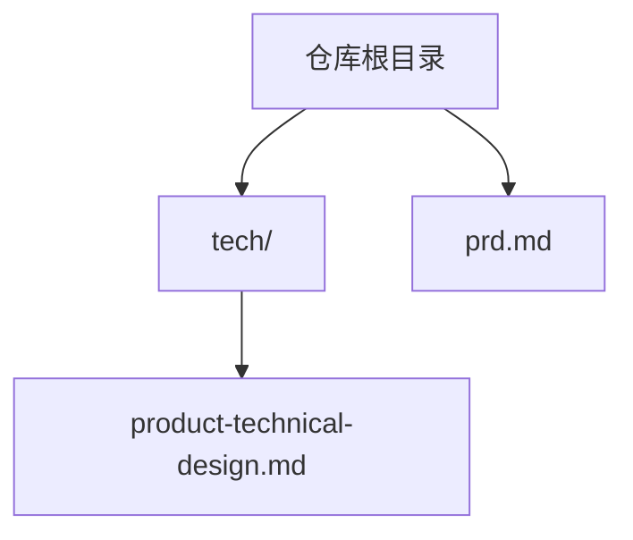
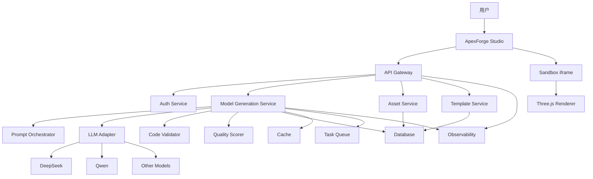
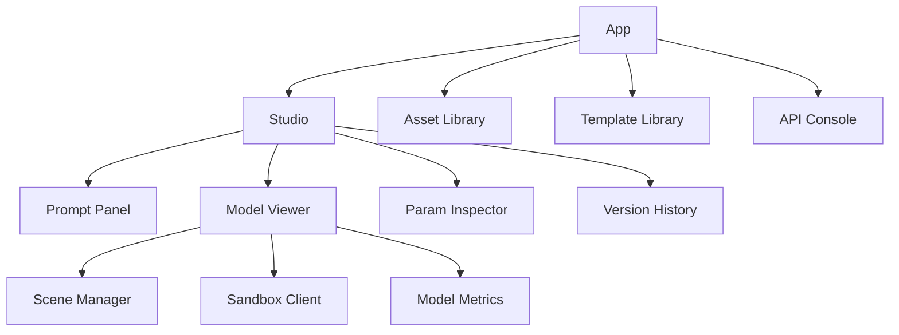
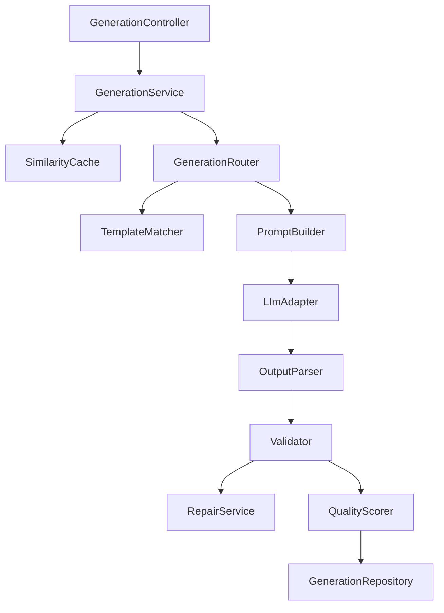
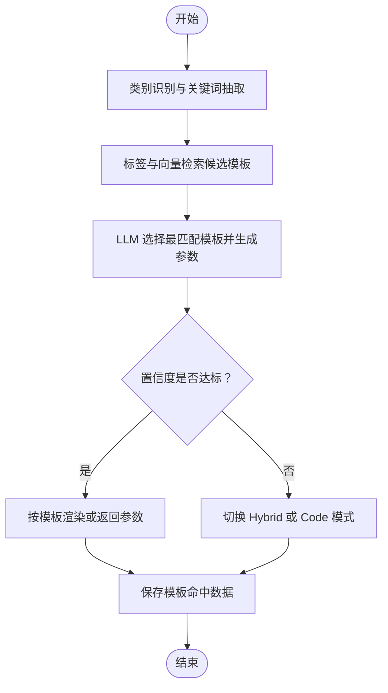
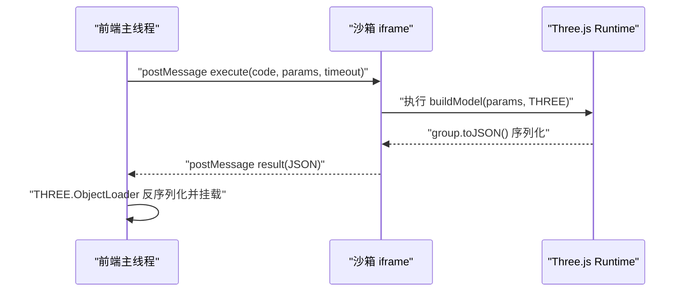
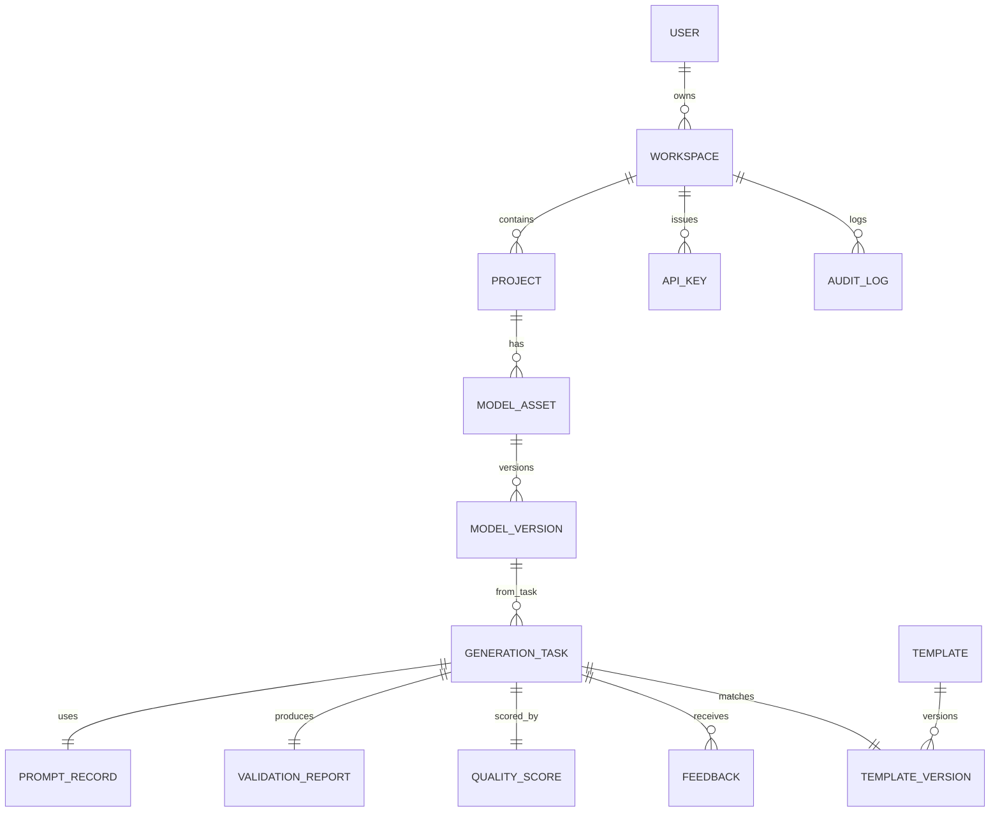
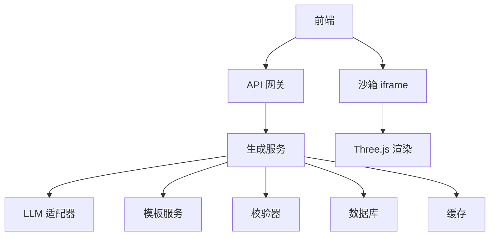

# 项目概述

<cite>
**本文引用的文件**   
- [prd.md](file://prd.md)
- [product-technical-design.md](file://tech/product-technical-design.md)
</cite>

## 目录
1. [引言](#引言)
2. [项目结构](#项目结构)
3. [核心组件](#核心组件)
4. [架构总览](#架构总览)
5. [详细组件分析](#详细组件分析)
6. [依赖关系分析](#依赖关系分析)
7. [性能考量](#性能考量)
8. [故障排查指南](#故障排查指南)
9. [结论](#结论)
10. [附录](#附录)

## 引言
ApexForge 是一个基于 Web 的实时 3D 模型生成与展示平台，核心能力是将用户的自然语言描述转化为可交互的 Three.js 模型代码，并在浏览器端高性能渲染。平台聚焦“程序化生成”路线，采用“固定 HTML 渲染框架 + AI 动态生成 JS 模型代码”的技术范式，平衡生成灵活性、运行性能与开发成本。

差异化优势：
- 零后端 3D 计算：所有渲染在客户端完成，服务端仅处理 AI 推理与编排。
- 代码即模型：生成结果为标准 Three.js 代码，可编辑、可复用、可审计。
- 企业级安全与稳定：沙箱执行、代码过滤、自动回退与监控体系。

业务目标：
- 降低 3D 内容创作门槛：产品经理、设计师可直接描述需求并实时预览原型。
- 加速资产生产流水线：为游戏、汽车、工业设计提供可批量生成的程序化模型基座。
- 构建可进化的模型知识库：通过用户交互与参数化模板沉淀，持续优化生成质量。
- 开放 API 生态：允许第三方通过 REST/WebSocket/SSE 集成生成能力。

技术特色：
- 前端 React SPA + Three.js；后端 NestJS；AI 生成服务与模板库协同工作。
- 模板优先、参数化驱动，必要时再自由生成代码，兼顾稳定性与创造力。
- 全链路可观测（traceId）、多供应商 LLM 适配、严格的安全校验与沙箱隔离。

章节来源
- [prd.md:13-31](file://prd.md#L13-L31)
- [product-technical-design.md:9-31](file://tech/product-technical-design.md#L9-L31)

## 项目结构
仓库当前包含产品需求文档与技术设计文档，用于定义从 MVP 到平台化的整体方案、数据模型、接口契约与安全策略等。



图表来源
- [product-technical-design.md:1-20](file://tech/product-technical-design.md#L1-L20)
- [prd.md:1-20](file://prd.md#L1-L20)

章节来源
- [prd.md:1-20](file://prd.md#L1-L20)
- [product-technical-design.md:1-20](file://tech/product-technical-design.md#L1-L20)

## 核心组件
- 前端（ApexForge Studio）
  - 职责：自然语言输入、场景维护、加载并执行生成的 JS 代码、参数微调面板、历史记录。
  - 关键实现：SceneManager（单例，负责场景初始化、灯光、控制器、模型挂载）、CodeExecutor（iframe 沙箱执行与 postMessage 通信）、UI 组件库。
- 后端（NestJS）
  - 职责：API 网关、鉴权与限流、生成任务编排、模板匹配、LLM 适配、结果持久化与推送。
- AI 生成服务
  - 职责：接收描述文本，构建 Prompt，调用大模型（如 DeepSeek、Qwen），对返回进行协议校验、AST 扫描与复杂度限制，输出结构化结果。
- 模板库与参数化系统
  - 职责：分层模板（骨架、风格变体、细节包、材质预设）、参数 Schema、默认参数、渲染函数与示例 Prompt。
- 代码执行沙箱
  - 职责：隐藏 iframe 隔离执行、CSP 与 sandbox 限制、超时销毁、序列化/反序列化模型数据。
- 监控与质量保证
  - 职责：质量评分、用户反馈闭环、全链路追踪、告警规则。

章节来源
- [prd.md:59-123](file://prd.md#L59-L123)
- [product-technical-design.md:520-572](file://tech/product-technical-design.md#L520-L572)
- [product-technical-design.md:472-518](file://tech/product-technical-design.md#L472-L518)
- [product-technical-design.md:807-841](file://tech/product-technical-design.md#L807-L841)

## 架构总览
逻辑架构涵盖前端、API 网关、认证、生成服务、模板服务、LLM 适配器、校验器、质量评分、数据库与缓存、队列与可观测性。



图表来源
- [product-technical-design.md:38-62](file://tech/product-technical-design.md#L38-L62)

章节来源
- [product-technical-design.md:34-101](file://tech/product-technical-design.md#L34-L101)

## 详细组件分析

### 前端（ApexForge Studio）
- 模块划分
  - Studio（提示面板、模型查看器、参数检查器、版本历史）
  - Asset Library（资产浏览与管理）
  - Template Library（模板浏览与选择）
  - API Console（开放 API 调试）
- 关键服务
  - ApiClient：管理 REST/SSE/WebSocket 请求
  - GenerationStore：管理生成任务状态和结果
  - SceneManager：初始化 Three.js 场景、灯光、控制器与模型挂载
  - SandboxClient：与 iframe 通信、超时控制与错误映射
  - ModelNormalizer：模型居中、缩放、复杂度统计
  - AssetStore / TemplateStore：管理与查询资产与模板
- 性能策略
  - 动态加载 Three.js 与沙箱 runtime
  - 模型 JSON 解析放入 Worker
  - 重复几何体使用 InstancedMesh
  - 释放旧模型时遍历 dispose geometry/material/texture
  - requestAnimationFrame 控制渲染循环，页面不可见时暂停



图表来源
- [product-technical-design.md:524-537](file://tech/product-technical-design.md#L524-L537)

章节来源
- [product-technical-design.md:520-572](file://tech/product-technical-design.md#L520-L572)

### 后端（NestJS）
- 模块划分
  - AuthModule、WorkspaceModule、ProjectModule、GenerationModule、PromptModule、LlmModule、ValidationModule、TemplateModule、AssetModule、FeedbackModule、ExportModule、BillingModule、ObservabilityModule
- Generation Service 内部结构
  - Controller -> Service -> SimilarityCache -> GenerationRouter -> TemplateMatcher/PromptBuilder -> LlmAdapter -> OutputParser -> Validator -> RepairService -> QualityScorer -> Repository



图表来源
- [product-technical-design.md:596-609](file://tech/product-technical-design.md#L596-L609)

章节来源
- [product-technical-design.md:574-630](file://tech/product-technical-design.md#L574-L630)

### AI 生成服务与模板系统
- 生成模式优先级：Cache Mode > Template Mode > Hybrid Mode > Code Mode
- 模板分层：Skeleton、Style Variant、Detail Pack、Material Preset、Param Schema
- 模板匹配策略：类别识别与关键词抽取 -> 标签与向量检索候选 -> LLM 选择最匹配模板并生成参数 -> 置信度不足切换 Hybrid/Code -> 保存命中数据以优化覆盖率



图表来源
- [product-technical-design.md:797-804](file://tech/product-technical-design.md#L797-L804)

章节来源
- [product-technical-design.md:327-339](file://tech/product-technical-design.md#L327-L339)
- [product-technical-design.md:760-804](file://tech/product-technical-design.md#L760-L804)

### 代码安全校验与沙箱运行时
- 校验分层：输出协议校验 -> 文本黑名单 -> AST 白名单 -> 运行时沙箱 -> 超时销毁 -> 结果校验
- 黑名单 API：动态执行、网络访问、DOM 访问、动态加载、原型污染、计算风险
- iframe 隔离方案：sandbox 属性、CSP 限制、postMessage 通信、超时销毁、只暴露受限全局对象
- 错误分类：SANDBOX_TIMEOUT、SANDBOX_RUNTIME_ERROR、MODEL_JSON_INVALID、MODEL_TOO_COMPLEX、MODEL_EMPTY



图表来源
- [product-technical-design.md:478-488](file://tech/product-technical-design.md#L478-L488)

章节来源
- [product-technical-design.md:428-470](file://tech/product-technical-design.md#L428-L470)
- [product-technical-design.md:472-518](file://tech/product-technical-design.md#L472-L518)

### 生成链路与时序
一次完整生成请求的关键步骤包括创建任务、相似缓存、模板匹配、LLM 生成、校验、持久化、SSE/WebSocket 推送、前端沙箱执行与渲染。

```mermaid
sequenceDiagram
participant FE as "前端"
participant API as "API 网关"
participant GEN as "生成服务"
participant CACHE as "缓存"
participant TPL as "模板服务"
participant LLM as "LLM 适配器"
participant VAL as "校验器"
participant DB as "数据库"
participant BOX as "沙箱"
FE->>API : "POST /api/v1/generations"
API->>GEN : "createGenerationTask"
GEN->>CACHE : "querySimilarPrompt"
alt 命中缓存
CACHE-->>GEN : "返回缓存结果"
else 未命中
GEN->>TPL : "findCandidateTemplate"
TPL-->>GEN : "候选模板"
GEN->>LLM : "generate code or params"
LLM-->>GEN : "生成输出"
GEN->>VAL : "validate output"
VAL-->>GEN : "校验报告"
end
GEN->>DB : "持久化任务与结果"
GEN-->>API : "结果"
API-->>FE : "generation payload"
FE->>BOX : "在 iframe 中执行"
BOX-->>FE : "模型 JSON 或错误"
```

图表来源
- [product-technical-design.md:361-390](file://tech/product-technical-design.md#L361-L390)

章节来源
- [product-technical-design.md:327-390](file://tech/product-technical-design.md#L327-L390)

### 数据模型概览
核心领域对象包括用户、空间、项目、生成任务、模型资产、模型版本、模板、模板版本、Prompt 记录、校验报告、质量评分、反馈、API Key、审计日志等。



图表来源
- [product-technical-design.md:155-170](file://tech/product-technical-design.md#L155-L170)

章节来源
- [product-technical-design.md:132-170](file://tech/product-technical-design.md#L132-L170)

## 依赖关系分析
- 组件耦合与内聚
  - 前端与沙箱强耦合（postMessage 协议），与 SceneManager 解耦渲染逻辑
  - 后端 GenerationService 高内聚，通过 Router 分发至 TemplateMatcher/PromptBuilder/LlmAdapter
  - 模板系统与生成服务松耦合，通过统一参数 Schema 与渲染函数接口
- 外部依赖与集成点
  - LLM 多供应商适配（DeepSeek、Qwen 等）
  - 数据库（SQLite/PostgreSQL）、缓存（Redis）、对象存储（S3/MinIO/OSS）
  - 可观测性（OpenTelemetry、Prometheus、Grafana）
- 潜在循环依赖
  - 通过接口抽象与事件总线避免模块间直接循环引用



图表来源
- [product-technical-design.md:38-62](file://tech/product-technical-design.md#L38-L62)

章节来源
- [product-technical-design.md:34-101](file://tech/product-technical-design.md#L34-L101)

## 性能考量
- 前端
  - 几何体实例化与 LOD，远距离低面数模型
  - Web Worker 进行模型反序列化，避免主线程阻塞
  - InstancedMesh 批量渲染重复元素
- 服务端
  - 本地缓存相同/相似 Prompt 的生成结果（相似度阈值）
  - 模板模式下参数化生成仅需 10～50ms，避免 LLM 调用
- 网络
  - 静态资源 CDN 缓存，Gzip/Brotli 压缩，代码增量更新

章节来源
- [prd.md:155-165](file://prd.md#L155-L165)
- [product-technical-design.md:933-958](file://tech/product-technical-design.md#L933-L958)

## 故障排查指南
- 常见错误码与定位
  - SANDBOX_TIMEOUT：执行超时，检查模型复杂度与超时配置
  - SANDBOX_RUNTIME_ERROR：运行时报错，查看 AST 校验与黑名单规则
  - MODEL_JSON_INVALID：返回结构非法，核对 ObjectLoader 反序列化流程
  - MODEL_TOO_COMPLEX：复杂度超限，建议降级或使用模板模式
  - MODEL_EMPTY：未生成有效对象，补充描述或调整 Prompt
- 全链路追踪
  - 每个生成请求带 traceId，贯穿前端、网关、生成服务、LLM、校验、数据库、沙箱执行
- 告警规则
  - 生成失败率过高、LLM 延迟过高、校验失败突增、沙箱超时突增、API 错误率过高

章节来源
- [product-technical-design.md:508-518](file://tech/product-technical-design.md#L508-L518)
- [product-technical-design.md:868-907](file://tech/product-technical-design.md#L868-L907)

## 结论
ApexForge 以“代码即模型”为核心，结合模板优先与参数化驱动，在保证安全与稳定的前提下，显著降低 3D 内容创作门槛并加速资产生产流水线。平台具备清晰的演进路径（MVP → Beta → Scale），支持多供应商 LLM、企业级权限与计费、以及完善的可观测性与质量闭环，适合构建开放的 3D 模型生态。

## 附录

### 使用场景与价值体现
- 快速原型：产品经理与设计团队用自然语言即时生成 3D 原型，缩短沟通与验证周期。
- 批量资产：为游戏、汽车、工业设计提供程序化模型基座，提升产出效率。
- 开放集成：通过 REST/SSE/WebSocket 将生成能力嵌入现有工具链与平台。
- 知识沉淀：模板与参数化体系形成可进化的模型知识库，持续优化生成质量。

章节来源
- [prd.md:24-31](file://prd.md#L24-L31)
- [product-technical-design.md:9-20](file://tech/product-technical-design.md#L9-L20)