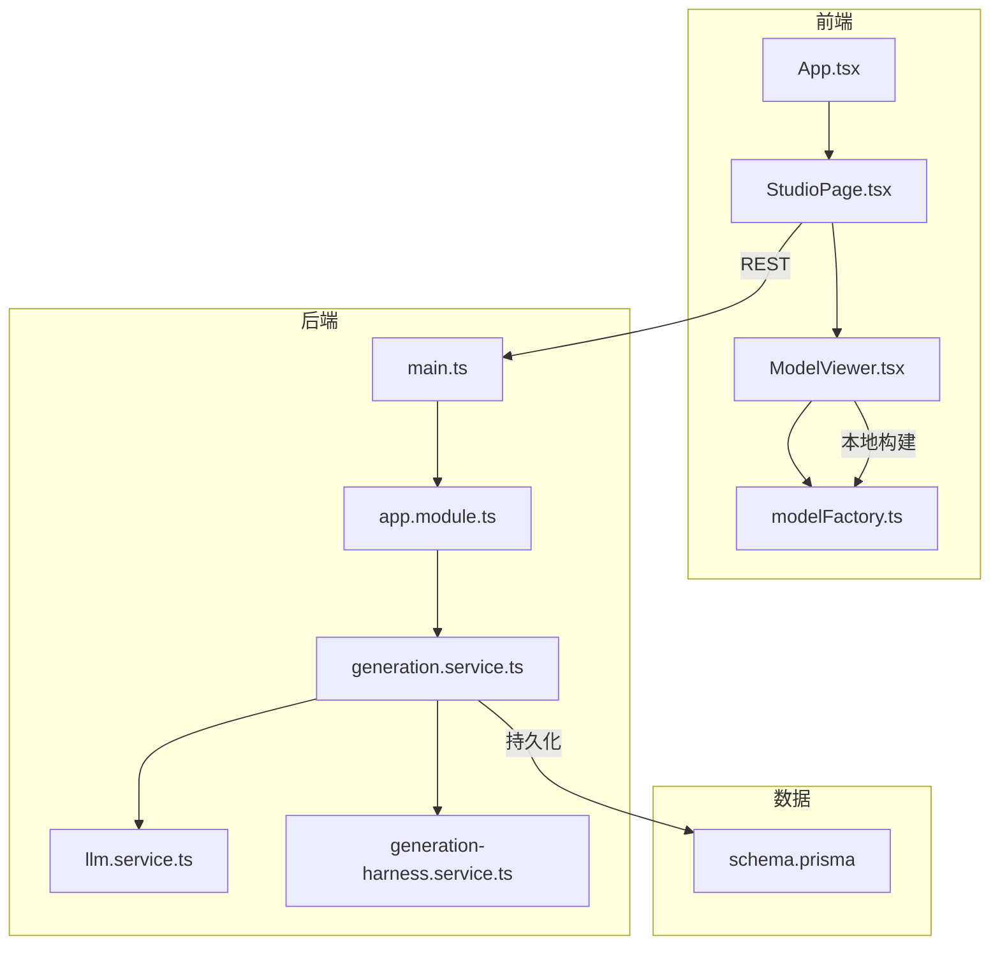
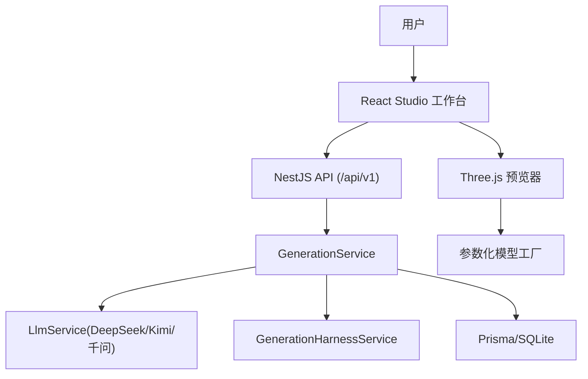
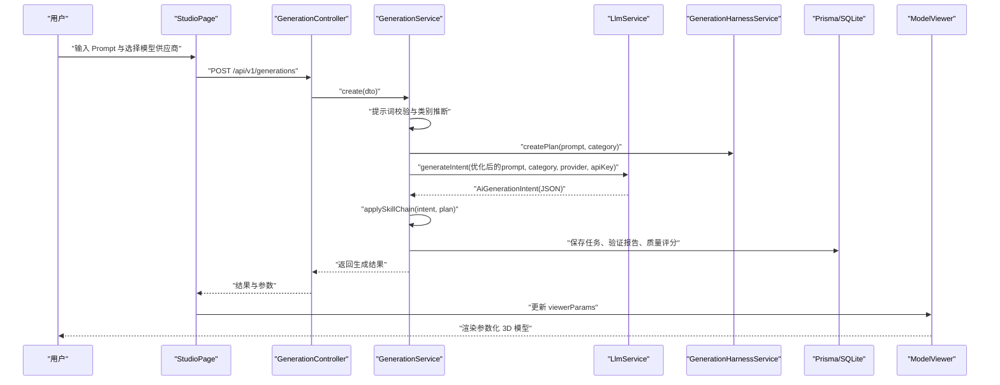
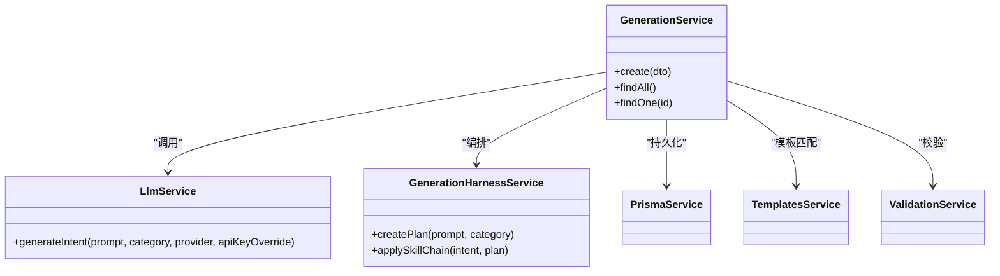
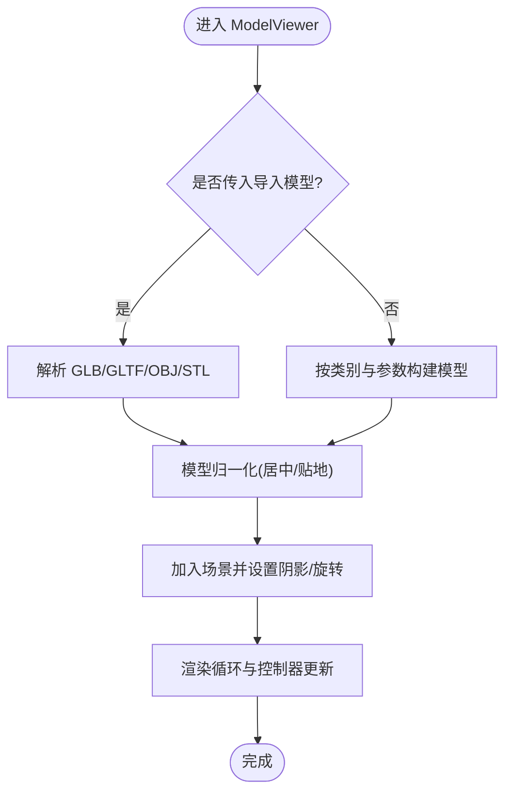
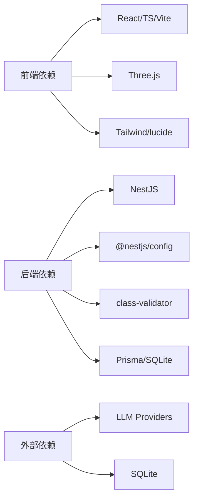

# ApexForge 3D CAD 参数化建模系统

<cite>
**本文引用的文件**   
- [README.md](file://README.md)
- [package.json](file://package.json)
- [src/App.tsx](file://src/App.tsx)
- [apps/api/src/main.ts](file://apps/api/src/main.ts)
- [apps/api/src/app.module.ts](file://apps/api/src/app.module.ts)
- [prisma/schema.prisma](file://prisma/schema.prisma)
- [src/modules/studio/pages/StudioPage.tsx](file://src/modules/studio/pages/StudioPage.tsx)
- [src/modules/viewer/components/ModelViewer.tsx](file://src/modules/viewer/components/ModelViewer.tsx)
- [src/modules/viewer/utils/modelFactory.ts](file://src/modules/viewer/utils/modelFactory.ts)
- [apps/api/src/modules/generation/generation.service.ts](file://apps/api/src/modules/generation/generation.service.ts)
- [apps/api/src/modules/llm/llm.service.ts](file://apps/api/src/modules/llm/llm.service.ts)
- [apps/api/src/modules/generation/generation-harness.service.ts](file://apps/api/src/modules/generation/generation-harness.service.ts)
- [src/shared/types/generation.ts](file://src/shared/types/generation.ts)
- [apps/api/src/modules/templates/template.seed.ts](file://apps/api/src/modules/templates/template.seed.ts)
- [tech/product-technical-design.md](file://tech/product-technical-design.md)
</cite>

## 目录
1. [简介](#简介)
2. [项目结构](#项目结构)
3. [核心组件](#核心组件)
4. [架构总览](#架构总览)
5. [详细组件分析](#详细组件分析)
6. [依赖关系分析](#依赖关系分析)
7. [性能考量](#性能考量)
8. [故障排查指南](#故障排查指南)
9. [结论](#结论)
10. [附录](#附录)

## 简介
ApexForge 是一个 AI 驱动的实时 3D CAD / 参数化建模工作台。用户通过自然语言描述，后端调用多模型供应商（DeepSeek、Kimi、千问）生成结构化参数，前端基于 Three.js 进行参数化建模与物理材质渲染，支持在线 API Key、模板库、导入 GLB/GLTF/OBJ/STL、属性编辑与历史记录等能力。系统采用 React + Vite 前端与 NestJS + Prisma + SQLite 后端，提供从 Prompt 到可交互模型的完整闭环。

## 项目结构
- 前端：React 18 + TypeScript + Vite，包含 Studio 工作台、Three.js 预览器、共享类型与工具。
- 后端：NestJS 模块化服务，涵盖生成编排、LLM 适配、模板、校验、资产与反馈模块。
- 数据层：Prisma 定义 Template、GenerationTask、ValidationReport、QualityScore、ModelAsset、ModelVersion、Feedback 等实体，使用 SQLite。
- 文档：tech/doc 与 tech/product-technical-design.md 提供产品与技术设计说明。



图表来源
- [src/App.tsx:1-6](file://src/App.tsx#L1-L6)
- [src/modules/studio/pages/StudioPage.tsx:1-445](file://src/modules/studio/pages/StudioPage.tsx#L1-L445)
- [src/modules/viewer/components/ModelViewer.tsx:1-307](file://src/modules/viewer/components/ModelViewer.tsx#L1-L307)
- [src/modules/viewer/utils/modelFactory.ts:1-800](file://src/modules/viewer/utils/modelFactory.ts#L1-L800)
- [apps/api/src/main.ts:1-23](file://apps/api/src/main.ts#L1-L23)
- [apps/api/src/app.module.ts:1-24](file://apps/api/src/app.module.ts#L1-L24)
- [apps/api/src/modules/generation/generation.service.ts:1-309](file://apps/api/src/modules/generation/generation.service.ts#L1-L309)
- [apps/api/src/modules/llm/llm.service.ts:1-177](file://apps/api/src/modules/llm/llm.service.ts#L1-L177)
- [apps/api/src/modules/generation/generation-harness.service.ts:1-147](file://apps/api/src/modules/generation/generation-harness.service.ts#L1-L147)
- [prisma/schema.prisma:1-122](file://prisma/schema.prisma#L1-L122)

章节来源
- [README.md:1-330](file://README.md#L1-L330)
- [package.json:1-65](file://package.json#L1-L65)

## 核心组件
- 前端入口与页面中枢
  - App 根组件挂载 Studio 页面，作为应用唯一入口。
  - StudioPage 管理状态机（idle/queued/generating/validating/renderable/failed）、Prompt 输入、在线 API Key、历史版本、主题预设与参数覆盖。
- 3D 预览与参数化建模
  - ModelViewer 初始化 Three.js 场景、灯光、网格、OrbitControls，并负责导入模型加载与归一化。
  - modelFactory 根据类别与参数构建几何体，支持多种材质预设、纹理贴图、连接结构与技能增强标记。
- 后端生成链路
  - GenerationService 负责任务创建、提示词优化、模板匹配、LLM 调用、结果持久化与质量评分。
  - LlmService 统一 DeepSeek/Kimi/Qwen 的 OpenAI-compatible 接口，支持在线 Key 优先与环境变量回退。
  - GenerationHarnessService 生成多 Agent 执行计划与 3D 技能链，对意图进行增强。
- 数据模型
  - Prisma schema 定义模板、生成任务、验证报告、质量评分、模型资产与版本、反馈等实体及关系。

章节来源
- [src/App.tsx:1-6](file://src/App.tsx#L1-L6)
- [src/modules/studio/pages/StudioPage.tsx:1-445](file://src/modules/studio/pages/StudioPage.tsx#L1-L445)
- [src/modules/viewer/components/ModelViewer.tsx:1-307](file://src/modules/viewer/components/ModelViewer.tsx#L1-L307)
- [src/modules/viewer/utils/modelFactory.ts:1-800](file://src/modules/viewer/utils/modelFactory.ts#L1-L800)
- [apps/api/src/modules/generation/generation.service.ts:1-309](file://apps/api/src/modules/generation/generation.service.ts#L1-L309)
- [apps/api/src/modules/llm/llm.service.ts:1-177](file://apps/api/src/modules/llm/llm.service.ts#L1-L177)
- [apps/api/src/modules/generation/generation-harness.service.ts:1-147](file://apps/api/src/modules/generation/generation-harness.service.ts#L1-L147)
- [prisma/schema.prisma:1-122](file://prisma/schema.prisma#L1-L122)

## 架构总览
系统由前端 Studio 工作台与后端 API 组成，前后端通过 REST 通信；后端整合 LLM 适配器与 Harness 多 Agent 编排，输出结构化参数驱动前端参数化建模与渲染。



图表来源
- [apps/api/src/main.ts:1-23](file://apps/api/src/main.ts#L1-L23)
- [apps/api/src/app.module.ts:1-24](file://apps/api/src/app.module.ts#L1-L24)
- [apps/api/src/modules/generation/generation.service.ts:1-309](file://apps/api/src/modules/generation/generation.service.ts#L1-L309)
- [apps/api/src/modules/llm/llm.service.ts:1-177](file://apps/api/src/modules/llm/llm.service.ts#L1-L177)
- [apps/api/src/modules/generation/generation-harness.service.ts:1-147](file://apps/api/src/modules/generation/generation-harness.service.ts#L1-L147)
- [src/modules/studio/pages/StudioPage.tsx:1-445](file://src/modules/studio/pages/StudioPage.tsx#L1-L445)
- [src/modules/viewer/components/ModelViewer.tsx:1-307](file://src/modules/viewer/components/ModelViewer.tsx#L1-L307)
- [src/modules/viewer/utils/modelFactory.ts:1-800](file://src/modules/viewer/utils/modelFactory.ts#L1-L800)

## 详细组件分析

### 生成链路时序（端到端）


图表来源
- [src/modules/studio/pages/StudioPage.tsx:163-190](file://src/modules/studio/pages/StudioPage.tsx#L163-L190)
- [apps/api/src/modules/generation/generation.service.ts:143-278](file://apps/api/src/modules/generation/generation.service.ts#L143-L278)
- [apps/api/src/modules/llm/llm.service.ts:123-176](file://apps/api/src/modules/llm/llm.service.ts#L123-L176)
- [apps/api/src/modules/generation/generation-harness.service.ts:117-146](file://apps/api/src/modules/generation/generation-harness.service.ts#L117-L146)
- [src/modules/viewer/components/ModelViewer.tsx:201-243](file://src/modules/viewer/components/ModelViewer.tsx#L201-L243)

章节来源
- [src/modules/studio/pages/StudioPage.tsx:163-190](file://src/modules/studio/pages/StudioPage.tsx#L163-L190)
- [apps/api/src/modules/generation/generation.service.ts:143-278](file://apps/api/src/modules/generation/generation.service.ts#L143-L278)
- [apps/api/src/modules/llm/llm.service.ts:123-176](file://apps/api/src/modules/llm/llm.service.ts#L123-L176)
- [apps/api/src/modules/generation/generation-harness.service.ts:117-146](file://apps/api/src/modules/generation/generation-harness.service.ts#L117-L146)
- [src/modules/viewer/components/ModelViewer.tsx:201-243](file://src/modules/viewer/components/ModelViewer.tsx#L201-L243)

### 类与职责图（后端关键服务）


图表来源
- [apps/api/src/modules/generation/generation.service.ts:134-141](file://apps/api/src/modules/generation/generation.service.ts#L134-L141)
- [apps/api/src/modules/llm/llm.service.ts:118-121](file://apps/api/src/modules/llm/llm.service.ts#L118-L121)
- [apps/api/src/modules/generation/generation-harness.service.ts:116-132](file://apps/api/src/modules/generation/generation-harness.service.ts#L116-L132)

章节来源
- [apps/api/src/modules/generation/generation.service.ts:134-141](file://apps/api/src/modules/generation/generation.service.ts#L134-L141)
- [apps/api/src/modules/llm/llm.service.ts:118-121](file://apps/api/src/modules/llm/llm.service.ts#L118-L121)
- [apps/api/src/modules/generation/generation-harness.service.ts:116-132](file://apps/api/src/modules/generation/generation-harness.service.ts#L116-L132)

### 参数化建模流程（前端）


图表来源
- [src/modules/viewer/components/ModelViewer.tsx:45-76](file://src/modules/viewer/components/ModelViewer.tsx#L45-L76)
- [src/modules/viewer/components/ModelViewer.tsx:201-243](file://src/modules/viewer/components/ModelViewer.tsx#L201-L243)
- [src/modules/viewer/utils/modelFactory.ts:404-446](file://src/modules/viewer/utils/modelFactory.ts#L404-L446)

章节来源
- [src/modules/viewer/components/ModelViewer.tsx:45-76](file://src/modules/viewer/components/ModelViewer.tsx#L45-L76)
- [src/modules/viewer/components/ModelViewer.tsx:201-243](file://src/modules/viewer/components/ModelViewer.tsx#L201-L243)
- [src/modules/viewer/utils/modelFactory.ts:404-446](file://src/modules/viewer/utils/modelFactory.ts#L404-L446)

### 数据模型关系（Prisma）
```mermaid
erDiagram
TEMPLATE {
string id PK
string name
string category
string description
string tags
string defaultPrompt
string complexity
string status
datetime createdAt
datetime updatedAt
}
GENERATION_TASK {
string id PK
string traceId UK
string prompt
string normalizedPrompt
string category
string mode
string status
string templateId FK
string generatedCode
string generatedParams
string explanation
string metrics
string errorCode
string errorMessage
datetime startedAt
datetime completedAt
datetime createdAt
datetime updatedAt
}
VALIDATION_REPORT {
string id PK
string generationTaskId UK FK
boolean passed
string blockedReasons
string warnings
string complexity
string astSummary
datetime createdAt
}
QUALITY_SCORE {
string id PK
string generationTaskId UK FK
int totalScore
int renderabilityScore
int structureScore
int promptMatchScore
int performanceScore
string details
datetime createdAt
}
MODEL_ASSET {
string id PK
string name
string category
string prompt
string thumbnailUrl
string currentVersionId
string tags
string status
datetime createdAt
datetime updatedAt
}
MODEL_VERSION {
string id PK
string assetId FK
string generationTaskId FK
int versionNo
string code
string params
string modelJsonUrl
string screenshotUrl
string metrics
datetime createdAt
}
FEEDBACK {
string id PK
string generationTaskId FK
string rating
string comment
datetime createdAt
}
GENERATION_TASK ||--o{ VALIDATION_REPORT : "has one"
GENERATION_TASK ||--o{ QUALITY_SCORE : "has one"
GENERATION_TASK ||--o{ MODEL_VERSION : "produces"
MODEL_ASSET ||--o{ MODEL_VERSION : "contains"
GENERATION_TASK ||--o{ FEEDBACK : "receives"
TEMPLATE ||--o{ GENERATION_TASK : "used by"
```

图表来源
- [prisma/schema.prisma:10-122](file://prisma/schema.prisma#L10-L122)

章节来源
- [prisma/schema.prisma:10-122](file://prisma/schema.prisma#L10-L122)

## 依赖关系分析
- 前端依赖
  - React、TypeScript、Vite、TailwindCSS、lucide-react、three、@types/three。
  - 组件间耦合：StudioPage 聚合多个面板与 Viewer，Viewer 依赖 modelFactory 与 modelNormalizer。
- 后端依赖
  - NestJS、@nestjs/config、class-validator/class-transformer、reflect-metadata、rxjs。
  - 模块装配：AppModule 引入 ConfigModule、PrismaModule、Health/Templates/Validation/Generation/Assets/Feedback 模块。
- 外部依赖
  - LLM 供应商（DeepSeek/Kimi/千问）OpenAI-compatible 接口。
  - SQLite 数据库（Prisma）。



图表来源
- [package.json:19-63](file://package.json#L19-L63)
- [apps/api/src/app.module.ts:11-23](file://apps/api/src/app.module.ts#L11-L23)

章节来源
- [package.json:19-63](file://package.json#L19-L63)
- [apps/api/src/app.module.ts:11-23](file://apps/api/src/app.module.ts#L11-L23)

## 性能考量
- 前端渲染
  - 使用 requestAnimationFrame 控制渲染循环，窗口不可见时暂停。
  - 旧模型释放需遍历 dispose geometry/material/texture，避免内存泄漏。
  - 导入模型优先于参数化模型，减少不必要的计算。
  - 纹理缓存复用，降低重复加载开销。
- 后端处理
  - 生成任务包含指标估算（meshes/vertices/materials/score），便于前端降级策略。
  - 模板模式优先，提高稳定性与响应速度。
  - 多供应商失败重试与降级策略预留。

[本节为通用指导，不直接分析具体文件]

## 故障排查指南
- 未配置 API Key
  - 现象：后端抛出未配置供应商 API Key 的错误。
  - 处理：在左侧在线模型配置填写对应 Key，或在 .env 中设置 DEEPSEEK_API_KEY/KIMI_API_KEY/QWEN_API_KEY。
- 生成失败或网络错误
  - 现象：请求失败或 JSON 解析异常。
  - 处理：检查模型名称、网络连通性与 Key 有效性；查看日志中的警告信息。
- 模型为空或过于复杂
  - 现象：渲染空白或超时。
  - 处理：降低复杂度与细节等级，或切换模板模式；确保导入模型格式正确。
- 视图异常
  - 现象：模型只显示一半或位置不正确。
  - 处理：确认模型归一化逻辑生效，必要时调整垂直偏移。

章节来源
- [apps/api/src/modules/llm/llm.service.ts:128-130](file://apps/api/src/modules/llm/llm.service.ts#L128-L130)
- [apps/api/src/modules/llm/llm.service.ts:157-174](file://apps/api/src/modules/llm/llm.service.ts#L157-L174)
- [src/modules/viewer/components/ModelViewer.tsx:201-243](file://src/modules/viewer/components/ModelViewer.tsx#L201-L243)

## 结论
ApexForge 将自然语言转化为可交互的 3D 参数化模型，形成“提示词→多 Agent 编排→结构化参数→Three.js 渲染”的完整闭环。系统以模块化架构实现前后端解耦，具备多模型供应商接入、在线 Key 配置、模板库与导入模型能力，适合快速原型与商业展示。后续可在导出、压缩、HDR 后处理、云端资产库与可编辑零件等方面持续演进。

[本节为总结性内容，不直接分析具体文件]

## 附录
- 快速开始与脚本
  - 安装依赖、初始化 Prisma、启动开发与构建生产版本命令见 package.json。
- 模板种子
  - 内置多品类模板种子，用于快速匹配与默认 Prompt。
- 技术设计
  - 产品技术设计文档涵盖架构、安全、沙箱、API 契约与平台化演进路线。

章节来源
- [package.json:6-18](file://package.json#L6-L18)
- [apps/api/src/modules/templates/template.seed.ts:1-75](file://apps/api/src/modules/templates/template.seed.ts#L1-L75)
- [tech/product-technical-design.md:1-800](file://tech/product-technical-design.md#L1-L800)