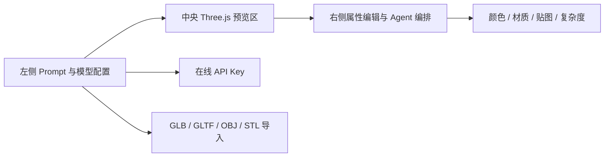
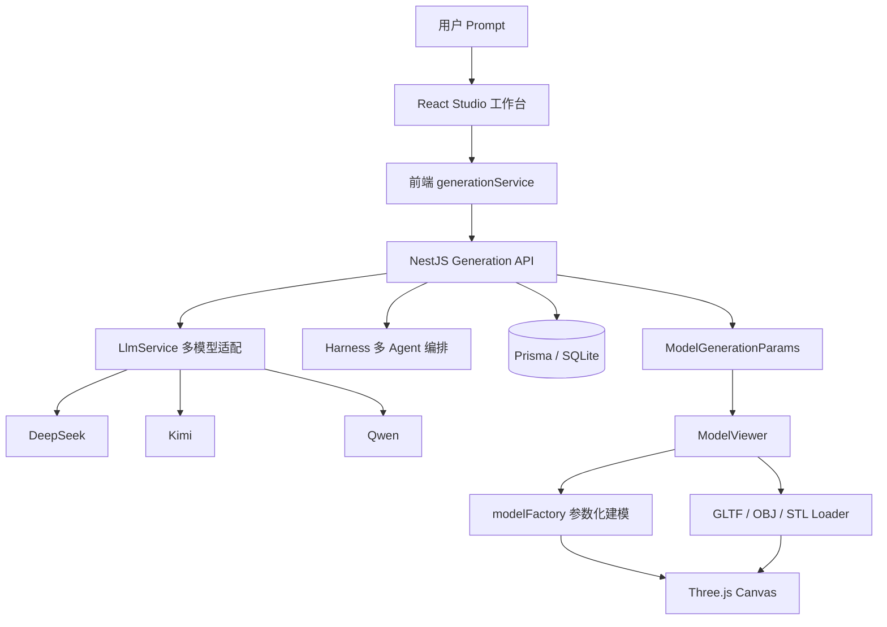
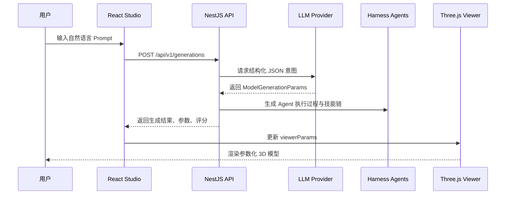

<div align="center">
  <br />
  <h1>ApexForge</h1>
  <p><strong>AI 驱动的实时 3D CAD / 参数化建模工作台</strong></p>
  <p>用自然语言生成可交互的 Three.js 商业级 3D 模型，支持多模型供应商、在线 API Key、模型导入、贴图上传与实时属性编辑。</p>

  <p>
    <a href="./tech/doc/index.html"><strong>产品首页</strong></a>
    ·
    <a href="./tech/doc/architecture.html"><strong>架构文档</strong></a>
    ·
    <a href="./tech/doc/generation-flow.html"><strong>AI 生成链路</strong></a>
    ·
    <a href="https://aibook.mvtable.com"><strong>AI 实战学习手册</strong></a>
    ·
    <a href="https://jitword.com"><strong>AI 文档</strong></a>
  </p>

  <p>
    
    
    
    
    
  </p>
</div>

---

## 为什么做 ApexForge

ApexForge 想解决一个很具体的问题：**让产品经理、设计师、开发者不用打开复杂 3D 软件，也能通过一句自然语言快速得到可预览、可调参、可继续工程化的 3D 原型**。

它不是一个简单的模型展示页面，而是一套完整的 AI CAD 工作流：

- **自然语言生成模型**：输入“复古便携式收音机”“未来感飞行器”“智能镜子”等描述，生成对应参数化 3D 模型。
- **多模型供应商接入**：支持 DeepSeek、Kimi、千问，使用 OpenAI-compatible 调用协议。
- **在线 API Key 配置**：在页面左侧直接填写模型 Key，不必强制修改项目 `.env`。
- **Three.js 实时预览**：浏览器内完成三维渲染、光照、阴影、轨道控制和模型归一化。
- **3D 模型导入**：支持 GLB、GLTF、OBJ、STL 等常见 Three.js 格式。
- **贴图与属性编辑**：支持图片贴图、颜色、材质、复杂度、曲线强度、连接密度等实时调整。
- **开发者文档齐全**：内置 `tech/doc` 多页面 HTML 文档，覆盖架构、前端、后端、AI 生成链路与 3D 渲染。

---

## 产品预览

> 当前仓库内置了图文并茂的产品首页与技术文档，打开 `tech/doc/index.html` 即可查看。

<div align="center">
  <a href="./tech/doc/index.html">
    
  </a>
</div>

### Studio 工作台布局



---

## 核心能力

| 能力 | 说明 |
| --- | --- |
| AI 参数化建模 | LLM 输出结构化 `ModelGenerationParams`，前端模型工厂负责稳定生成几何结构。 |
| 开放品类生成 | 覆盖车辆、手表、首饰、建筑、飞行器、家具、镜子、耳机、相机、鞋、背包、小家电、容器、机器人、面板设备、收音机等。 |
| 多模型供应商 | 支持 DeepSeek、Kimi、Qwen，后端统一封装 baseURL、model、API Key 与 JSON 输出协议。 |
| Harness 多 Agent | 通过 Prompt Architect、Structure Agent、Surface Detail Agent、Material Agent、Quality Agent 解释生成过程。 |
| Three.js 渲染 | 使用物理材质、阴影、地面网格、OrbitControls、模型归一化与导入模型加载器。 |
| 在线 AK 配置 | 前端本地保存当前浏览器的 API Key，生成时传给后端，后端未收到时才回退环境变量。 |
| 外部模型导入 | 支持 GLB、GLTF、OBJ、STL，导入模型优先覆盖参数化模型预览。 |
| 开发者文档 | `tech/doc` 提供总览、架构、AI 链路、前端、后端、3D 渲染等多页面文档。 |

---

## 技术架构



### 前端

- **React 18 + TypeScript + Vite**：构建 Studio 工作台。
- **TailwindCSS + shadcn/ui 风格组件**：实现深色产品化界面。
- **lucide-react**：统一图标体系。
- **Three.js**：负责实时 3D 渲染、导入模型解析和参数化几何体展示。

### 后端

- **NestJS 11**：提供 REST API 与模块化服务。
- **Prisma + SQLite**：保存模板、生成任务、资产、版本、质量评分和反馈。
- **LLM Adapter**：统一 DeepSeek、Kimi、千问的 OpenAI-compatible `/chat/completions` 调用。
- **Harness Service**：生成多 Agent 执行过程与 3D 技能链说明。

---

## 快速开始

### 1. 安装依赖

```bash
npm install
```

### 2. 初始化 Prisma

```bash
npm run prisma:generate
npm run prisma:push
```

### 3. 配置模型 API Key

ApexForge 支持两种方式：

#### 方式一：页面在线填写

启动项目后，在左侧“在线模型配置”中填写 DeepSeek、Kimi 或千问 API Key。该方式会保存在当前浏览器本地，适合快速体验。

#### 方式二：服务端环境变量

在项目根目录创建 `.env`，按需配置：

```bash
DEEPSEEK_API_KEY=your_deepseek_api_key
KIMI_API_KEY=your_kimi_api_key
QWEN_API_KEY=your_qwen_api_key

DEEPSEEK_BASE_URL=https://api.deepseek.com
DEEPSEEK_MODEL=deepseek-chat
KIMI_BASE_URL=https://api.moonshot.cn/v1
KIMI_MODEL=moonshot-v1-8k
QWEN_BASE_URL=https://dashscope.aliyuncs.com/compatible-mode/v1
QWEN_MODEL=qwen-plus
```

> 请不要把真实 API Key 提交到 GitHub。

### 4. 启动开发环境

```bash
npm run dev
```

默认会同时启动：

- **Web 前端**：Vite 开发服务
- **API 后端**：NestJS watch 服务

### 5. 构建生产版本

```bash
npm run build
```

---

## 项目目录

```text
ApexForge
├── apps/api                  # NestJS 后端 API
│   └── src/modules
│       ├── generation         # 生成任务、LLM 调用、Harness 编排
│       ├── llm                # 多模型供应商适配
│       ├── templates          # 模板库
│       ├── validation         # 质量校验
│       ├── assets             # 模型资产
│       └── feedback           # 用户反馈
├── prisma
│   └── schema.prisma          # 数据模型定义
├── src
│   ├── modules/studio         # AI CAD Studio 工作台
│   ├── modules/viewer         # Three.js 预览与模型工厂
│   └── shared                 # 共享类型与工具
├── tech/doc                   # 图文并茂的多页面 HTML 开发者文档
├── prd.md                     # 产品技术设计文档
└── package.json
```

---

## 重点源码导读

| 文件 | 作用 |
| --- | --- |
| `src/modules/studio/pages/StudioPage.tsx` | Studio 页面状态中枢，负责生成调用、顶部导航、历史记录、参数传递和联系作者弹窗。 |
| `src/modules/studio/components/PromptInput.tsx` | Prompt 输入、多模型选择、在线 API Key 表单、本地 3D 模型导入。 |
| `src/modules/studio/components/PropertyInspectorPanel.tsx` | 右侧属性编辑器，控制颜色、材质、细节、复杂度、曲线、连接与贴图。 |
| `src/modules/viewer/components/ModelViewer.tsx` | Three.js 场景、导入模型加载、OrbitControls、渲染生命周期。 |
| `src/modules/viewer/utils/modelFactory.ts` | 参数化模型工厂，包含收音机、镜子、飞机、耳机、相机等品类模型。 |
| `src/modules/viewer/utils/modelNormalizer.ts` | 模型 XZ 居中、底部贴地，避免网格穿过模型中心。 |
| `apps/api/src/modules/generation/generation.service.ts` | 后端生成主流程：品类推断、LLM 调用、任务保存、结果返回。 |
| `apps/api/src/modules/llm/llm.service.ts` | DeepSeek、Kimi、Qwen 供应商适配与在线 Key 优先逻辑。 |
| `apps/api/src/modules/generation/generation-harness.service.ts` | 多 Agent 与 3D 技能链编排说明。 |

---

## 生成链路详解



---

## 3D 渲染特色

- **默认精致收音机模型**：包含圆角机身、后壳、前面板、扬声器格栅、频段显示窗、调谐线、双旋钮、顶部提手、底座和脚垫。
- **坐标系底部对齐**：模型归一化时 XZ 居中，Y 轴贴地，解决网格穿过模型中心导致“只看到半个模型”的问题。
- **减少无意义圆柱**：连接结构只对白名单品类启用，例如车辆、飞行器、家具，避免普通产品生成多余圆柱。
- **物理材质分层**：使用 `MeshPhysicalMaterial` 表现金属、玻璃、陶瓷、哑光塑料等材质。
- **导入模型优先**：上传 GLB、GLTF、OBJ、STL 后，预览区优先展示用户导入资产。

---

## 开发者文档

仓库内置了更完整的 HTML 文档，适合新成员入门、技术分享或开源项目介绍：

| 页面 | 内容 |
| --- | --- |
| [`tech/doc/index.html`](./tech/doc/index.html) | 项目总览、能力地图、产品闭环。 |
| [`tech/doc/architecture.html`](./tech/doc/architecture.html) | 系统架构、模块分层、数据模型。 |
| [`tech/doc/generation-flow.html`](./tech/doc/generation-flow.html) | AI 生成链路、Harness、多供应商、品类识别。 |
| [`tech/doc/frontend.html`](./tech/doc/frontend.html) | Studio 页面、组件职责、状态流、在线 Key、模型导入。 |
| [`tech/doc/backend.html`](./tech/doc/backend.html) | NestJS 模块、LLM 适配、DTO、Prisma 数据模型。 |
| [`tech/doc/rendering.html`](./tech/doc/rendering.html) | Three.js 渲染、模型工厂、导入模型、归一化和材质。 |

---

## 路线图

- [x] React + Three.js Studio 工作台
- [x] NestJS 后端 MVP
- [x] DeepSeek / Kimi / Qwen 多模型供应商
- [x] 在线 API Key 配置
- [x] GLB / GLTF / OBJ / STL 导入
- [x] 图片贴图与实时属性编辑
- [x] Harness 多 Agent 与 3D 技能链说明
- [x] 多页面 HTML 开发者文档
- [ ] 模型导出与资产下载
- [ ] Draco / KTX2 等模型压缩能力
- [ ] HDR 环境光与后处理渲染
- [ ] 云端资产库与用户空间
- [ ] 可编辑零件、节点和控制点

---

## 适合谁使用

- **前端工程师**：学习 React + Three.js + AI 工作台的工程化组织方式。
- **AI 应用开发者**：参考多模型供应商、在线 API Key、结构化 JSON 输出和 Harness 编排模式。
- **产品经理 / 设计师**：快速把产品创意转成可交互 3D 原型。
- **3D 工具开发者**：参考参数化建模、模型归一化、导入格式支持和材质分层策略。

---

## 贡献指南

欢迎提交 Issue 和 Pull Request。建议贡献方向：

- 新增参数化品类模型。
- 优化 Three.js 材质、灯光和后处理。
- 增强模型导入、导出和资产管理。
- 接入更多 OpenAI-compatible 模型供应商。
- 完善 `tech/doc` 开发者文档与示例。

提交前建议运行：

```bash
npm run build
```

---

## 相关链接

- **GitHub 仓库**：[https://github.com/MrXujiang/ApexForge](https://github.com/MrXujiang/ApexForge)
- **产品首页**：[`tech/doc/index.html`](./tech/doc/index.html)
- **架构文档**：[`tech/doc/architecture.html`](./tech/doc/architecture.html)
- **AI 实战学习手册**：[https://aibook.mvtable.com](https://aibook.mvtable.com)
- **AI 文档**：[https://jitword.com](https://jitword.com)
- **联系作者二维码**：[https://next.jitword.com/uploads/WechatIMG246_19d428a664c.jpg](https://next.jitword.com/uploads/WechatIMG246_19d428a664c.jpg)

---

## License

本项目遵循仓库中的 [`LICENSE`](./LICENSE) 协议。
