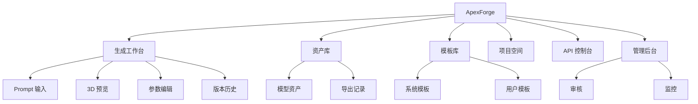
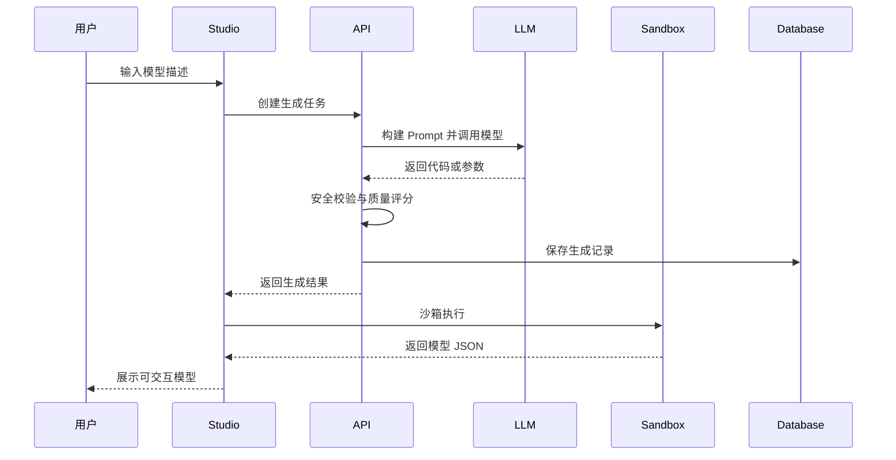

# ApexForge 优化版产品需求文档

| 版本 | 日期 | 作者 | 状态 | 描述 |
|------|------|------|------|------|
| 1.1 | 2026-07-08 | 徐小夕 / Qoder | Draft | 基于原始 PRD 进行产品化、商业化与可落地性增强 |

---

## 1. 产品定位

ApexForge 是一个面向 3D 内容生产场景的 AI 辅助建模平台，通过自然语言、参数化模板与可执行 Three.js 程序化代码，帮助非专业建模用户快速生成可预览、可编辑、可复用的 3D 模型资产。

平台优先聚焦“实时可交互的程序化 3D 模型生成”，而非直接输出高精度网格资产。其核心价值是让用户以低门槛完成 3D 原型、概念模型、低中精度资产和参数化变体的快速生产。

---

## 2. 产品愿景与阶段目标

### 2.1 产品愿景

成为面向设计、游戏、工业和营销场景的 AI 程序化 3D 资产生成基础设施，沉淀可扩展模板库、生成质量评估体系和 API 生态。

### 2.2 阶段目标

| 阶段 | 周期 | 目标 | 交付重点 |
|------|------|------|----------|
| MVP | 0 到 8 周 | 验证自然语言生成 3D 原型的可用性 | Prompt 输入、模型生成、沙箱预览、历史记录、基础模板 |
| Beta | 2 到 4 个月 | 提升稳定性、质量和协作能力 | 参数化模板、用户反馈、项目管理、导出能力、质量评分 |
| Scale | 4 到 8 个月 | 平台化和商业化 | API 开放、团队空间、权限计费、审核系统、企业部署 |
| Ecosystem | 8 个月以上 | 形成模板与插件生态 | 模板市场、插件机制、私有模型、资产工作流集成 |

---

## 3. 目标用户与核心场景

### 3.1 用户角色

| 用户角色 | 典型诉求 | 核心价值 |
|----------|----------|----------|
| 产品经理 | 快速表达三维产品概念 | 用文本生成可交互原型，提升沟通效率 |
| 设计师 | 快速尝试造型和风格变体 | 降低早期建模成本，辅助灵感探索 |
| 游戏开发者 | 批量生成低中精度场景道具 | 生成可复用的程序化资产草稿 |
| 工业/硬件团队 | 快速验证结构与外观概念 | 以参数化方式探索比例和结构变化 |
| 教育用户 | 学习 Three.js 与 3D 构型 | 通过代码即模型理解程序化建模 |
| 企业开发者 | 集成 3D 生成能力 | 通过 API 接入内部资产生产流程 |

### 3.2 高频业务场景

| 场景 | 示例输入 | 期望输出 |
|------|----------|----------|
| 概念模型生成 | “生成一辆未来感跑车，黑色车身，蓝色发光线条” | 可旋转预览的 Three.js 模型 |
| 参数微调 | “把轮胎变大，车身压低，颜色改成银色” | 保留上下文后的二次生成结果 |
| 模板变体 | “基于这辆跑车生成越野风格版本” | 同骨架下的风格参数变化 |
| 批量资产生成 | “生成 20 个不同风格的科幻路障” | 多个可复用低中精度资产 |
| 教学解释 | “解释这个模型由哪些几何体构成” | 模型结构说明与可读代码 |
| API 集成 | 调用生成接口并指定模板 ID | 标准化生成记录和模型数据 |

---

## 4. 核心产品价值

### 4.1 对用户的价值

- **降低创作门槛**：用户无需掌握 3D 建模工具即可生成基础模型。
- **缩短迭代周期**：从想法到可视化结果压缩到秒级或分钟级。
- **提升可控性**：通过模板和参数体系提升生成结果的一致性。
- **保留可编辑性**：生成结果是结构化代码和参数，不是黑盒图片。
- **支持集成**：未来可通过 API 嵌入游戏、设计和内容生产工具链。

### 4.2 产品差异化

| 维度 | ApexForge 方案 | 传统文生 3D 网格方案 |
|------|----------------|----------------------|
| 生成形式 | Three.js 程序化代码和参数 | Mesh、Point Cloud 或 NeRF |
| 可控性 | 高，可通过代码和参数约束 | 中低，结果不稳定 |
| 实时预览 | 强，浏览器直接渲染 | 依赖后处理或下载 |
| 成本 | 较低，主要消耗 LLM 推理 | 较高，依赖 3D 生成模型算力 |
| 可编辑性 | 强，可读、可审计、可二次开发 | 弱，通常需专业工具修复 |
| 商业落地 | 适合原型、低中精度资产、教育和 API | 适合高质量资产生成探索 |

---

## 5. 产品范围

### 5.1 MVP 范围

| 模块 | 能力 | 优先级 |
|------|------|--------|
| Prompt 输入 | 文本描述、长度限制、基础提示词推荐 | P0 |
| 模型生成 | 调用 LLM 生成符合规范的 Three.js 代码 | P0 |
| 安全校验 | 黑名单 API、函数签名、代码长度、超时控制 | P0 |
| 沙箱执行 | iframe 沙箱执行并返回序列化模型 | P0 |
| 3D 预览 | 旋转、缩放、重置视角、切换背景 | P0 |
| 生成历史 | 查看历史、重新加载、删除记录 | P0 |
| 模板库 | 内置 3 到 5 个高质量模板 | P1 |
| 参数编辑 | 颜色、比例、部分结构参数调整 | P1 |
| 用户反馈 | 满意、不满意、违规标记 | P1 |
| 导出能力 | 导出 JS、JSON、截图 | P2 |

### 5.2 暂不纳入 MVP

- 高精度 mesh 直接导出为生产级资产。
- 复杂骨骼动画和物理仿真。
- 多人实时协作编辑。
- 完整模板市场和插件生态。
- 私有化模型训练和企业级微调平台。
- 自动生成商业品牌 Logo 或受版权保护的模型。

---

## 6. 核心功能需求

### 6.1 AI 生成工作台

#### 功能说明

用户输入自然语言描述，系统生成并展示一个可交互 3D 模型。

#### 用户故事

作为设计师，我希望输入一句模型描述后，在浏览器中快速看到可旋转的 3D 结果，以便进行概念评审。

#### 关键需求

- 支持中文和英文 Prompt。
- 支持选择模型类别，如车辆、建筑、道具、飞行器、家具。
- 支持生成中状态展示，包括排队、生成、校验、渲染。
- 支持失败原因解释和一键重试。
- 支持保存生成记录。

#### 验收标准

- 80% 常规 Prompt 能在 30 秒内返回可渲染结果。
- 渲染失败时不会造成页面崩溃。
- 用户可从历史记录恢复最近生成结果。

### 6.2 模型预览与交互

#### 功能说明

提供固定 Three.js 场景作为模型展示容器。

#### 关键需求

- 支持 OrbitControls 旋转、缩放、平移。
- 支持重置视角、截图、切换背景、显示网格。
- 支持模型居中、自动缩放和边界盒计算。
- 支持显示模型元信息，如几何体数量、顶点数量、材质数量。

#### 验收标准

- 主流桌面浏览器可流畅运行 50 个以内基础 Mesh 的模型。
- 模型加载异常时显示可理解错误，不中断工作台。

### 6.3 模板库与参数化生成

#### 功能说明

平台内置经过验证的程序化模板，AI 可选择模板并生成参数对象，以提升质量、速度和一致性。

#### 关键需求

- 模板包含 `templateId`、类别、标签、参数 Schema、默认参数、渲染函数。
- 支持模板检索与推荐。
- 支持模板参数范围校验。
- 支持参数变体生成。
- 支持模板版本管理。

#### 验收标准

- 模板模式下生成结果可在 5 秒内返回。
- 参数越界时系统能自动修正或提示。

### 6.4 二次编辑与上下文生成

#### 功能说明

用户可基于已有模型继续用文本修改，系统理解上下文并生成新版本。

#### 关键需求

- 保留用户 Prompt 历史和当前模型摘要。
- 支持版本链路，如 V1、V2、V3。
- 支持回滚到任意历史版本。
- 支持针对局部属性修改，如颜色、尺寸、装饰件。

#### 验收标准

- 二次修改不应完全丢失原模型主体结构。
- 用户可查看每个版本的 Prompt、代码和参数差异。

### 6.5 安全执行与合规审核

#### 功能说明

AI 返回代码必须通过服务端静态校验和客户端沙箱隔离后才可渲染。

#### 关键需求

- 禁止网络请求、动态导入、DOM 操作、存储访问等高风险能力。
- 限制代码长度、循环复杂度、几何体数量和执行时间。
- 提供内容合规检测，避免品牌侵权、违法或危险内容。
- 对失败样本进行日志记录和质量回流。

#### 验收标准

- 恶意代码样本不能访问宿主页面信息。
- 死循环代码不会导致主页面不可用。

### 6.6 资产管理

#### 功能说明

用户可管理生成的模型资产。

#### 关键需求

- 支持项目、文件夹、标签、搜索。
- 支持收藏、复制、删除、恢复。
- 支持导出代码、JSON、截图；Beta 后支持 glTF 导出。
- 支持公开分享链接，默认私有。

#### 验收标准

- 用户可在 3 秒内打开最近 20 条历史记录。
- 删除记录支持软删除和恢复窗口。

### 6.7 开放 API

#### 功能说明

为第三方系统提供模型生成、查询和渲染数据获取能力。

#### 关键需求

- 提供 API Key 管理。
- 支持同步和异步生成模式。
- 支持 Webhook 回调。
- 支持调用量限制和审计日志。

#### 验收标准

- API 响应包含 traceId、状态码、错误码和文档化错误信息。
- 单个 API Key 可配置配额与限流策略。

---

## 7. 非功能需求

### 7.1 性能

| 指标 | MVP 目标 | Beta 目标 |
|------|----------|-----------|
| 首屏加载 | 小于 3 秒 | 小于 2 秒 |
| 普通生成耗时 | P80 小于 30 秒 | P80 小于 15 秒 |
| 模板生成耗时 | P80 小于 5 秒 | P80 小于 2 秒 |
| 模型渲染帧率 | 普通模型大于 45 FPS | 普通模型大于 55 FPS |
| 历史列表加载 | 小于 3 秒 | 小于 1 秒 |

### 7.2 可用性

- 核心生成服务月可用性目标不低于 99.5%。
- 生成失败必须提供可操作的错误反馈。
- 前端主页面不得因沙箱执行失败而崩溃。

### 7.3 安全

- 所有用户请求需要认证，匿名体验使用临时会话与严格限流。
- AI 代码不直接在宿主页面执行。
- 服务端保存原始 Prompt、生成结果和校验报告，便于审计。
- LLM API Key 和用户 API Key 必须使用加密存储。

### 7.4 可扩展性

- AI 模型供应商可替换。
- 模板库可版本化扩展。
- 生成任务可异步队列化。
- 数据库从 SQLite 平滑迁移到 PostgreSQL。
- 静态渲染层和生成服务可独立扩容。

---

## 8. 信息架构

---

## 9. 用户旅程

---

## 10. 关键指标体系

### 10.1 北极星指标

每周成功生成并被用户保存或导出的有效 3D 模型数量。

### 10.2 产品指标

| 指标 | 定义 | 目标 |
|------|------|------|
| 生成成功率 | 通过校验且前端成功渲染的生成占比 | MVP 大于 75%，Beta 大于 90% |
| 有效保存率 | 生成后被保存或导出的占比 | MVP 大于 25% |
| 二次编辑率 | 用户对结果继续修改的占比 | MVP 大于 30% |
| 模板命中率 | 使用模板模式完成生成的占比 | Beta 大于 50% |
| 用户满意率 | 正向反馈占总反馈比例 | Beta 大于 70% |
| 平均生成耗时 | 从提交到可预览完成 | 持续下降 |
| 渲染失败率 | 前端执行或加载失败占比 | Beta 小于 3% |

### 10.3 技术指标

| 指标 | 说明 |
|------|------|
| LLM 调用耗时 | 衡量模型供应商和 Prompt 复杂度 |
| 校验失败原因分布 | 定位 Prompt 和模型输出问题 |
| 沙箱执行超时率 | 识别风险代码和性能问题 |
| 平均几何体数量 | 衡量渲染复杂度 |
| 缓存命中率 | 衡量相似 Prompt 复用效果 |
| API 错误率 | 衡量平台稳定性 |

---

## 11. 商业化路径

| 版本 | 收费对象 | 商业能力 |
|------|----------|----------|
| Free | 个人用户 | 每日限量生成、公共模板、基础导出 |
| Pro | 设计师和开发者 | 更高额度、私有资产、高清截图、代码导出 |
| Team | 小团队 | 团队空间、项目管理、权限、共享模板 |
| Enterprise | 企业客户 | 私有化部署、API SLA、审计、专属模板库 |
| API | 开发者平台 | 按调用量、并发、存储和高级模型计费 |

---

## 12. 风险与应对

| 风险 | 影响 | 应对策略 |
|------|------|----------|
| LLM 生成代码不稳定 | 渲染失败、体验不佳 | 强模板化、AST 校验、自动修复、失败重试 |
| 用户期望高精度建模 | 认知落差 | 明确定位为程序化原型与低中精度资产 |
| 沙箱安全漏洞 | 页面安全风险 | iframe 隔离、CSP、超时销毁、黑白名单策略 |
| 浏览器性能限制 | 大模型卡顿 | 限制复杂度、LOD、InstancedMesh、质量评分 |
| 模型供应商不稳定 | 生成服务不可用 | 多供应商适配、缓存、降级模板模式 |
| 内容侵权与合规风险 | 法务风险 | Prompt 审核、品牌检测、用户协议、人工复核 |

---

## 13. 迭代路线图

### 13.1 MVP 版本

- 完成基础生成链路。
- 完成沙箱执行和 3D 预览。
- 支持生成历史和基础模板。
- 建立生成质量日志。

### 13.2 Beta 版本

- 引入参数化模板体系。
- 支持版本差异和回滚。
- 支持项目空间和资产管理。
- 支持导出 JSON、JS、截图和初步 glTF。
- 引入用户反馈闭环。

### 13.3 商业化版本

- 支持团队、权限、计费、API Key。
- 支持 Webhook 和异步任务。
- 建设管理后台和审核系统。
- 引入企业私有模板和部署方案。

---

## 14. 关键产品决策建议

1. **优先走“模板加代码生成”混合路线**，避免纯自由代码生成导致质量不可控。
2. **MVP 不追求生产级 mesh 质量**，优先证明“从文本到可交互程序化 3D 原型”的闭环。
3. **生成结果必须结构化保存**，不仅保存代码，还要保存 Prompt、参数、校验报告、质量评分和版本关系。
4. **沙箱安全是 P0 需求**，不能因为演示效率而直接在主页面执行 AI 代码。
5. **模板库是长期壁垒**，应从第一版开始设计模板 Schema 和版本管理。
6. **反馈数据要产品化采集**，为 Prompt 优化、模板优化和未来训练数据沉淀服务。
