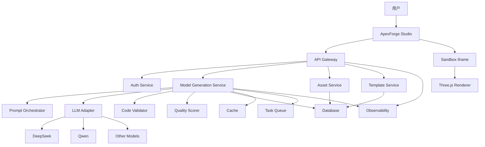
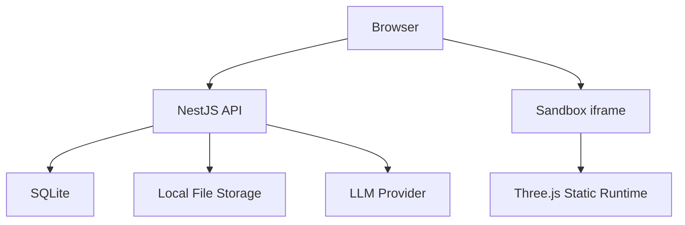
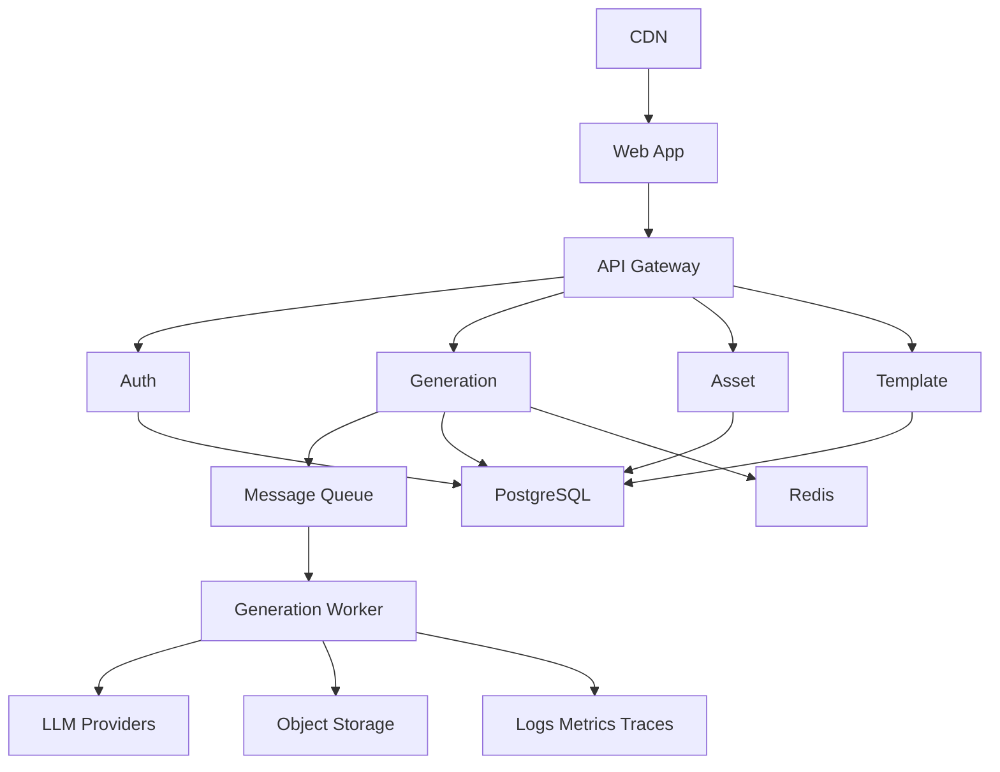
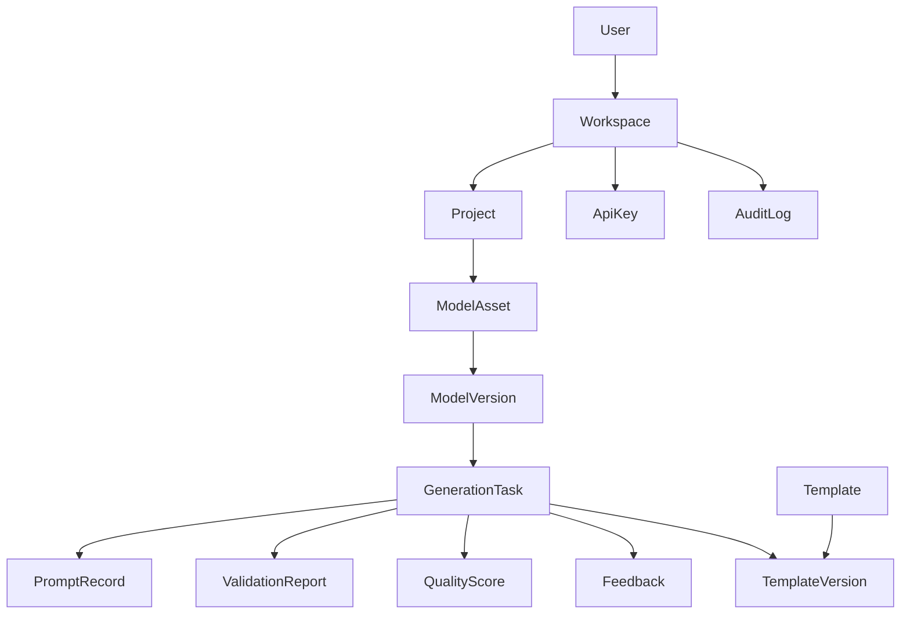
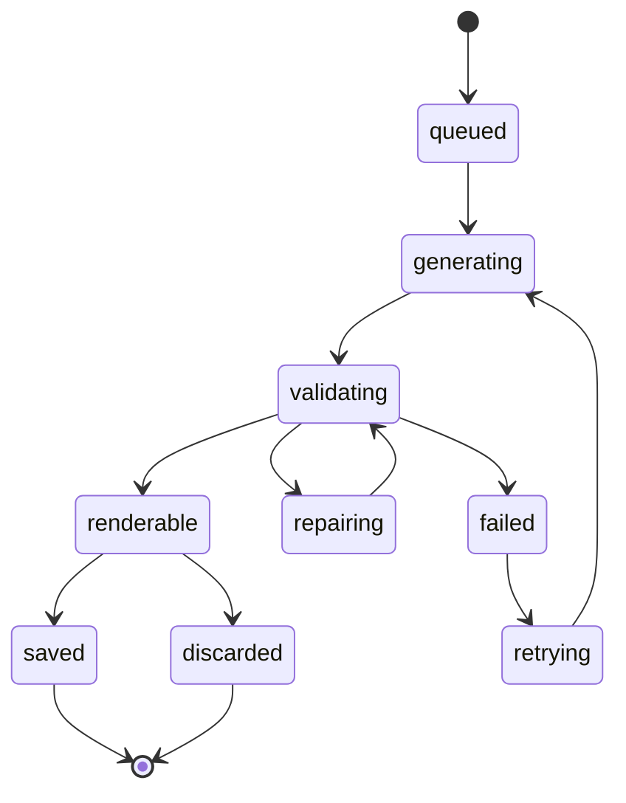
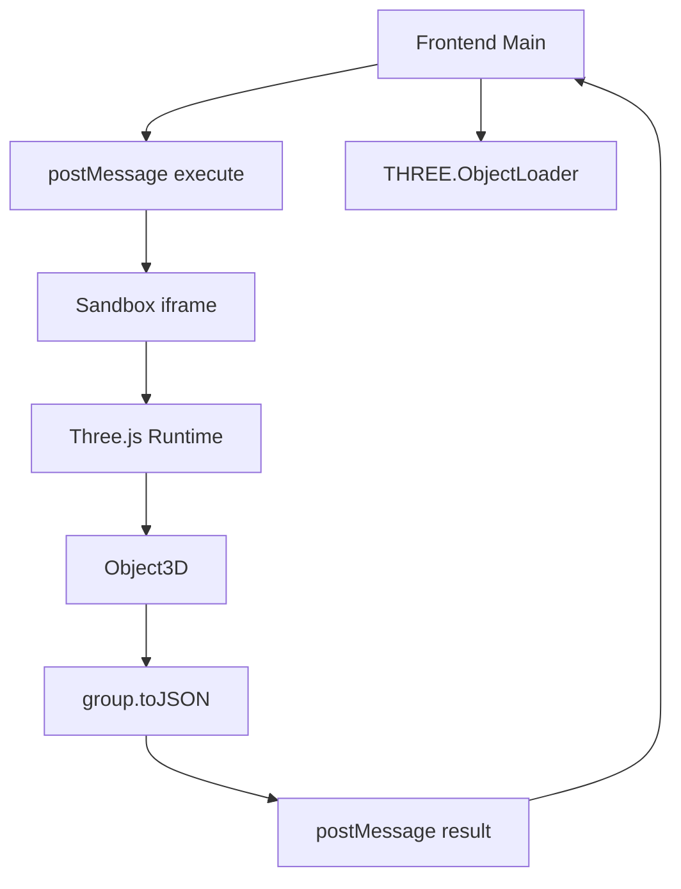
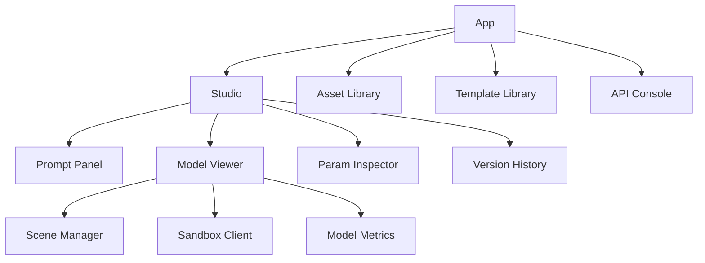
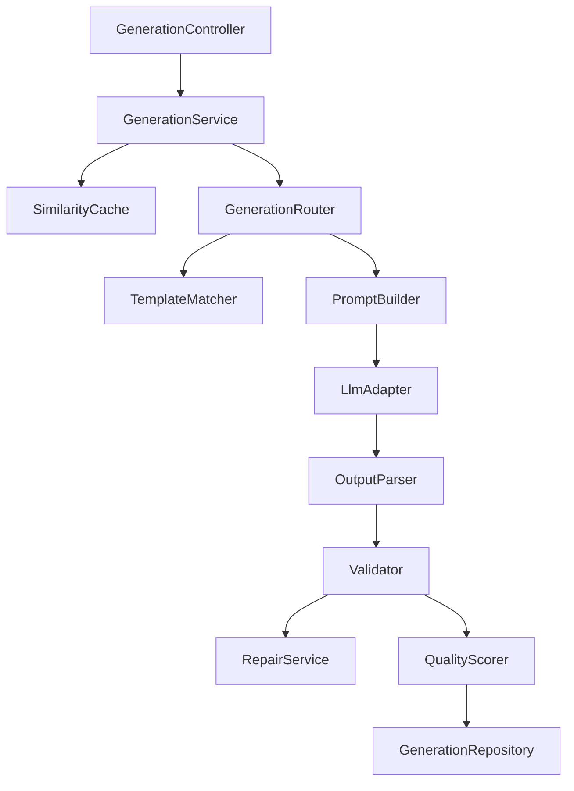
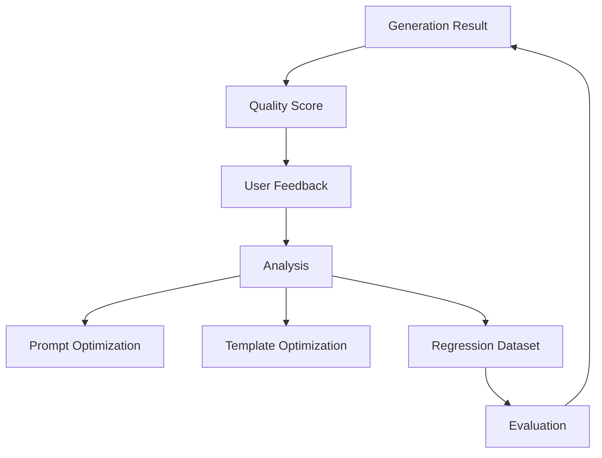

# ApexForge 产品技术设计文档

| 版本 | 日期 | 作者 | 状态 | 描述 |
|------|------|------|------|------|
| 1.0 | 2026-07-08 | 徐小夕 / Qoder | Draft | 面向可扩展平台化落地的产品技术设计 |

---

## 1. 设计目标

本文档面向产品经理、技术负责人、前后端工程师、算法工程师和 DevOps 团队，定义 ApexForge 从 MVP 到平台化阶段的技术架构、核心模块、数据模型、接口契约、安全策略、扩展路线和工程落地方案。

### 1.1 核心目标

- 构建从自然语言到可交互 Three.js 模型的完整闭环。
- 保障 AI 代码生成、执行和渲染过程安全可控。
- 支持模板化、参数化、版本化和多模型供应商扩展。
- 支持从本地轻量部署平滑演进到企业级云原生架构。
- 通过数据闭环持续提升模型生成质量。

### 1.2 设计原则

| 原则 | 说明 |
|------|------|
| 安全优先 | AI 代码不可信，必须校验、隔离、限时执行 |
| 模板优先 | 优先使用可控模板，必要时再自由生成代码 |
| 结构化保存 | 保存 Prompt、代码、参数、结果、评分和版本关系 |
| 可插拔 | LLM、模板引擎、存储、队列、导出服务均可替换 |
| 渐进式演进 | MVP 使用简单架构，预留云原生扩展边界 |
| 可观测 | 每个生成请求具备 traceId、状态流转和质量指标 |

---

## 2. 总体架构

### 2.1 逻辑架构



### 2.2 MVP 部署架构

MVP 建议采用单体后端加模块化代码结构，降低工程复杂度。



### 2.3 平台化部署架构

当生成量、团队协作和 API 调用增加后，演进为服务化架构。



---

## 3. 技术选型建议

### 3.1 推荐技术栈

| 层级 | MVP 选型 | 平台化选型 | 说明 |
|------|----------|------------|------|
| 前端 | React 18、TypeScript、Vite | Next.js 或 React SPA | MVP 可用 SPA，后续如需 SEO 和多页面再引入 Next.js |
| 3D 渲染 | Three.js | Three.js、React Three Fiber 可选 | 核心渲染层建议保持 Three.js 原生可控 |
| UI | Tailwind CSS、Radix UI 或 Ant Design | Design System | 根据团队风格选择，避免早期过重定制 |
| 后端 | NestJS | NestJS 微服务 | 与 TypeScript 生态统一 |
| 数据库 | SQLite | PostgreSQL | MVP 快速落地，后续迁移到 PostgreSQL |
| 缓存 | 内存缓存 | Redis | 用于相似 Prompt、任务状态和限流 |
| 队列 | BullMQ 可选 | BullMQ、RabbitMQ 或 Kafka | 根据任务量演进 |
| 对象存储 | 本地文件 | S3、MinIO、OSS | 保存截图、导出文件、模型 JSON |
| LLM | DeepSeek、Qwen | 多供应商适配 | 降低供应商绑定风险 |
| 校验 | Babel Parser、Acorn | AST 校验服务 | 限制危险 API 和复杂度 |
| 可观测 | Pino、OpenTelemetry | OpenTelemetry、Prometheus、Grafana | 全链路追踪和质量分析 |

### 3.2 SQLite 到 PostgreSQL 的演进策略

- MVP 阶段使用 ORM 抽象数据库访问层。
- 所有 ID 使用 UUID 或 CUID，避免依赖 SQLite 自增特性。
- JSON 字段在 SQLite 使用 TEXT 存储，PostgreSQL 使用 JSONB。
- 避免写 SQLite 特有 SQL，统一通过 Repository 或 Prisma/TypeORM。
- Beta 阶段提供迁移脚本，将历史生成记录、模板和资产导入 PostgreSQL。

---

## 4. 核心领域模型

### 4.1 领域对象

| 对象 | 说明 |
|------|------|
| User | 用户主体 |
| Workspace | 团队或个人空间 |
| Project | 模型资产项目 |
| GenerationTask | 一次生成任务 |
| ModelAsset | 成功生成的模型资产 |
| ModelVersion | 模型版本 |
| Template | 程序化模板 |
| TemplateVersion | 模板版本 |
| PromptRecord | Prompt 和上下文记录 |
| ValidationReport | 代码校验报告 |
| QualityScore | 质量评分结果 |
| Feedback | 用户反馈 |
| ApiKey | 开放 API 调用凭证 |
| AuditLog | 审计日志 |

### 4.2 核心关系



---

## 5. 数据模型设计

以下为平台化目标模型，MVP 可裁剪部分表。

### 5.1 users

| 字段 | 类型 | 说明 |
|------|------|------|
| id | string | 用户 ID |
| email | string | 邮箱 |
| name | string | 昵称 |
| avatarUrl | string | 头像 |
| plan | string | 套餐类型 |
| status | string | active、disabled |
| createdAt | datetime | 创建时间 |
| updatedAt | datetime | 更新时间 |

### 5.2 workspaces

| 字段 | 类型 | 说明 |
|------|------|------|
| id | string | 空间 ID |
| ownerId | string | 所有者用户 ID |
| name | string | 空间名称 |
| type | string | personal、team、enterprise |
| createdAt | datetime | 创建时间 |
| updatedAt | datetime | 更新时间 |

### 5.3 projects

| 字段 | 类型 | 说明 |
|------|------|------|
| id | string | 项目 ID |
| workspaceId | string | 所属空间 |
| name | string | 项目名称 |
| description | string | 项目描述 |
| visibility | string | private、shared、public |
| createdBy | string | 创建者 |
| createdAt | datetime | 创建时间 |
| updatedAt | datetime | 更新时间 |

### 5.4 generation_tasks

| 字段 | 类型 | 说明 |
|------|------|------|
| id | string | 任务 ID |
| traceId | string | 链路追踪 ID |
| workspaceId | string | 所属空间 |
| projectId | string | 项目 ID |
| userId | string | 发起用户 |
| mode | string | code、template、hybrid |
| status | string | queued、generating、validating、renderable、failed、cancelled |
| prompt | text | 用户原始输入 |
| normalizedPrompt | text | 归一化 Prompt |
| templateId | string | 命中的模板 ID |
| templateVersionId | string | 模板版本 ID |
| generatedCode | text | 生成代码 |
| generatedParams | json | 生成参数 |
| errorCode | string | 错误码 |
| errorMessage | text | 错误信息 |
| startedAt | datetime | 开始时间 |
| completedAt | datetime | 完成时间 |
| createdAt | datetime | 创建时间 |

### 5.5 model_assets

| 字段 | 类型 | 说明 |
|------|------|------|
| id | string | 资产 ID |
| workspaceId | string | 所属空间 |
| projectId | string | 项目 ID |
| name | string | 资产名称 |
| category | string | 分类 |
| thumbnailUrl | string | 缩略图 |
| currentVersionId | string | 当前版本 |
| tags | json | 标签列表 |
| status | string | active、deleted、archived |
| createdBy | string | 创建者 |
| createdAt | datetime | 创建时间 |
| updatedAt | datetime | 更新时间 |

### 5.6 model_versions

| 字段 | 类型 | 说明 |
|------|------|------|
| id | string | 版本 ID |
| assetId | string | 资产 ID |
| generationTaskId | string | 来源任务 |
| versionNo | number | 版本号 |
| code | text | Three.js 代码 |
| params | json | 参数对象 |
| modelJsonUrl | string | Three.js Object JSON 地址 |
| screenshotUrl | string | 截图地址 |
| metrics | json | 几何体、顶点、材质等指标 |
| createdAt | datetime | 创建时间 |

### 5.7 templates

| 字段 | 类型 | 说明 |
|------|------|------|
| id | string | 模板 ID |
| name | string | 模板名称 |
| category | string | 分类 |
| description | text | 描述 |
| tags | json | 标签 |
| status | string | draft、published、deprecated |
| createdBy | string | 创建者 |
| createdAt | datetime | 创建时间 |
| updatedAt | datetime | 更新时间 |

### 5.8 template_versions

| 字段 | 类型 | 说明 |
|------|------|------|
| id | string | 模板版本 ID |
| templateId | string | 模板 ID |
| version | string | 语义化版本 |
| paramSchema | json | 参数 Schema |
| defaultParams | json | 默认参数 |
| rendererCode | text | 渲染函数代码 |
| examplePrompts | json | 示例 Prompt |
| validationRules | json | 参数校验规则 |
| createdAt | datetime | 创建时间 |

### 5.9 validation_reports

| 字段 | 类型 | 说明 |
|------|------|------|
| id | string | 报告 ID |
| generationTaskId | string | 任务 ID |
| passed | boolean | 是否通过 |
| blockedReasons | json | 阻断原因 |
| warnings | json | 警告信息 |
| complexity | json | 复杂度指标 |
| astSummary | json | AST 摘要 |
| createdAt | datetime | 创建时间 |

### 5.10 quality_scores

| 字段 | 类型 | 说明 |
|------|------|------|
| id | string | 评分 ID |
| generationTaskId | string | 任务 ID |
| totalScore | number | 总分 |
| renderabilityScore | number | 可渲染分 |
| structureScore | number | 结构分 |
| promptMatchScore | number | Prompt 匹配分 |
| performanceScore | number | 性能分 |
| details | json | 评分详情 |
| createdAt | datetime | 创建时间 |

---

## 6. 生成链路设计

### 6.1 生成模式

| 模式 | 说明 | 适用场景 |
|------|------|----------|
| Template Mode | AI 只生成模板参数 | 常见类别、高稳定性要求 |
| Code Mode | AI 生成完整 Three.js 函数 | 新类别、探索性生成 |
| Hybrid Mode | AI 选择模板并补充局部代码 | 复杂但仍需可控的资产 |
| Cache Mode | 命中相似 Prompt 直接复用 | 重复请求、批量变体 |

推荐优先级：Cache Mode、Template Mode、Hybrid Mode、Code Mode。

### 6.2 状态机



### 6.3 完整时序

```mermaid
sequenceDiagram
  participant FE as Frontend
  participant API as API Gateway
  participant GEN as Generation Service
  participant CACHE as Cache
  participant TPL as Template Service
  participant LLM as LLM Adapter
  participant VAL as Validator
  participant DB as Database
  participant BOX as Sandbox
  FE->>API: POST /api/v1/generations
  API->>GEN: createGenerationTask
  GEN->>CACHE: querySimilarPrompt
  alt cache hit
    CACHE-->>GEN: cached result
  else cache miss
    GEN->>TPL: findCandidateTemplate
    TPL-->>GEN: template candidates
    GEN->>LLM: generate code or params
    LLM-->>GEN: generated output
    GEN->>VAL: validate output
    VAL-->>GEN: validation report
  end
  GEN->>DB: persist task and result
  GEN-->>API: result
  API-->>FE: generation payload
  FE->>BOX: execute in iframe
  BOX-->>FE: model json or error
```

### 6.4 Prompt 编排策略

#### System Prompt 要点

- 角色设定为资深 Three.js 程序化建模工程师。
- 输出必须符合固定 JSON 协议。
- 代码必须只暴露 `buildModel(params, THREE)` 或返回参数对象。
- 禁止访问网络、DOM、全局对象、浏览器存储。
- 几何体和材质必须在白名单范围内。
- 限制模型复杂度、循环、递归和动态代码执行。

#### 输出协议

```json
{
  "mode": "template | code | hybrid",
  "templateId": "vehicle.sport_car.v1",
  "params": {
    "bodyColor": "#111827",
    "accentColor": "#2563eb"
  },
  "code": "function buildModel(params, THREE) { const group = new THREE.Group(); return group; }",
  "explanation": "模型结构说明",
  "warnings": []
}
```

#### Prompt 版本管理

- 每次生成记录保存 `promptVersion`。
- System Prompt、Few-shot 示例、模板摘要均版本化。
- 质量回归测试按 Prompt 版本执行。
- 当生成质量下降时可快速回滚 Prompt。

---

## 7. 代码安全校验设计

### 7.1 校验分层

| 层级 | 位置 | 目标 |
|------|------|------|
| 输出协议校验 | 服务端 | 确保 JSON、mode、字段结构正确 |
| 文本黑名单 | 服务端 | 快速阻断明显危险代码 |
| AST 校验 | 服务端 | 精确限制 API、语法和复杂度 |
| 运行时沙箱 | 客户端 | 隔离执行环境 |
| 超时销毁 | 客户端 | 防止死循环和阻塞 |
| 结果校验 | 客户端/服务端 | 检查模型 JSON 和复杂度 |

### 7.2 黑名单 API

| 类型 | 禁止项 |
|------|--------|
| 动态执行 | eval、Function、setTimeout 字符串参数、setInterval 字符串参数 |
| 网络访问 | fetch、XMLHttpRequest、WebSocket、EventSource、navigator.sendBeacon |
| DOM 访问 | document、window.top、window.parent、localStorage、sessionStorage |
| 动态加载 | import、importScripts、require |
| 原型污染 | __proto__、prototype、constructor 链式异常访问 |
| 计算风险 | while(true)、无限递归、过深嵌套循环 |

### 7.3 AST 白名单策略

允许语法：

- 变量声明、函数声明、对象字面量、数组字面量。
- 基础数学运算和 `Math` 白名单方法。
- `new THREE.Group()`、基础几何体、基础材质、Mesh、Line 等白名单构造器。
- `group.add()`、`mesh.position.set()`、`mesh.rotation.set()` 等安全方法。

限制策略：

- 最大代码长度：MVP 20KB，Beta 可配置。
- 最大 AST 深度：建议小于 30。
- 最大循环层数：2。
- 最大 Mesh 数量：MVP 80，Beta 通过套餐配置。
- 最大几何体顶点估算：可按几何参数预估。
- 禁止访问未声明全局变量，除 `THREE`、`Math`、`params`、安全工具函数外。

---

## 8. 沙箱运行时设计

### 8.1 iframe 隔离方案

MVP 建议采用隐藏或可控 iframe 执行 AI 代码。



### 8.2 iframe 配置

- `sandbox="allow-scripts"`，不允许同源访问、表单、弹窗和顶级导航。
- CSP 限制脚本来源，只允许加载预构建 runtime。
- 每次执行创建任务 ID，超时未返回则销毁 iframe。
- iframe 内只暴露 `THREE`、安全构建函数和 `params`。
- 执行结果只允许返回结构化 JSON，不允许回传函数或 DOM 引用。

### 8.3 执行流程

1. 主页面生成 `executionId`。
2. 向 iframe 发送 `{ executionId, code, params, timeoutMs }`。
3. iframe 包装代码并执行 `buildModel(params, THREE)`。
4. 执行成功后调用 `group.toJSON()`。
5. 主页面使用 `THREE.ObjectLoader` 反序列化。
6. 主页面计算边界盒并自动居中缩放。
7. 如果执行超时或异常，销毁 iframe 并返回错误。

### 8.4 错误分类

| 错误码 | 说明 | 用户提示 |
|--------|------|----------|
| SANDBOX_TIMEOUT | 执行超时 | 模型过于复杂，已终止渲染 |
| SANDBOX_RUNTIME_ERROR | 运行时报错 | 生成代码存在执行问题，可重试 |
| MODEL_JSON_INVALID | 返回结构非法 | 模型数据无效，系统将重新生成 |
| MODEL_TOO_COMPLEX | 模型复杂度超限 | 请降低细节或使用模板模式 |
| MODEL_EMPTY | 未生成有效对象 | 描述过于模糊，请补充模型主体 |

---

## 9. 前端架构设计

### 9.1 模块划分



### 9.2 关键前端服务

| 服务 | 职责 |
|------|------|
| ApiClient | 管理 REST/SSE/WebSocket 请求 |
| GenerationStore | 管理生成任务状态和结果 |
| SceneManager | 初始化 Three.js 场景、灯光、控制器和模型挂载 |
| SandboxClient | 与 iframe 通信、超时控制和错误映射 |
| ModelNormalizer | 模型居中、缩放、复杂度统计 |
| AssetStore | 管理项目、资产和版本数据 |
| TemplateStore | 管理模板列表、详情和参数 Schema |

### 9.3 SceneManager 设计

对外能力：

- `init(canvasElement)` 初始化场景。
- `loadModel(object3D, options)` 加载模型。
- `clearModel()` 清空当前模型。
- `fitToView()` 自动适配视角。
- `setBackground(mode)` 切换背景。
- `captureScreenshot()` 截图。
- `dispose()` 释放几何体、材质和纹理。

### 9.4 前端性能策略

- 动态加载 Three.js 和沙箱 runtime，降低首屏体积。
- 模型 JSON 解析可放入 Worker，主线程只做渲染挂载。
- 对重复几何体优先使用 InstancedMesh。
- 加载模型前统计复杂度，超过阈值提示用户降级。
- 释放旧模型时必须遍历 dispose geometry、material、texture。
- 使用 requestAnimationFrame 控制渲染循环，页面不可见时暂停。

---

## 10. 后端架构设计

### 10.1 NestJS 模块划分

| 模块 | 职责 |
|------|------|
| AuthModule | 用户认证、JWT、API Key |
| WorkspaceModule | 空间、成员、权限 |
| ProjectModule | 项目管理 |
| GenerationModule | 生成任务编排 |
| PromptModule | Prompt 模板和版本管理 |
| LlmModule | 多供应商适配 |
| ValidationModule | 代码与参数校验 |
| TemplateModule | 模板库和版本 |
| AssetModule | 模型资产和版本 |
| FeedbackModule | 用户反馈 |
| ExportModule | 导出 JS、JSON、截图、glTF |
| BillingModule | 配额、套餐、调用量统计 |
| ObservabilityModule | 日志、指标、trace |

### 10.2 Generation Service 内部结构



### 10.3 多供应商 LLM Adapter

统一接口：

```ts
interface LlmAdapter {
  provider: string;
  generate(request: LlmGenerateRequest): Promise<LlmGenerateResponse>;
  stream?(request: LlmGenerateRequest): AsyncIterable<LlmStreamChunk>;
}
```

选择策略：

- 按任务类型选择模型，如代码生成、参数生成、Prompt 改写。
- 按成本和响应速度选择供应商。
- 支持失败重试和供应商降级。
- 记录每次调用的 token、耗时、错误码和输出质量。

---

## 11. API 设计

### 11.1 通用规范

- Base URL：`/api/v1`
- 认证：用户侧 JWT，开放平台 API Key。
- 响应必须包含 `traceId`。
- 错误响应统一结构。

错误结构：

```json
{
  "traceId": "tr_123",
  "error": {
    "code": "GENERATION_VALIDATION_FAILED",
    "message": "生成结果未通过安全校验",
    "details": []
  }
}
```

### 11.2 创建生成任务

`POST /api/v1/generations`

请求：

```json
{
  "projectId": "proj_123",
  "prompt": "生成一辆未来感跑车，黑色车身，蓝色灯带",
  "category": "vehicle",
  "mode": "auto",
  "contextVersionId": "ver_001",
  "preferences": {
    "style": "sci-fi",
    "quality": "balanced"
  }
}
```

响应：

```json
{
  "traceId": "tr_123",
  "data": {
    "taskId": "gen_123",
    "status": "renderable",
    "mode": "template",
    "templateId": "vehicle.sport_car",
    "params": {},
    "code": "function buildModel(params, THREE) { return new THREE.Group(); }",
    "validationReport": {
      "passed": true,
      "warnings": []
    },
    "qualityScore": {
      "totalScore": 86
    }
  }
}
```

### 11.3 查询生成任务

`GET /api/v1/generations/{taskId}`

返回任务状态、生成结果、错误信息和质量评分。

### 11.4 保存为资产

`POST /api/v1/assets`

请求：

```json
{
  "projectId": "proj_123",
  "generationTaskId": "gen_123",
  "name": "未来感跑车",
  "tags": ["vehicle", "sci-fi"]
}
```

### 11.5 查询资产版本

`GET /api/v1/assets/{assetId}/versions`

返回该资产全部版本、Prompt、参数、截图和指标。

### 11.6 模板接口

| 方法 | 路径 | 说明 |
|------|------|------|
| GET | `/api/v1/templates` | 查询模板列表 |
| GET | `/api/v1/templates/{id}` | 查询模板详情 |
| POST | `/api/v1/templates/{id}/render` | 使用模板和参数生成模型 |
| POST | `/api/v1/templates` | 创建模板，管理端权限 |
| POST | `/api/v1/templates/{id}/versions` | 发布模板版本 |

### 11.7 SSE 事件

`GET /api/v1/generations/{taskId}/events`

事件类型：

- `queued`
- `generating`
- `validating`
- `repairing`
- `renderable`
- `failed`

事件示例：

```json
{
  "event": "validating",
  "traceId": "tr_123",
  "taskId": "gen_123",
  "message": "正在进行安全校验"
}
```

---

## 12. 模板系统设计

### 12.1 模板结构

```json
{
  "templateId": "vehicle.sport_car",
  "version": "1.0.0",
  "category": "vehicle",
  "paramSchema": {
    "bodyColor": {
      "type": "string",
      "format": "color",
      "default": "#111827"
    },
    "bodyLength": {
      "type": "number",
      "min": 2,
      "max": 8,
      "default": 4.2
    }
  },
  "defaultParams": {},
  "renderer": "function render(params, THREE) { const group = new THREE.Group(); return group; }"
}
```

### 12.2 模板分层

| 层级 | 说明 |
|------|------|
| Skeleton | 控制主体比例、关键部件位置和结构 |
| Style Variant | 控制风格，如科幻、复古、工业、卡通 |
| Detail Pack | 控制装饰件，如灯带、轮毂、天线、纹理 |
| Material Preset | 控制材质，如金属、玻璃、塑料、发光 |
| Param Schema | 定义参数范围、默认值和校验 |

### 12.3 模板匹配策略

1. 对用户 Prompt 做类别识别和关键词抽取。
2. 使用标签和向量检索找出候选模板。
3. 让 LLM 在候选模板中选择最匹配模板并生成参数。
4. 如果置信度低于阈值，切换 Hybrid 或 Code Mode。
5. 保存模板命中数据，用于优化模板覆盖率。

---

## 13. 质量评分体系

### 13.1 评分维度

| 维度 | 权重 | 说明 |
|------|------|------|
| 可渲染性 | 30% | 是否能成功生成 Object3D 并加载 |
| Prompt 匹配度 | 25% | 输出是否符合用户描述 |
| 结构完整性 | 20% | 主体、关键部件、比例是否合理 |
| 性能表现 | 15% | Mesh 数量、顶点数量、材质数量是否可控 |
| 可编辑性 | 10% | 参数是否清晰、代码是否结构化 |

### 13.2 自动评分输入

- 生成模式和模板命中情况。
- AST 校验结果。
- 几何体数量、顶点数、材质数。
- 沙箱执行是否成功。
- 模型边界盒尺寸和空模型检测。
- 用户反馈和保存行为。

### 13.3 质量闭环



---

## 14. 权限与计费设计

### 14.1 权限模型

| 角色 | 权限 |
|------|------|
| Owner | 空间管理、成员管理、计费、全部项目 |
| Admin | 项目管理、模板管理、审核 |
| Editor | 创建和编辑模型资产 |
| Viewer | 查看和导出授权资产 |
| API Client | 通过 API 调用限定能力 |

### 14.2 配额维度

- 每日生成次数。
- 每分钟请求数。
- 并发生成任务数。
- 最大模型复杂度。
- 存储空间。
- API 调用量。
- 高级模型调用额度。

---

## 15. 可观测性设计

### 15.1 Trace 链路

每个生成请求创建 `traceId`，贯穿：

- 前端提交。
- API Gateway。
- Generation Service。
- LLM Adapter。
- Validator。
- Database。
- Sandbox execution。

### 15.2 日志字段

| 字段 | 说明 |
|------|------|
| traceId | 链路 ID |
| userId | 用户 ID |
| workspaceId | 空间 ID |
| taskId | 任务 ID |
| provider | LLM 供应商 |
| promptVersion | Prompt 版本 |
| generationMode | 生成模式 |
| latencyMs | 耗时 |
| status | 状态 |
| errorCode | 错误码 |
| qualityScore | 质量分 |

### 15.3 告警规则

| 告警 | 条件 |
|------|------|
| 生成失败率过高 | 5 分钟内失败率大于 30% |
| LLM 延迟过高 | P95 大于 60 秒 |
| 校验失败突增 | 10 分钟内校验失败率翻倍 |
| 沙箱超时突增 | 10 分钟内超时率大于 10% |
| API 错误率过高 | 5xx 比例大于 5% |

---

## 16. 安全与合规

### 16.1 输入安全

- Prompt 长度限制，MVP 建议 2000 字符以内。
- 对明显违法、暴力、仇恨和侵权内容进行拦截。
- 品牌、商标和名人相关 Prompt 进入更严格审核。

### 16.2 输出安全

- 代码必须经过协议校验、黑名单扫描和 AST 白名单校验。
- 输出模型不得包含侵权品牌标识和违规符号。
- 开放 API 生成结果默认私有。

### 16.3 数据安全

- 密钥使用 KMS、Vault 或云厂商 Secret Manager。
- 用户 API Key 只展示一次，数据库只保存哈希。
- 敏感日志脱敏，不记录完整密钥和鉴权头。
- 企业版支持数据隔离、审计日志和私有化部署。

---

## 17. 性能优化设计

### 17.1 前端优化

- Three.js runtime 按需加载。
- 模型加载前检查复杂度阈值。
- 旧模型释放 geometry、material、texture。
- 大模型解析移至 Worker。
- 相机和控制器状态与模型版本解耦。
- 使用低面数基础几何体和 InstancedMesh。

### 17.2 后端优化

- 相似 Prompt 缓存，向量相似度大于阈值时复用结果。
- 模板模式跳过 LLM 代码生成，改为参数生成。
- 生成任务异步化，避免 HTTP 长连接占用。
- LLM 供应商并发和熔断控制。
- 热门模板和参数 Schema 缓存在 Redis。

### 17.3 数据库优化

- `generation_tasks.traceId`、`workspaceId`、`createdAt` 建索引。
- `model_assets.workspaceId`、`projectId`、`updatedAt` 建索引。
- 大字段如代码、模型 JSON、截图建议迁移至对象存储，仅保存 URL 和摘要。
- 历史任务按时间归档。

---

## 18. 工程落地计划

### 18.1 MVP 里程碑

| 任务 | 交付物 |
|------|--------|
| 项目初始化 | 前端 Vite、后端 NestJS、SQLite、基础 CI |
| 生成接口 | 创建任务、调用 LLM、返回代码 |
| 安全校验 | 黑名单、AST 基础校验、错误码 |
| 沙箱运行时 | iframe runtime、postMessage、超时销毁 |
| 3D 预览 | SceneManager、ObjectLoader、相机适配 |
| 历史记录 | 生成任务和资产保存 |
| 基础模板 | 车辆、建筑、飞行器、家具、道具模板 |
| 质量日志 | traceId、耗时、失败原因、复杂度统计 |

### 18.2 Beta 里程碑

| 任务 | 交付物 |
|------|--------|
| 模板平台化 | Template、TemplateVersion、参数 Schema |
| 参数编辑器 | 根据 Schema 动态生成表单 |
| 二次编辑 | 版本链路、上下文 Prompt、回滚 |
| 导出服务 | JS、JSON、截图、初步 glTF |
| 用户反馈 | 满意、不满意、违规、质量分析 |
| API Key | 开放 API、配额、限流 |
| 可观测性 | 指标、日志、trace、告警 |

### 18.3 Scale 里程碑

| 任务 | 交付物 |
|------|--------|
| 数据库迁移 | SQLite 到 PostgreSQL |
| 队列化 | BullMQ 或 RabbitMQ 生成任务 |
| 多模型供应商 | DeepSeek、Qwen、备用模型 |
| 团队空间 | 成员、角色、权限、审计 |
| 计费系统 | 套餐、额度、用量统计 |
| 私有部署 | Docker Compose、K8s Helm、企业配置 |

---

## 19. 推荐目录结构

```text
apexforge/
  apps/
    web/
      src/
        modules/
          studio/
          assets/
          templates/
          api-console/
        shared/
          api/
          components/
          three/
          sandbox/
    api/
      src/
        modules/
          auth/
          generation/
          llm/
          validation/
          templates/
          assets/
          feedback/
          observability/
  packages/
    shared-types/
    prompt-kit/
    template-runtime/
    code-validator/
  tech/
  docs/
```

---

## 20. 测试策略

### 20.1 单元测试

- PromptBuilder 输出协议测试。
- Validator 黑名单和 AST 白名单测试。
- Template 参数校验测试。
- SceneManager 模型释放和边界盒计算测试。
- SandboxClient 超时和错误映射测试。

### 20.2 集成测试

- 从创建生成任务到保存资产的完整链路。
- LLM Adapter mock 响应测试。
- 模板模式和代码模式分别测试。
- API 鉴权、限流、错误响应测试。

### 20.3 安全测试

- 恶意代码样本集。
- 沙箱逃逸尝试。
- 动态 import、fetch、WebSocket、DOM 访问阻断测试。
- 无限循环和复杂几何体压力测试。

### 20.4 质量回归测试

建立固定 Prompt 集：

- 车辆类 20 条。
- 建筑类 20 条。
- 道具类 20 条。
- 飞行器类 20 条。
- 边界与恶意输入 30 条。

每次 Prompt、模板或模型供应商调整后执行回归，比较生成成功率、质量分和耗时。

---

## 21. 关键技术决策

### 21.1 为什么不是纯文本生成 Three.js 代码

纯代码生成灵活但不稳定，容易出现语法错误、安全风险和造型不可控问题。ApexForge 应以模板和参数为主，代码生成为补充，形成稳定性和创造力之间的平衡。

### 21.2 为什么使用 iframe 而不是只用 Web Worker

Web Worker 适合计算隔离，但 Three.js Object3D 的序列化、依赖加载、执行上下文和超时销毁在 iframe 中更容易控制。iframe 可通过 sandbox 属性和 CSP 提供更强隔离边界。后续可将 JSON 解析或复杂度分析放入 Worker。

### 21.3 为什么早期使用 SQLite

SQLite 能降低 MVP 运维成本，适合单机验证。但必须通过 ORM 和规范化模型设计避免绑定。进入 Beta 或多人协作后应迁移到 PostgreSQL。

### 21.4 为什么要保存 ValidationReport 和 QualityScore

AI 产品的核心壁垒来自反馈和评估数据。只保存结果无法解释失败原因，也无法持续优化 Prompt、模板和模型选择策略。

---

## 22. 风险清单与技术预案

| 风险 | 技术预案 |
|------|----------|
| LLM 输出不稳定 | 输出协议约束、自动修复、Few-shot、模板优先 |
| 生成结果不可渲染 | AST 校验、沙箱预执行、质量评分、重试 |
| 浏览器卡顿 | 复杂度限制、模型归一化、InstancedMesh、LOD |
| 沙箱逃逸 | iframe sandbox、CSP、黑白名单、无同源权限 |
| 成本不可控 | 缓存、模板模式、供应商路由、配额系统 |
| 用户期待过高 | 产品定位明确、示例库、质量标签 |
| 数据迁移困难 | ORM 抽象、UUID、JSON 字段兼容设计 |

---

## 23. 技术验收标准

### 23.1 MVP 验收

- 用户可输入 Prompt 并成功生成可交互模型。
- 生成结果经过服务端校验后才返回前端。
- 前端在 iframe 沙箱中执行生成代码。
- 主页面不因沙箱异常而崩溃。
- 生成记录可保存、查看和重新加载。
- 系统记录 traceId、耗时、状态和失败原因。

### 23.2 Beta 验收

- 模板模式生成成功率大于 90%。
- 支持参数 Schema 和动态编辑表单。
- 支持模型版本回滚。
- 支持 API Key 和基础开放 API。
- 支持质量评分和用户反馈统计。
- 支持 PostgreSQL 部署。

### 23.3 Scale 验收

- 生成服务可水平扩容。
- 支持多供应商 LLM 路由和降级。
- 支持团队权限、配额和审计。
- 支持队列化异步生成和 Webhook。
- 支持企业私有化部署。

---

## 24. 下一步建议

1. 先完成 MVP 技术 Spike：验证 LLM 输出协议、AST 校验和 iframe 沙箱执行。
2. 建立 30 到 50 条高质量 Prompt 回归集，用于持续评估生成质量。
3. 优先沉淀 5 个高质量模板，覆盖车辆、建筑、飞行器、家具和道具。
4. 在第一版数据库中保留任务、资产、版本、校验报告和质量评分表。
5. 尽早实现 traceId 和错误码体系，避免后期排查成本失控。
